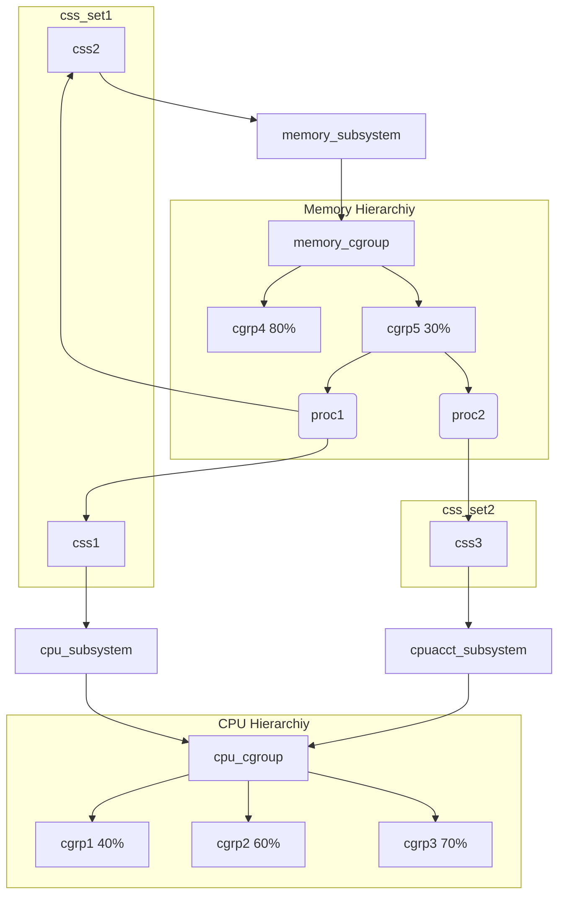

## 常识

### 进程描述符

每一个线程对应一个进程描述符task_struct，宏current指向当前任务的task_struct。

```c
// [include/linux/sched.h]

struct task_struct {
    volatile long state;            // process state (running, stopped, ...)
    void *stack;                    // task's stack pointer
    int prio;                       // process priority
    struct mm_struct *mm;           // memory address space
    struct files_struct *files;     // open file information
    const struct cred *cred;        // credentials
  // ...
};
```

### 文件描述符

文件描述符可以表示Linux系统上的任意文件，每个文件描述符对应一个file结构体。

```c
// [include/linux/fs.h]

struct file {
    loff_t                            f_pos;            // "cursor" while reading file
    atomic_long_t                     f_count;          // object's reference counter
    const struct file_operations      *f_op;            // virtual function table (VFT) pointer
  void                              *private_data;      // used by file "specialization"
  // ...
};
```

文件描述符到file结构体的映射由文件描述符表(FDT)来实现，可能存在多个文件描述符指向同一个file结构体。FDT存储在fdtable结构体中，这是个file结构体指针数组，使用文件描述符进行索引。

```c
// [include/linux/fdtable.h]

struct fdtable {
    unsigned int max_fds;
    struct file ** fd;      /* current fd array */
  // ...
};
```

### 进程和文件的关联

将文件描述符表与进程关联起来的是files_struct结构体。

```c
// [include/linux/fdtable.h]

struct files_struct {
    atomic_t count;           // reference counter
    struct fdtable *fdt;      // pointer to the file descriptor table
  // ...
};
```

由于一个files_struct可以在多个线程(task_struct)中共享，所以files_struct**以指针的形式**保存在task_struct的files字段中。

### 虚函数表

虚函数表(VFT)是主要由函数指针组成的结构体，其中比较出名的VFT是file_operations。

```c
// [include/linux/fs.h]

struct file_operations {
    ssize_t (*read) (struct file *, char __user *, size_t, loff_t *);
    ssize_t (*write) (struct file *, const char __user *, size_t, loff_t *);
    int (*open) (struct inode *, struct file *);
    int (*release) (struct inode *, struct file *);
  // ...
};
```

这样一来就可以根据文件本身的性质来定义是否实现某功能。

```c
if (file->f_op->read)
    ret = file->f_op->read(file, buf, count, pos);
```

### Socket, Sock 和 SKB


### cgroup

> cgroup：control group

cgroup为系统中*运行的task*分配诸如CPU时间片、系统内存、网络带宽或这些资源的组合。用户可以监控配置的cgroup，禁止cgroup访问某些资源。
* cgroup将一组task与一个或多个*子系统*的参数关联起来。
  * 资源被定义成不同的*子系统*（如CPU子系统、Memory子系统）。
* cgroup采用*层次结构*划分资源，系统中每个task都属于层次结构的一个cgroup。
  * *层次结构*就是一组以树形态排列的cgroup。
  * 每个层次结构都对应一个*cgroup虚拟文件系统实例*。

cgroup_subsys_state(css)用于关联层次结构中cgroup和子系统，css_set将一组task绑定到cgroup。
* task可以隶属于多个cgroup，但是只能属于一个css_set。
* 由于进程可能共享资源，所以css_set可以包含多个进程。



> 上图中百分比表示该cgroup中资源利用占比的最大值。


用户级代码可以在cgroup虚拟文件系统实例中，按照名称创建和销毁cgroup、查询task的分配情况。
* 这些操作只会影响cgroup虚拟文件系统实例对应的层次结构。
* 通过fsopen()打开cgroup虚拟文件系统，fsconfig()对文件系统结构进行配置。

## 技巧

* kASLR以2M为最小单位设置基地址，所以通过不断重启查看/proc/kallsyms，可以计算出某个全局变量的偏移量。