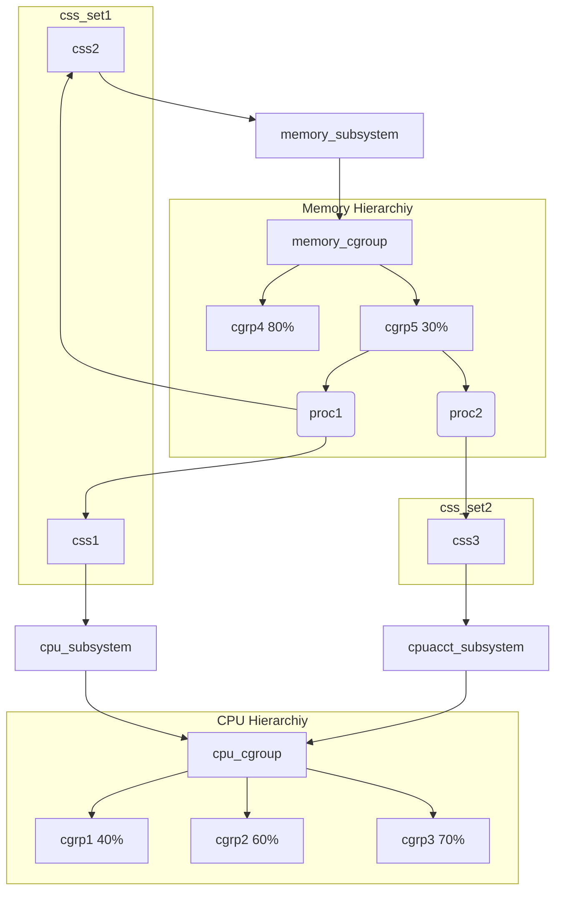

## 常识

### 进程描述符

每一个线程对应一个进程描述符task_struct，宏current指向当前任务的task_struct。

```c
// [include/linux/sched.h]

struct task_struct {
    volatile long state;            // process state (running, stopped, ...)
    void *stack;                    // task's stack pointer
    int prio;                       // process priority
    struct mm_struct *mm;           // memory address space
    struct files_struct *files;     // open file information
    const struct cred *cred;        // credentials
  // ...
};
```

### 文件描述符

文件描述符可以表示Linux系统上的任意文件，每个文件描述符对应一个file结构体。

```c
// [include/linux/fs.h]

struct file {
    loff_t                            f_pos;            // "cursor" while reading file
    atomic_long_t                     f_count;          // object's reference counter
    const struct file_operations      *f_op;            // virtual function table (VFT) pointer
  void                              *private_data;      // used by file "specialization"
  // ...
};
```

文件描述符到file结构体的映射由文件描述符表(FDT)来实现，可能存在多个文件描述符指向同一个file结构体。FDT存储在fdtable结构体中，这是个file结构体指针数组，使用文件描述符进行索引。

```c
// [include/linux/fdtable.h]

struct fdtable {
    unsigned int max_fds;
    struct file ** fd;      /* current fd array */
  // ...
};
```

### 进程和文件的关联

将文件描述符表与进程关联起来的是files_struct结构体。

```c
// [include/linux/fdtable.h]

struct files_struct {
    atomic_t count;           // reference counter
    struct fdtable *fdt;      // pointer to the file descriptor table
  // ...
};
```

由于一个files_struct可以在多个线程(task_struct)中共享，所以files_struct**以指针的形式**保存在task_struct的files字段中。

### 虚函数表

虚函数表(VFT)是主要由函数指针组成的结构体，其中比较出名的VFT是file_operations。

```c
// [include/linux/fs.h]

struct file_operations {
    ssize_t (*read) (struct file *, char __user *, size_t, loff_t *);
    ssize_t (*write) (struct file *, const char __user *, size_t, loff_t *);
    int (*open) (struct inode *, struct file *);
    int (*release) (struct inode *, struct file *);
  // ...
};
```

这样一来就可以根据文件本身的性质来定义是否实现某功能。

```c
if (file->f_op->read)
    ret = file->f_op->read(file, buf, count, pos);
```

### Socket, Sock 和 SKB

在socket创建期间，即调用socket()，将创建一个新的file结构体，并将其文件操作字段设置为socket_file_ops。

```c
// [net/socket.c]

static const struct file_operations socket_file_ops = {
    .read = sock_aio_read,      // <---- calls sock->ops->recvmsg()
    .write =    sock_aio_write, // <---- calls sock->ops->sendmsg()
    .llseek =   no_llseek,      // <---- returns an error
  // ...
}
```

由于socket实际上实现了socket API(connect()、bind()、accept()、listen()...)，因此它们嵌入了一个类型为struct proto_ops的特殊虚函数表(vft)。每种类型的套接字(例如AF_INET、AF_NETLINK)都实现自己的proto_ops。

```c
// [include/linux/net.h]

struct proto_ops {
    int     (*bind)    (struct socket *sock, struct sockaddr *myaddr, int sockaddr_len);
    int     (*connect) (struct socket *sock, struct sockaddr *vaddr,  int sockaddr_len, int flags);
    int     (*accept)  (struct socket *sock, struct socket *newsock, int flags);
  // ...
}
```

执行如上系统调用(例如bind())时，内核的处理过程如下：
1. 从文件描述符表中获得file结构体指针；
2. 从file结构体中获得socket结构体指针；
3. 调用专门的proto_ops回调函数(例如sock->ops->bind())。

struct socket具有指向struct sock对象的指针，该指针通常由套接字协议操作(proto_ops)使用。struct socket是连接struct file和struct sock的中间结构体。

```c
// [include/linux/net.h]

struct socket {
    struct file     *file;
    struct sock     *sk;
    const struct proto_ops  *ops;
  // ...
};
```

struct sock用于以通用方式保持接收/发送缓冲区。当通过网卡接收到数据包时，驱动程序将网络数据包加入到*sock接收缓冲区*中，直到程序决定接收它(recvmsg())。反过来，当程序想要发送数据(sendmsg())时，网络数据包被加入到*sock发送缓冲区*。一有机会，网卡将取出该数据包并发送。

上述网络数据包就是struct sk_buff(SKB)，缓冲区就是由struct sk_buff组成的双向链表。

```c
// [include/linux/sock.h]

struct sock {
    int         sk_rcvbuf;    // theorical "max" size of the receive buffer
    int         sk_sndbuf;    // theorical "max" size of the send buffer
    atomic_t        sk_rmem_alloc;  // "current" size of the receive buffer
    atomic_t        sk_wmem_alloc;  // "current" size of the send buffer
    struct sk_buff_head sk_receive_queue;   // head of doubly-linked list
    struct sk_buff_head sk_write_queue;     // head of doubly-linked list
    struct socket       *sk_socket; // socket <-> sock
  // ...
}
```

> struct sock对象通常称为sk，而struct socket对象通常称为sock。

### Netlink Socket

Netlink Socket是socket的一种，该地址族(AF_NETLINK)负责内核和用户之间的通信：
* 修改路由表(NETLINK_ROUTE)
* 接收SELinux事件通知(NETLINK_SELINUX)
* 与其他用户进程通信(NETLINK_USERSOCK)

创建Netlink Socket时，顶层仍使用socket(通用套接字)，使用BSD样式的套接字操作netlink_ops。

```c
// [net/netlink/af_netlink.c]

static const struct proto_ops netlink_ops = {
    .bind =     netlink_bind,
    .accept =   sock_no_accept,     // <--- calling accept() on netlink sockets leads to EOPNOTSUPP error
    .sendmsg =  netlink_sendmsg,
    .recvmsg =  netlink_recvmsg,
  // ...
}
```

在使用netlink的情况下，sock对应的是struct netlink_sock(更像sock的子类)。

```c
// [include/net/netlink_sock.h]

struct netlink_sock {
    /* struct sock has to be the first member of netlink_sock */
    struct sock     sk;
    u32         pid;
    u32         dst_pid;
    u32         dst_group;
  // ...
};
```

> sk是netlink_sock的**第一个成员(地址相同)**，就可以实现释放指针＆netlink_sock.sk实际上释放了整个netlink_sock对象。

### 引用计数

在Linux内核中，使用refcounter作为引用计数，类型为atomic_t。使用原子操作来修改：
1. atomic_inc()：减
2. atomic_add()：加
3. atomic_dec_and_test()：减一并判断是否为0

一般来说\*_get()用于增加引用，\*_put()用于减少引用。

>仅仅是习惯，比如skb_put()并不会减少引用。

### cgroup

> cgroup：control group

cgroup为系统中*运行的task*分配诸如CPU时间片、系统内存、网络带宽或这些资源的组合。用户可以监控配置的cgroup，禁止cgroup访问某些资源。
* cgroup将一组task与一个或多个*子系统*的参数关联起来。
  * 资源被定义成不同的*子系统*（如CPU子系统、Memory子系统）。
* cgroup采用*层次结构*划分资源，系统中每个task都属于层次结构的一个cgroup。
  * *层次结构*就是一组以树形态排列的cgroup。
  * 每个层次结构都对应一个*cgroup虚拟文件系统实例*。

cgroup_subsys_state(css)用于关联层次结构中cgroup和子系统，css_set将一组task绑定到cgroup。
* task可以隶属于多个cgroup，但是只能属于一个css_set。
* 由于进程可能共享资源，所以css_set可以包含多个进程。



> 上图中百分比表示该cgroup中资源利用占比的最大值。


用户级代码可以在cgroup虚拟文件系统实例中，按照名称创建和销毁cgroup、查询task的分配情况。
* 这些操作只会影响cgroup虚拟文件系统实例对应的层次结构。
* 通过fsopen()打开cgroup虚拟文件系统，fsconfig()对文件系统结构进行配置。

### 用户命名空间

命名空间**将内核资源分区**，以便不同的进程看到不同的资源。
* 内核将资源和进程归到同一个命名空间中，每个命名空间引用的资源不同。
* 资源可能存在于多个命名空间中，包含pid、uid、文件名、接入网络名和IPC。

用户命名空间是用于隔离安全相关的资源的命名空间，包含uid、gid、keys和cap。
* 用户名称空间中有个*映射表*，可以将uid从容器的视图转换为实际系统视图。
  * 例如，容器中的uid为0时，在系统中其uid为非0值。
  * 除了uid的映射外，还有gid的映射表以及所有权检查。

### netfilter

netfilter是用于**数据包处理**的子组件。
* 支持数据包过滤、网络地址/端口转换（NA[P]T）、数据包日志记录、用户空间数据包队列和其他数据包处理。
* 如iptables和NAT server的实现。

## 技巧

* kASLR以2M为最小单位设置基地址，所以通过不断重启查看/proc/kallsyms，可以计算出某个全局变量的偏移量。