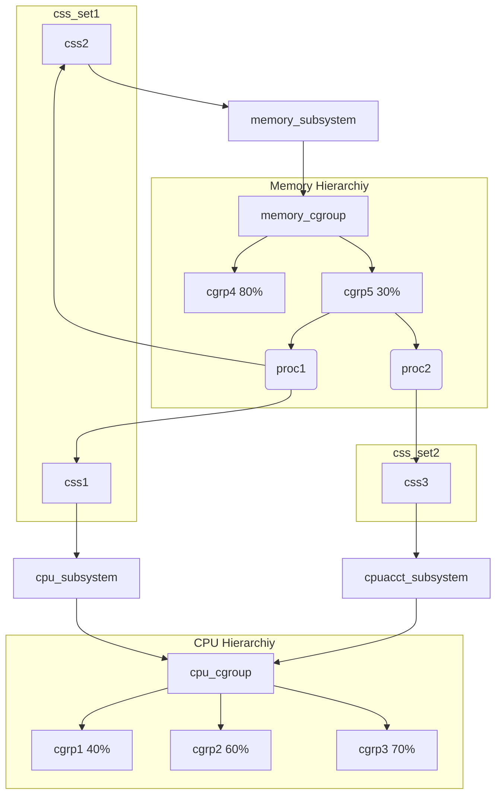

# 介绍

|属性|值|
|-|-|
|编号|CVE-2021-4154|
|版本|v5.13.4之前|
|目的|本地提权|

# 背景

## cgroup

> cgroup；control group

cgroup为系统中*运行的task*分配诸如CPU时间片、系统内存、网络带宽或这些资源的组合。用户可以监控配置的cgroup，禁止cgroup访问某些资源。
* cgroup将一组task与一个或多个*子系统*的参数关联起来。
  * 资源被定义成不同的*子系统*（如CPU子系统、Memory子系统）。
* cgroup采用*层次结构*划分资源，系统中每个task都属于层次结构的一个cgroup。
  * *层次结构*就是一组以树形态排列的cgroup。
  * 每个层次结构都对应一个*cgroup虚拟文件系统实例*。

cgroup_subsys_state(css)用于关联层次结构中cgroup和子系统，css_set将一组task绑定到cgroup。
* task可以隶属于多个cgroup，但是只能属于一个css_set。
* 由于进程可能共享资源，所以css_set可以包含多个进程。



> 上图中百分比表示该cgroup中资源利用占比的最大值。


用户级代码可以在cgroup虚拟文件系统实例中，按照名称创建和销毁cgroup、查询task的分配情况。
* 这些操作只会影响cgroup虚拟文件系统实例对应的层次结构。
* 通过fsopen()打开cgroup虚拟文件系统，fsconfig()对文件系统结构进行配置。

# 原理

fsconfig()低层调用[cgroup1_parse_param()](https://elixir.bootlin.com/linux/v5.13.3/source/kernel/cgroup/cgroup-v1.c#L905)。

```c
int cgroup1_parse_param(struct fs_context *fc, struct fs_parameter *param)
{
	struct cgroup_fs_context *ctx = cgroup_fc2context(fc);
	struct cgroup_subsys *ss;
	struct fs_parse_result result;
	int opt, i;

	opt = fs_parse(fc, cgroup1_fs_parameters, param, &result);
	if (opt == -ENOPARAM) {
		if (strcmp(param->key, "source") == 0) {
			if (fc->source)
				return invalf(fc, "Multiple sources not supported");
			fc->source = param->string;
			param->string = NULL;
			return 0;
		}
        ...
	}
    ...
	return 0;
}
```

在判断param->key的内容是否为"source"之后，cgroup v1默认"source"对应的param->type为fs_value_is_string，即union中使用string属性（char*）。
* 但param->type很有可能是fs_value_is_file，即union使用file属性（file*）。且没有进行类型检查，从而存在一个类型混淆的漏洞。
* param对应的结构体如下。

```c
struct fs_parameter {
	const char		*key;		/* Parameter name */
	enum fs_value_type	type:8;		/* The type of value here */
	union {
		char		*string;
		void		*blob;
		struct filename	*name;
		struct file	*file;
	};
	size_t	size;
	int	dirfd;
};
```

Linux官方给出一个漏洞利用案例：
```c
int fscontext_fd = fsopen("cgroup");
int fd_null = open("/dev/null", O_RDONLY);
int fsconfig(fscontext_fd, FSCONFIG_SET_FD, "source", fd_null);
close_range(3, ~0U, 0);
```

put_fs_context()将释放fc->source，从而释放param->file指向的file对象，即fd_null对应的文件被关闭。
* fd_null仍指向被释放后的内存区域，此时打开只读文件便可创建file对象覆盖fd_null指向的内存区域。

# 利用

[dirtycred exploit code](../../Literature/DirtyCred/exp/dirtycred.c)
1. 在trigger()函数释放uaf_fd指向的文件对象。
2. 线程1：重新打开uaf文件，向其写入大量数据，从而为后面替换file对象延长时间窗口。开始写之前，通知线程2。
3. 线程2：等待线程1通知，向uaf_fd写入恶意数据。得到线程1通知后，通知主线程，而自己需要等线程1写完后才开始写。
4. 主线程：等待线程2通知，循环打开/etc/passwd，当uaf_fd和当前fd指向同一块内存区域时，表明替换file对象成功。
5. 线程2等待线程1写完数据后，此时主线程已经完成file对象替换（uaf_fd指向/etc/passwd文件对象），再向uaf_fd写入数据。
