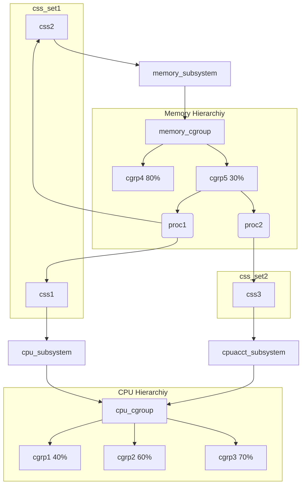

# 介绍

|属性|值|
|-|-|
|编号|CVE-2021-4154|
|版本|v5.13.4之前|
|目的|本地提权|

# 背景

## cgroup

> cgroup；control group

cgroup为系统中*运行的task*分配诸如CPU时间片、系统内存、网络带宽或这些资源的组合。用户可以监控配置的cgroup，禁止cgroup访问某些资源。
* cgroup将一组task与一个或多个*子系统*的参数关联起来。
  * 资源被定义成不同的*子系统*（如CPU子系统、Memory子系统）。
* cgroup采用*层次结构*划分资源，系统中每个task都属于层次结构的一个cgroup。
  * *层次结构*就是一组以树形态排列的cgroup。
  * 每个层次结构都对应一个*cgroup虚拟文件系统实例*。

> 用户级代码可以在cgroup虚拟文件系统实例中，按照名称创建和销毁cgroup、查询task的分配情况。
> 这些操作只会影响cgroup虚拟文件系统实例对应的层次结构。

cgroup_subsys_state(css)用于关联层次结构中cgroup和子系统，css_set将一组task绑定到cgroup。
* task可以隶属于多个cgroup，但是只能属于一个css_set。
* 由于进程可能共享资源，所以css_set可以包含多个进程。

> 上图中百分比表示该cgroup中资源利用占比的最大值。
