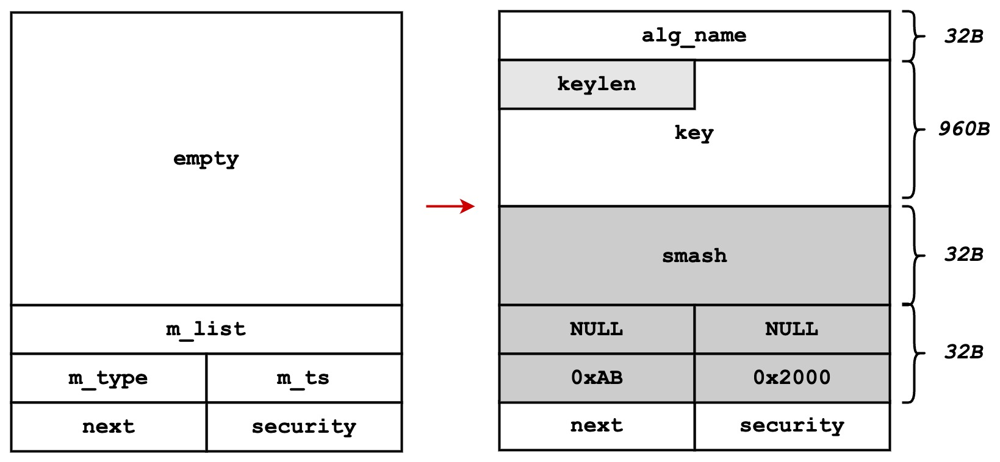
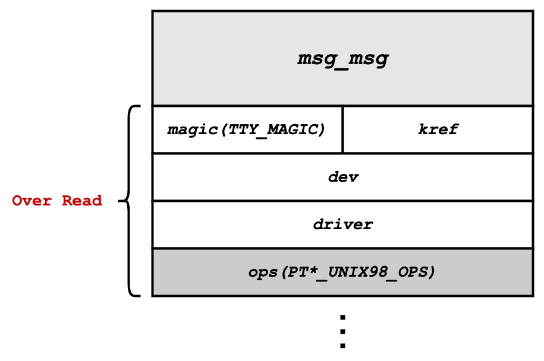

# 介绍

|属性|值|
|-|-|
|编号|CVE-2021-43267|
|版本|[v5.10, v5.15]|
|目的|OOB|
|参考|[Sentinel LABS](https://www.sentinelone.com/labs/tipc-remote-linux-kernel-heap-overflow-allows-arbitrary-code-execution/)、[haxxin](https://haxx.in/posts/pwning-tipc/)|

# 概述

在TIPC模块中发送密钥时，用于保存密钥的结构体tipc_aead_key缺乏对字符串长度的判定，导致长度可能大于分配的大小。在对密钥串进行拷贝的时候，就有可能发生OOB写。

# 原理

## 关键信息

保存密钥信息的结构体如下。

```c
struct tipc_aead_key {
    char alg_name[TIPC_AEAD_ALG_NAME];  //TIPC_AEAD_ALG_NAME=32
    unsigned int keylen;
    char key[];
};
```

## 漏洞点

该结构体的分配函数如下。

```c
/* Allocate memory for the key */
skey = kmalloc(size, GFP_ATOMIC);
/* Copy key from msg data */
skey->keylen = ntohl(*((__be32 *)(data + TIPC_AEAD_ALG_NAME)));
memcpy(skey->alg_name, data, TIPC_AEAD_ALG_NAME);
memcpy(skey->key, data + TIPC_AEAD_ALG_NAME + sizeof(__be32),
       skey->keylen);
```

变量size的大小（即分配的大小）等于有效载荷大小（即消息大小减去首部大小）。skey->keylen的值是直接读取内存区域获取的，可以被用户自定义。结合memcpy对skey->key缓冲区的覆盖，skey->keylen作为指定长度，故存在OOB写。

# 利用

利用方式参考[haxxin](https://haxx.in/posts/pwning-tipc/)。

首先成对分配结构体msg_msg到kmalloc-1k中，大概率使得前后msg_msg相邻。之后释放每对前一个msg_msg，形成内存洞。

此时大量分配tipc_aead_key到kmalloc-1k中，同时对关键字段进行覆盖。
* keylen=KEY_LEN+SMASH_LEN+MSG_HDR_LEN-16。刚好覆盖到msg_msg的next字段之前。
* key=ANY_CHAR+SMASH_CHAR+FAKE_HDR。FAKE_HDR将长度修改为0x2000。



在msg_msg结构体后面分配大量tty_struct，该结构体核心内容如下。

```c
struct tty_struct {
    int magic;
    struct kref kref;
    struct device *dev;
    struct tty_driver *driver;
    const struct tty_operations *ops;
    ...
}
```

其中包含指向内存固定位置的指针ops，以及固定值magic。读取前者可以计算出KASLR的基地址，后者可以用于检查是否分配成功（值为TTY_MAGIC时说明该内存被tty_struct占据）。

