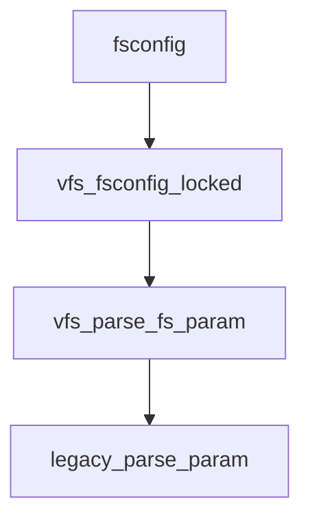
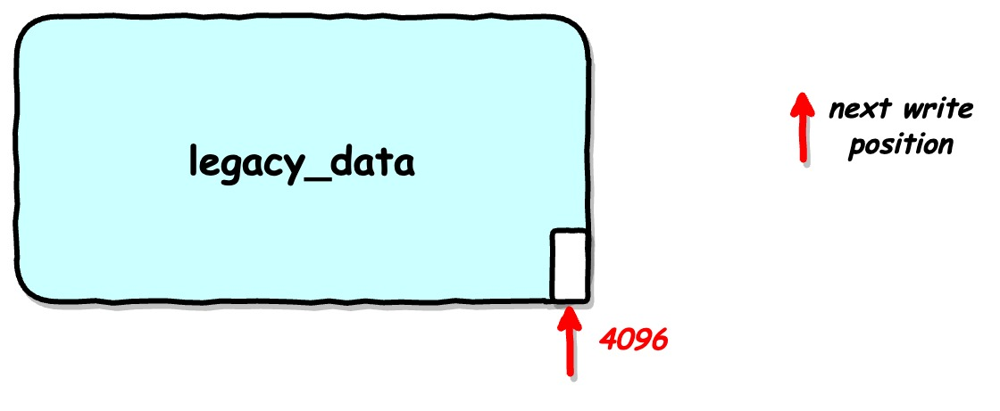
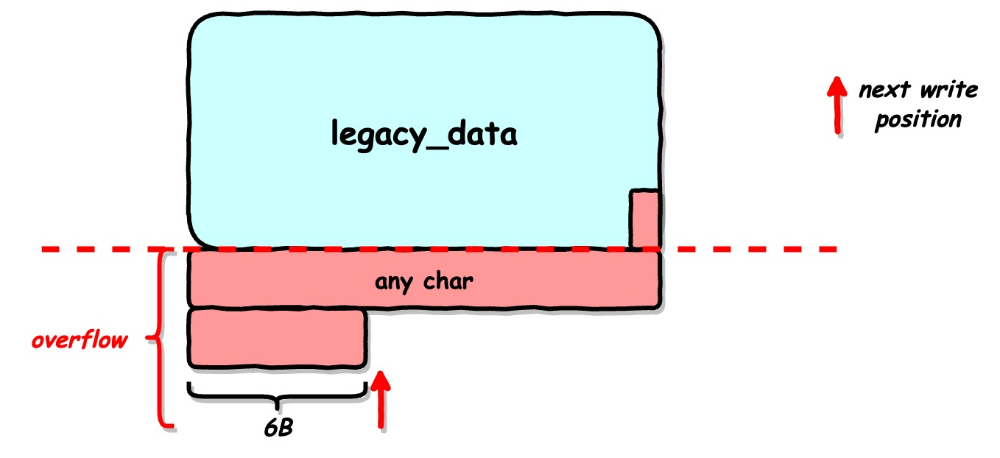
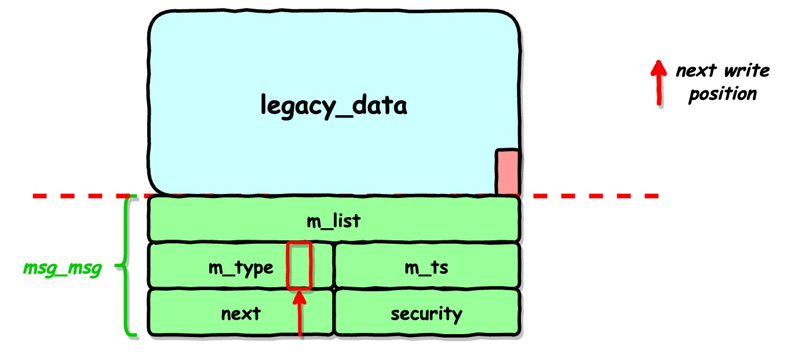
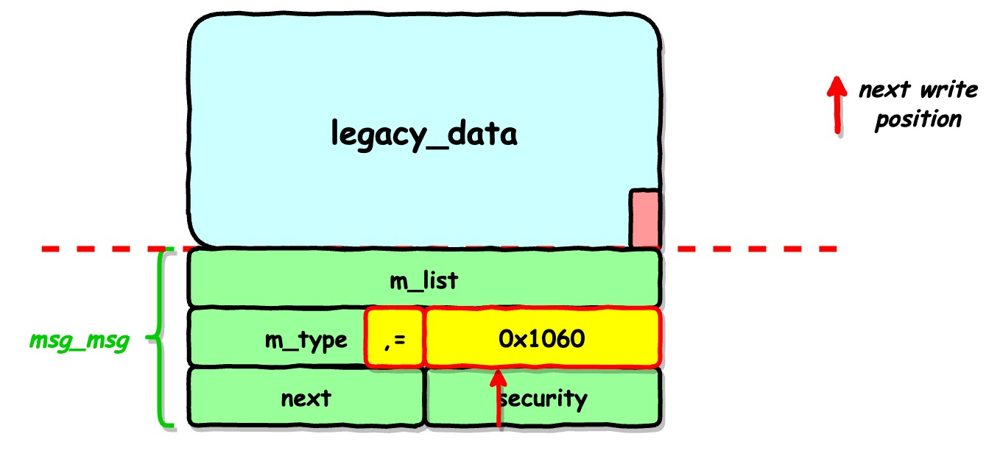
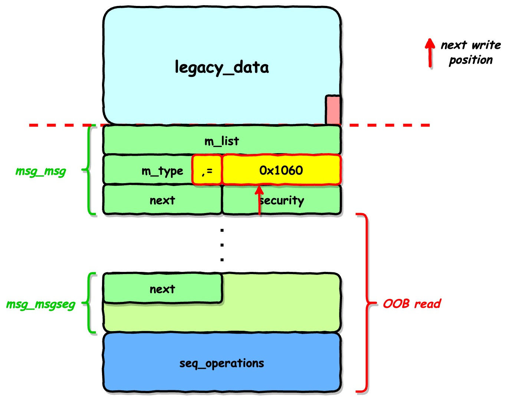
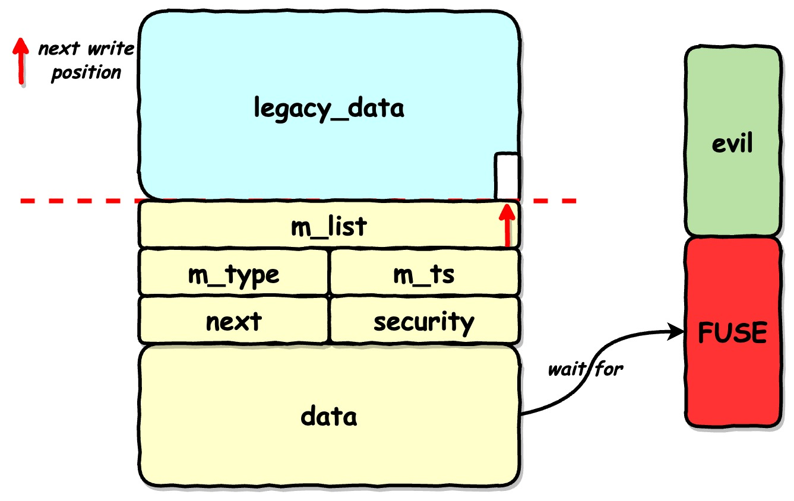
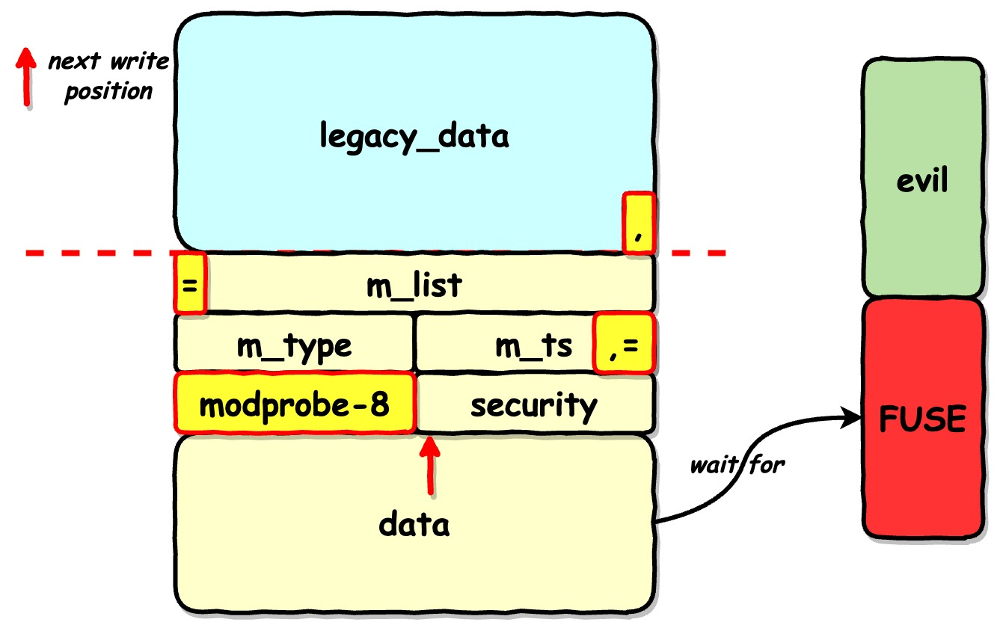

# 介绍

|属性|值|
|-|-|
|编号|CVE-2022-0185|
|版本|[v5.1-rc1, +∞]|
|目的|OOB|
|参考|[Will's Root](https://www.willsroot.io/2022/01/cve-2022-0185.html)|

# 概述

fsconfig的FSCONFIG_SET_STRING中，判断条件发生整数下溢，无法限制写入的数据长度，从而导致OOB。

# 原理

## 漏洞点

漏洞发生函数legacy_parse_param()的调用关系图如下。



legacy_parse_param()函数如下。

```c
static int legacy_parse_param(struct fs_context *fc, struct fs_parameter *param)
{
        struct legacy_fs_context *ctx = fc->fs_private;
        unsigned int size = ctx->data_size;
        size_t len = 0;
        int ret;

        ret = vfs_parse_fs_param_source(fc, param);
        if (ret != -ENOPARAM)
                return ret;

        if (ctx->param_type == LEGACY_FS_MONOLITHIC_PARAMS)
                return invalf(fc, "VFS: Legacy: Can't mix monolithic and individual options");

        switch (param->type) {
        case fs_value_is_string:
                len = 1 + param->size;
                fallthrough;
        case fs_value_is_flag:
                len += strlen(param->key);
                break;
        default:
                return invalf(fc, "VFS: Legacy: Parameter type for '%s' not supported",
                              param->key);
        }

        if (len > PAGE_SIZE - 2 - size)
                return invalf(fc, "VFS: Legacy: Cumulative options too large");
        if (strchr(param->key, ',') ||
            (param->type == fs_value_is_string &&
             memchr(param->string, ',', param->size)))
                return invalf(fc, "VFS: Legacy: Option '%s' contained comma",
                              param->key);
        if (!ctx->legacy_data) {
                ctx->legacy_data = kmalloc(PAGE_SIZE, GFP_KERNEL);
                if (!ctx->legacy_data)
                        return -ENOMEM;
        }

        ctx->legacy_data[size++] = ',';
        len = strlen(param->key);
        memcpy(ctx->legacy_data + size, param->key, len);
        size += len;
        if (param->type == fs_value_is_string) {
                ctx->legacy_data[size++] = '=';
                memcpy(ctx->legacy_data + size, param->string, param->size);
                size += param->size;
        }
        ctx->legacy_data[size] = '\0';
        ctx->data_size = size;
        ctx->param_type = LEGACY_FS_INDIVIDUAL_PARAMS;
        return 0;
}
```

在漏洞函数中，存在unsigned int变量下溢出，导致判断`if (len > PAGE_SIZE - 2 - size)`失效，len可以为很大的值。同时memcpy以len为拷贝单位，导致OOB。


# 利用

利用参考[Will's Root](https://www.willsroot.io/2022/01/cve-2022-0185.html)。

该漏洞需要CAP_SYS_ADMIN来触发，没有特权的用户可以使用unshare(CLONE_NEWNS|CLONE_NEWUSER)或者unshare -Urm命令使得子进程以CAP_SYS_ADMIN权限进入一个命名空间。

作者在本文中使用OOB漏洞覆盖msg_msg结构体完成KASLR基地址泄漏以及任意写完成提权。

>作者在[Wall of Perdition](https://syst3mfailure.io/wall-of-perdition)中提到了使用msg_msg结构体实现任意读和任意写。

该OOB漏洞所在函数的功能是配置legacy_data，使得legacy_data的格式为`key1=val1,key2=val2,key3=val3...`的格式。即在每次添加键值对时，会首先在legacy_data的基础上增加一个`,`，然后将传入的key和value解析为字符串并用`=`连接。所以每添加一个键值对实际上添加了`len(key)+len(val)+2`个字符。

作者通过重复添加键值对构造溢出条件：key为`\x00`，value为`A`*33，重复117次。此时legacy_data所在的4k页面中拥有`117*(33+2)=4095`个字节的数据，下一次添加键值对将从页面最后一个字节开始，其余部分将溢出到下一个4k页面。



## 泄漏KASLR基地址

基于上述内存布局，继续添加键值对以**调整下一次写入位置**：21个任意字符，加上`,=`一共23个字符。



此时发送大量大小为0xfe8的消息，使得msg_msg结构体覆盖到legacy_data所在页面对应的下一页面。根据msg_msg结构体的构造，
* 消息大小为0xfe8，这种情况下消息会被分为两部分：
  * 第一部分msg_msg首部(0x30)和大部分数据(0xfd)，被分配在kmalloc-4k。
  * 第二部分msg_msgseg首部(0x8)和小部分数据(0x8)，被分配在kmalloc-32。



继续添加键值对，构造key为`\x00`，val为`\x60\x10`。此时`,=`将会填入msg_msg结构体的m_type字段（不重要），m_ts字段低位将被写入1060（即修改后的长度为0x1060）。



使用大量seq_operations填充kmalloc-32，使其分布在消息的第二部分（即msg_msgseg）之后。由于消息长度被篡改，在回收消息的时候可以读取到seq_operations的内容。
* seq_operations全部由函数指针组成，通过读取到的函数地址可以计算出KASLR基地址。



## modprobe实现提权

作者首先在0x1337000的位置申请了4k的内存并使用之前的方式构造legacy_data。之后在0x1338000的位置注册FUSE文件系统，保证在读取[0x1338000, 0x1339000)的内存空间时发生page fault，从而让自定义的FUSE处理函数接管输入。

之后发送消息，使得消息的缓冲区位于0x1338000-8处，这样一来，发送消息时copy_from_user()企图读取[0x1338000, 0x1339000)范围内的内存，从而引发page fault。在作者给出的exp中，page fault的处理函数为evil_read()。
* copy_from_user()函数在load_msg()中查看详细细节。

此时，msg_msg结构体在内存中已完成分配，但是仍在等待copy_from_user()的数据。copy_from_user()在等待evil_read()返回的读取结果。



evil_read()阻塞等待线程覆盖msg_msg的next指针，该线程先添加新键值对：key为`\x00`，value为`A`*29。调整下一次写入的位置到next指针前2个字节。再添加新键值对：key为`\x00`，value为modprobe_path-8。保证next指向modprobe_path地址的前一个位置（这样才能保证写入消息时覆盖到modprobe_path）。
* 在获取了KASLR基地址之后，可以直接计算modprobe的地址：KASLR_base+offset。



线程覆盖结束后会唤醒evil_read()，evil_read()将构造好的恶意程序地址拷贝到读取内容中，从而导致在load_msg()时modprobe_path内容被覆盖。
