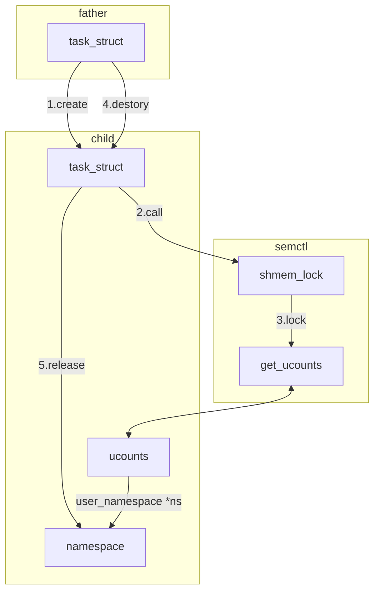

# 介绍

|属性|值|
|-|-|
|编号|CVE-2022-24122|
|版本|v5.14到v5.16.4|
|目的|UAF|

# 概述

> 该漏洞是**针对user_namespace对象的UAF漏洞**。

user_namespace对象和ucounts对象绑定，但是user_namespace对象缺少引用计数，导致user_namespace对象的生命周期可能比ucounts对象短。此时ucounts对象包含指向已经释放过的user_namespace指针，因此存在UAF漏洞。

# 背景

## 用户命名空间

[用户命名空间](https://github.com/CheUhxg/FuzzNote/blob/main/Background/comm.md#%E7%94%A8%E6%88%B7%E5%91%BD%E5%90%8D%E7%A9%BA%E9%97%B4)

# 原理

``` c
struct ucounts {
	struct hlist_node node;
	struct user_namespace *ns;
	kuid_t uid;
	atomic_t count;
	atomic_long_t ucount[UCOUNT_COUNTS];
};
```

方案"bubbles up"通过将用户命名空间绑定到ucounts对象上，从而限制对用户命名空间的更改。
1. 该用户命名空间的没有通过引用计数。
2. ucounts对象的生命周期与该用户命名空间不相关。
   * 假设ucounts对象比用户命名空间存活更久，此时ucounts对象的ns指针成为悬空指针。
   * 利用current_ucounts()并通过get_ucounts()中获取ucounts对象的指针，上述情况可能在shm（共享内存）和mqueue（消息队列）中发生。

```c
if (cmd == SHM_LOCK) {
    struct ucounts *ucounts = current_ucounts();

    err = shmem_lock(shm_file, 1, ucounts);
    if (!err && !(shp->shm_perm.mode & SHM_LOCKED)) {
        shp->shm_perm.mode |= SHM_LOCKED;
        shp->mlock_ucounts = ucounts;
    }
    goto out_unlock0;
}
```

shm摧毁时的UAF漏洞触发：
1. 创建一个新的shm段。
2. 派生一个子进程进入新的用户命名空间。
   * 子进程可以获得属于自己的ucounts，并且该ucounts对象将绑定到新的用户命名空间（通过alloc_ucounts()）。
3. 子进程调用semctl(SHM_LOCK)将它的ucounts对象绑定到shm对象上。
   * shmem_lock()调用user_shm_unlock()，后者调用get_ucounts()来获取ucounts对象的引用，这样一来ucounts对象就能比其所在命名空间存在更久。
4. 终止子进程导致它的task_struct、cred对象以及用户命名空间被销毁。
    * 这是由于没有对它们的引用了（但是指针还有引用），所以ucounts对象还会存活，因为它在shmem_lock()还有引用。
    * ucounts对象会包含一个悬空指针ns，指向已经被释放掉的用户命名空间。
5. 父进程摧毁shm段，导致shm_destory()调用shmem_lock()并传入依然存活的ucounts对象，进而导致user_shm_unlock()调用dec_rlimit_ucounts()以解引用一个悬空的ns指针。
    * 在dec_rlimit_ucounts()中，迭代的方式是访问ucounts对象的ns字段以获取下一个ucounts对象。**对ns对象的内容访问造成了UAF读漏洞**。



# 利用

参考[exp](https://github.com/meowmeowxw/CVE-2022-24122/blob/main/exploit.c)，[中文注释版](exp/cve_2022_24122.c)。
1. 创建共享内存段。
2. 创建子进程对共享内存段加锁。
   * 子进程的ucounts对象被共享内存段引用。
3. 给出两种触发UAF的方法。
   1. 创建两个进程创建大量消息队列写入消息，若消息队列的数量达到当前task消息队列上限，则调用put_ucounts()释放ucounts对象。
   2. 摧毁共享内存段，底层调用dec_rlimit_ucounts()释放ucounts对象。

