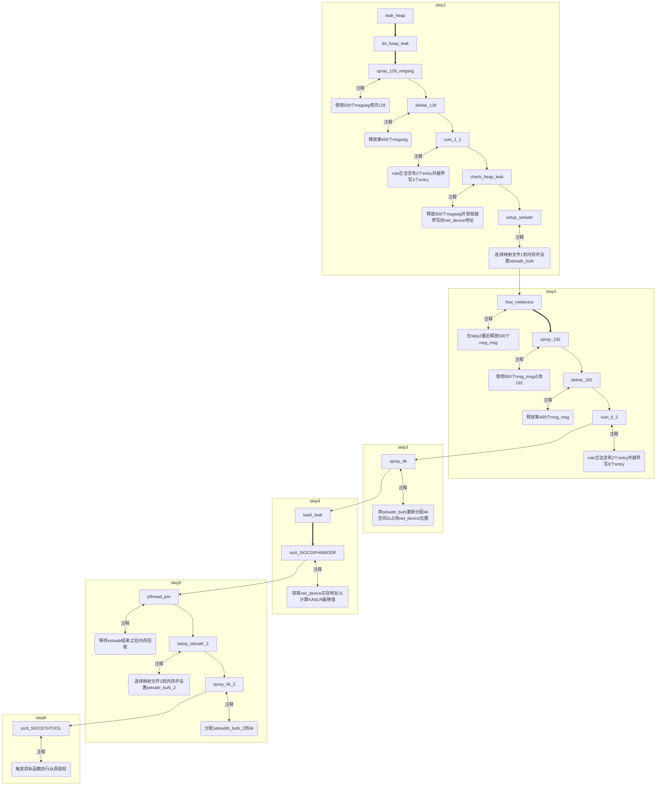

# 介绍

|属性|值|
|-|-|
|编号|CVE-2022-25636|
|版本|[v5.4, v5.6.10]|
|目的|OOB+UAF+DF|
|参考|[Nick Gregory](https://nickgregory.me/post/2022/03/12/cve-2022-25636/)、[Bonfee](https://bonfee.me/2022-03-17-cve-2022-25636/)|

# 概述

netfilter模块中分配的对象数量（少）和迭代访问的数量（多）不匹配，导致OOB写。

# 背景

## netfilter

netfilter是用于**数据包处理**的子组件。
* 支持数据包过滤、网络地址/端口转换（NA[P]T）、数据包日志记录、用户空间数据包队列和其他数据包处理。
* 如iptables和NAT server的实现。

# 原理

## 漏洞点

在函数[nft_fwd_dup_netdev_offload()](https://elixir.bootlin.com/linux/v5.16.11/source/net/netfilter/nf_dup_netdev.c#L67)中，以ctx->num_actions为下标访问flow->rule->action.entries动态数组时发生越界。
1. 以递增的ctx->num_actions为下标访问数组却**未进行边界检查**。
2. 下标ctx->num_actions和数组flow->rule->action.entries是两个完全不同的变量，没有明显的关联。

```c
int nft_fwd_dup_netdev_offload(struct nft_offload_ctx *ctx,
			       struct nft_flow_rule *flow,
			       enum flow_action_id id, int oif)
{
	struct flow_action_entry *entry;
	struct net_device *dev;

	/* nft_flow_rule_destroy() releases the reference on this device. */
	dev = dev_get_by_index(ctx->net, oif);
	if (!dev)
		return -EOPNOTSUPP;

	entry = &flow->rule->action.entries[ctx->num_actions++];
	entry->id = id;
	entry->dev = dev;

	return 0;
}
```

## 漏洞构造

为了确认这是个bug，需要明确三点：
1. action.entries数组长度是如何定义的？
2. 漏洞发生点nft_fwd_dup_netdev_offload()是如何被调用的？它的调用次数是由什么控制的？
3. ctx是何时被初始化的？如何被初始化的？

发现nft_fwd_dup_netdev_offload()是由一个叫做offload的处理函数调用的，这个offload是[nft_expr_ops](https://elixir.bootlin.com/linux/v5.16.11/C/ident/nft_expr_ops)的成员，而该成员在[nft_flow_rule_create()](https://elixir.bootlin.com/linux/v5.16.11/source/net/netfilter/nf_tables_offload.c#L125)中被调用。

```c
ctx = kzalloc(sizeof(struct nft_offload_ctx), GFP_KERNEL);

...

while (nft_expr_more(rule, expr)) {
  if (!expr->ops->offload) {
    err = -EOPNOTSUPP;
    goto err_out;
  }
  err = expr->ops->offload(ctx, flow, expr);
  if (err < 0)
    goto err_out;

  expr = nft_expr_next(expr);
}
```

从以上代码中我们可以发现：
1. nft_fwd_dup_netdev_offload在nft_flow_rule_create中被调用。
2. nft_fwd_dup_netdev_offload调用的次数取决于rule中expr的数量（参考[nft_expr_more()](https://elixir.bootlin.com/linux/v5.16.11/source/include/net/netfilter/nf_tables.h#L934)），没有其他的检查。
3. ctx在每次调用nft_flow_rule_create时被以全0初始化（num_actions为0），并将同一个ctx传给每一次nft_fwd_dup_netdev_offload调用。

```c
int num_actions = 0, err;

...

expr = nft_expr_first(rule);
while (nft_expr_more(rule, expr)) {
  if (expr->ops->offload_flags & NFT_OFFLOAD_F_ACTION)
    num_actions++;

  expr = nft_expr_next(expr);
}

...

flow = nft_flow_rule_alloc(num_actions);
```

从以上代码中可以看到，真正分配给flow的对象数量为num_actions。
* 该变量计算rule中expr->ops->offload_flags为NFT_OFFLOAD_F_ACTION的数量。
* 此时很明显的发现分配给flow的对象数量（数组长度）$\leq$调用nft_fwd_dup_netdev_offload的次数。

回顾之前提到的：每次调用nft_fwd_dup_netdev_offload时，ctx->num_actions会加1。
* 由于调用nft_fwd_dup_netdev_offload的次数不少于数组长度，所以有可能发生OOB写（在nft_fwd_dup_netdev_offload最后对越界对象的id和dev字段执行了写）。

# 利用

```c
entry = &flow->rule->action.entries[ctx->num_actions++];
entry->id = id;
entry->dev = dev;
```

上面提到这个bug提供了2处OOB写：
1. 第一处是*在数组末尾之后立即*向enum flow_action_id写入4或者5（取决于是fwd还是dup）对应的枚举值。
2. 第二处是*在数组末尾之后的第24个字节处*写入结构体net_device指针。

在内核v5.13中，[flow_rule](https://elixir.bootlin.com/linux/v5.16.11/source/include/net/flow_offload.h#L384)结构体大小为32字节，每个entry的大小为80字节。
* 没有entry时，rule大小为32字节，将在kmalloc-32 slab中被分配。
* 有1个entry时，rule大小为112字节，将在kmalloc-128 slab中被分配。
* 有2个entry时，rule大小为192字节，将在kmalloc-192 slab中被分配。
* 以此类推...

针对dev指针的写操作，上述的分配大小意味着写操作将在下一个32-或192-slab分配的偏移量24处（32-和192-刚好能放下flow_rule，相当于0加上偏移量24）进行，或者在下一个128-slab分配的偏移量8（放下112字节后128-slab中还剩下16字节，加上偏移量24，相当于24-16=8）处进行。
* 如果在规则中设置dup，则可以进行**多次写**。

## Nickgregory

作者Nickgregory的漏洞利用路径如下：
* 喷射大量System V的消息队列消息，导致内核分配大量大小可控的msg_msg结构体。从现在开始，我们关心在kmalloc-128上的分配。
* 释放一部分上述结构体。
* 添加netlink规则，使得flow_rule被如愿的分配到刚刚释放过的堆内存点上。
* 进行3次OOB写（netlink规则中包含3个dup，没有immediate），破坏
  * 下一条message的list_head.prev指针，偏移量为8。
  * 下一条message的一些随机的数据，偏移量为8+80=88。
  * 下面第二条message的security指针（**重点**），偏移量为88+80-128=40。
* msgrcv接收下面第二条message，导致内核调用kfree()释放net_device。
* 分配更多的message，但这次是在kmalloc-4k slab，为了落到net_device（在kmalloc-4k中分配）刚刚的位置。
* 让内核触发net_device.netdev_ops指针指向的操作，提供代码执行功能。
  * 作者选择了读取/proc/net/dev，这会导致netdev_ops->ndo_get_stats64被调用。

## Bonfee

Bonfee给出了[泄露KASLR的方案](https://github.com/Bonfee/CVE-2022-25636)。

### 泄露net_device地址

使用*msg_msg结构体*完成泄漏，使得msg_msgseg结构体在flow_rule之后。
* 设置flow_rule包含1个entry，使得flow_rule在kmalloc-128中被分配。
* flow_rule被OOB写之后，net_device指针会被写入msg_msgseg的消息体中。
* OOB之后，接收所有堆喷的消息就可以获得net_device的指针，从而计算出KASLR。

```bash
     ---------------------------------------------------
0x00 |                       |                         |  <- rule
0x10 |                       |                         |
0x20 |         | id (acc dup)|                         |
0x30 |                       |   *dev (acc dup)        |
0x40 |                       |                         |
0x50 |                       |                         |
0x60 |                       |                         |
0x70 |         | id (oob 1)  |                         |
     ---------------------------------------------------
0x00 |         *next         |   *dev (oob 1)          |  <- msg_msgseg
0x10 |                       |                         |
0x20 |                       |                         |
0x30 |                       |                         |
0x40 |                       |                         |
0x50 |                       |                         |
0x60 |                       |                         |
0x70 |                       |                         |
     ---------------------------------------------------
```

### 泄漏函数指针

> 类似Nick Gregory的利用方法，这里更加详细。

泄露KASLR可以通过覆盖net_device结构体来制造一个UAF。
* 在OOB时使用net_device指针覆盖msg_msg.security指针，之后在msg_msg释放的过程中，msg_msg.security将被释放。
* 之后喷射kmalloc-4k来重新占用net_device所在的内存点。
  * 但是由于net_device结构体总是需要被访问前0x30字节的内容，所以重新分配的对象需要**严格控制大小和布局**，这里选择**使用setxattr**来堆喷而不是msg_msg。
  * setxattr通常和userfaulted结合使用，这里用FUSE代替，[FUSE技术参考](https://www.willsroot.io/2022/01/cve-2022-0185.html)。

```c
// msgrcv() -> free_msg() -> security_msg_msg_free()

void security_msg_msg_free(struct msg_msg *msg) {
	...
	kfree(msg->security);
	...
}
```

net_device拥有一个unsigned char *dev_addr域，用于存储网络设备的mac地址，被unsigned char addr_len域指定长度。
* 在dev_get_mac_address中，dev_addr的内容被拷贝到sockaddr.sa_data中。
* 设置dev_addr指针指向需要泄露的数据位置，就可以实现任意地址读。

```c
int dev_get_mac_address(struct sockaddr *sa, struct net *net, char *dev_name)
{
	...
	struct net_device *dev;
	...

	dev = dev_get_by_name_rcu(net, dev_name);
	
	...

	if (!dev->addr_len)
		memset(sa->sa_data, 0, size);
	else
		memcpy(sa->sa_data, dev->dev_addr, min_t(size_t, size, dev->addr_len)); // <--- arb read

	...
}
```

> dev_get_mac_address调用栈：
> 
> ioctl(SIOCGIFHWADDR)->dev_ioctl->dev_get_mac_address

由于重新分配之后net_device中所有有用的*_ops指针被覆盖了，但是当不处于同一个网络命名空间时，会分配新的net_device。所以新的想法如下：
1. 使用CLONE_NEWNET标志clone()一个子进程，并且泄漏子进程的net_device指针pchild。
2. 在父进程中泄漏net_device指针pparent。
3. 释放父进程的net_device对象，重新分配对象覆盖它原来的位置，并将pparent覆盖到pchild（pchild指向的net_device保持不变，因此包含很多*_ops指针）。
4. 在父进程调用ioctl(SIOCGIFHWADDR)从而泄漏KASLR。
   * 这里选择的是net_device.netdev_ops，其指向loopback_ops。

### RIP控制

拥有内核地址后，覆盖net_device->ethtool_ops->begin并调用SIOCETHTOOL ioctl触发begin函数以劫持rip。

```bash
      ---------------------------------------------------
0x000 |    dev.name = "lo"    |                         |  <- net_device
0x010 |                       |                         |  <--|
0x020 |                       |                         |     | Pivoted stack
0x030 |                       |                         |     |
0x040 |                       |                         |     |
0x050 |                       |                         |  <--|
0x060 |                       |                         |
0x070 |                       |                         |
...
0x420 |  dev.ethtool_ops ptr  |  ethtool_ops.begin      |  <- stack pivot gadget
...
      ---------------------------------------------------
```

### 总结

1. 创建一个拥有新网络命名空间的子进程。
2. 在子进程中，泄漏net_device指针。
3. 在父进程中，泄漏net_device指针。
4. 释放父进程中的net_device对象。
5. 重新分配并使用子进程的net_device指针覆盖net_device.dev_addr指针。
6. 通过ioctl读取net_device.dev_addr泄漏KASLR。
7. 再次释放父进程的net_device。
8. 重新分配并在堆顶存储一个转换后的栈，同时使用栈转换代码覆盖一个函数指针。
9. 调用该代码，执行栈转换并提权。

### exp流程

