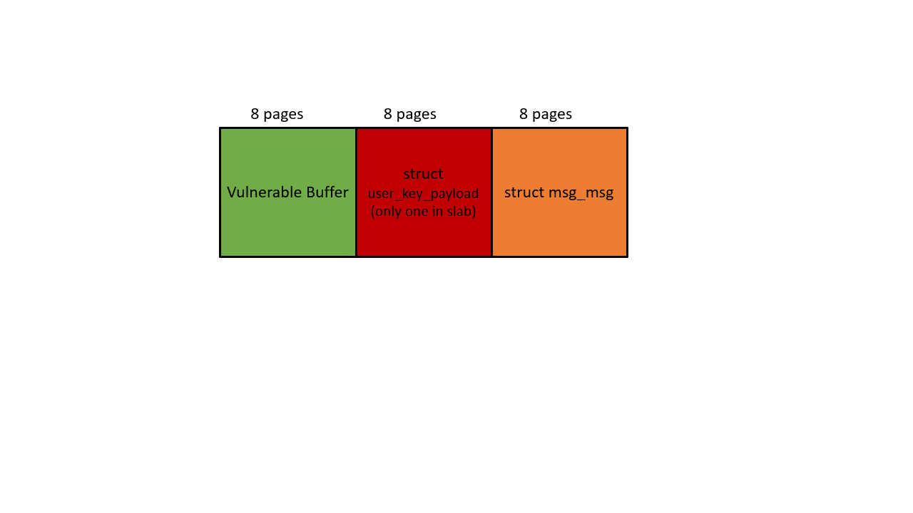
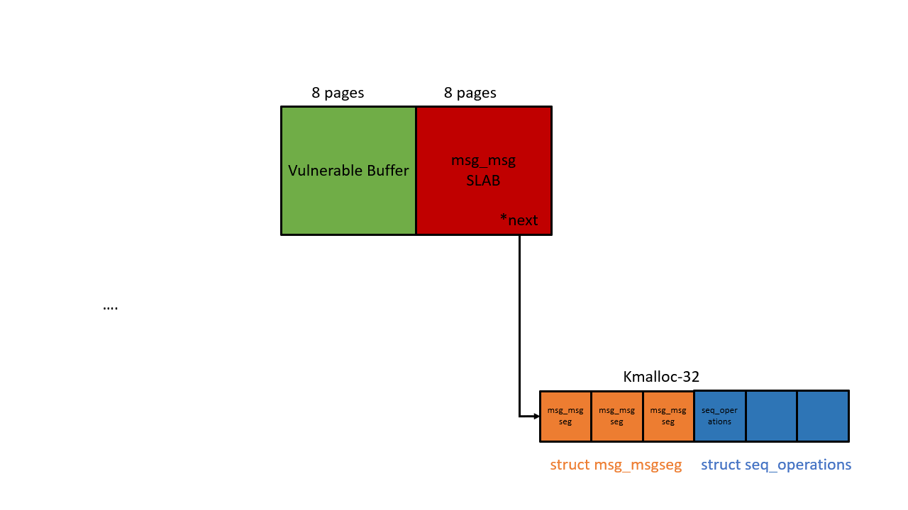

# 介绍

|属性|值|
|-|-|
|编号|CVE-2022-27666|
|版本|v5.17-rc8之前|
|目的|OOB|
|引用|[ETenal](https://etenal.me/archives/1825)|

# 概述

ESP6协议申请接收缓冲区的大小默认为8页，但是发送的数据可以大于8页，所以可以造成OOB写。

# 背景

Linux的*页面分配器*在内核中负责管理物理页面。
* 页面分配器在如SLUB、SLAB、SLOB这些*内存分配器*之后管理内存。
  * 比如内存分配器kmalloc-4k的所有slab都被消耗完了，**该内存分配器将向页面分配器请求一个新的slab**。
* 页面分配器使用free_area来保存释放的页面。
  * free_area是个保存order的数组。
  * 每个order对应一个free_list。
    * 页面从free_list中分配和回收，所以内存页**不保证连续**。
* 不同的内核slab在free_list消耗完时请求不同大小的页面。下面以Ubuntu21.10为例。
  * kmalloc-256请求order-0的页面。
  * kmalloc-512请求order-1的页面。
  * kmalloc-4k请求order-3的页面。

> order是用来区分页面大小的。
> 
> order-N页面的大小为PAGE_SIZE << N，故order-3就是8个页面大小。

如果低order的free_list被消耗完了，它将向高order的借页面。
* 高order的低地址部分被送去相应请求，高地址部分送给低order。


如果有多的释放的内存页，页面分配器将合并相同order的页面并送给高order。


# 原理

## 页面分配器

ESP6调用esp6_output_head()来分配接收缓冲区大小。
* 底层调用skb_page_frag_refill()，在该函数中，**始终分配8页大小的内存**，与实际申请内存大小无关。

```c
bool skb_page_frag_refill(unsigned int sz, struct page_frag *pfrag, gfp_t gfp)
{
        if (pfrag->offset + sz <= pfrag->size)
		return true;
	...
	if (SKB_FRAG_PAGE_ORDER &&
	    !static_branch_unlikely(&net_high_order_alloc_disable_key)) {

		pfrag->page = alloc_pages((gfp & ~__GFP_DIRECT_RECLAIM) |
					  __GFP_COMP | __GFP_NOWARN |
					  __GFP_NORETRY,
					  SKB_FRAG_PAGE_ORDER);
		...
	}
	...
	return false;
}
```

如果发送的数据大小大于8页，则在null_skcipher_crypt()函数发生OOB。
* 调用memcpy()时传入发送数据的长度，该值大于接收缓冲区的大小。

```c
static int null_skcipher_crypt(struct skcipher_request *req)
{
	struct skcipher_walk walk;
	int err;

	err = skcipher_walk_virt(&walk, req, false);

	while (walk.nbytes) {
		if (walk.src.virt.addr != walk.dst.virt.addr)
			// out-of-bounds write
			memcpy(walk.dst.virt.addr, walk.src.virt.addr,
			       walk.nbytes);
		err = skcipher_walk_done(&walk, 0);
	}

	return err;
}
```

# 利用

## 堆布局

由于相同order对应free_list中的内存页不一定连续，所以需要对堆内存进行布局。

首先需要保证一个free_list中的内存页连续。
* 步骤：放空目标order对应的free_list中的内存页，致使目标order向更高order借内存页。
* 一旦它从更高order中借用页面，连续两次分配将分割更高order的页面，此时页面是连续的内存块。

### 降低干扰

> 官方给的示例中，对order-3进行堆梳理。

由于内核daemon程序会使用低order的内存页，从而打乱高order的内存页。这里给出降低干扰的步骤。
1. 放空order-0、1、2的free_list。
2. 分配大量order-2大小的对象，设为N个。此时order-2会向order-3借内存页。
3. 释放第2步中每个对象的一半，保留另一半。这样将创建N/2个对象回到order-2的free_list。
   * **只有当这部分页面找到相邻的页面时**，会回到order-3，否则会一直呆在order-2。
4. 释放第1步中的所有对象。

> 该方法避免order-2向order-3借用/合并内存页。

### 选择对象

由于ESP6协议会在tail字段追加一些数据，导致挑选的结构体最后的字段会被覆盖。

```c
static inline void esp_output_fill_trailer(u8 *tail, int tfclen, int plen, __u8 proto)
{
	/* Fill padding... */
	if (tfclen) {
		memset(tail, 0, tfclen);
		tail += tfclen;
	}
	do {
		int i;
		for (i = 0; i < plen - 2; i++)
			tail[i] = i + 1;
	} while (0);
	tail[plen - 2] = plen - 2;
	tail[plen - 1] = proto;
}
```

最后选择了结构体user_key_payload，因为它最后的字段是个数组。
* rcu：可以直接设置为NULL。
* datalen：设置为计划覆盖的大小。
* data[]：用于接受esp_output_fill_trailer()覆盖的数据。

```c
struct user_key_payload {
	struct rcu_head	rcu;		/* RCU destructor */
	unsigned short	datalen;	/* length of this data */
	char		data[] __aligned(__alignof__(u64)); /* actual data */
};
```

由于Ubuntu用户最大能申请的内存大小为20000，所以设置user_key_payload的大小为2049（最少需要4k的空间）。
* 为了填满一个slab需要2049*8=16392字节，此时仅剩下20000-16392=3608字节可以申请，即1个user_key_payload结构体。


上述布局最多影响2个slab，为了解决这个问题，作者重新将9个user_key_payload对象放在9个连续的slab中。
* 由于free_list分配的随机性，每个user_key_payload在slab中的位置上随机的。
* 这样一来就能为堆布局创建9个slab，而不是2个了。且只要有slab的布局是在正确的位置就可以成功。


## 如何读

最简单的方法是放置一个具有函数指针的对象在user_key_payload旁边，这样就可以通过**计算符号文件中函数指针和它所在地址的差值**来泄露KASLR偏移量。

同时选择结构体msg_msg中*正确的*next指针作为泄露对象。
* 如果next指针是有效的，就可以覆盖m_ts字段并替换next指针。
* 覆盖时不需要担心对security的影响，因为它在Ubuntu中没有被使用。

### 第一阶段：从结构体msg_msg中泄漏有效的next指针

首先使用初始化OOB写来覆盖user_key_payload的datalen字段，然后通过读被破坏了的user_key_payload的内容实现OOB读。

```c
struct seq_operations {
	void * (*start) (struct seq_file *m, loff_t *pos);
	void (*stop) (struct seq_file *m, void *v);
	void * (*next) (struct seq_file *m, void *v, loff_t *pos);
	int (*show) (struct seq_file *m, void *v);
};

/* one msg_msg structure for each message */
struct msg_msg {
	struct list_head m_list;
	long m_type;
	size_t m_ts;		/* message text size */
	struct msg_msgseg *next;
	void *security;
	/* the actual message follows immediately */
};

struct msg_msgseg {
	struct msg_msgseg *next;
	/* the next part of the message follows immediately */
};
```

目标是读msg_msg的next指针，所以需要准备大量的seq_operations结构体和msg_msgseg结构体。应该让这两个结构体落到kmalloc-32，所以msg的大小限制为[4056, 4072]字节。
* 因为只有4096-48（msg_msg的大小）放在msg主体中，剩下的部分放在next指针指向的位置。
* 为了保证next指针指向kmalloc-32分配的内存，需要保证msg_msgseg的数据不超过32-8（msg_msgseg的大小）并且不小于16-8（否则就落到kmalloc-16了）。



> 黑箭头代表OOB写，橙箭头代表OOB读。

构造9组堆布局，只要有一组成功（如上图布局），就能获取msg_msg中有效的next指针。


### 第二阶段：泄漏KASLR偏移量

获取有效的next指针之后，需要创建*另一个*堆布局来泄漏KASLR偏移量。

首先使用OOB写覆盖msg_msg的m_ts字段和next指针，从而通过next读取（被安排在msg_msgseg之后的）seq_operations的函数指针。



### 总结

第一阶段
1. 分配大量8页大小的内存以耗尽order-3的free_list。order-3则会向高order借页面，这样使得页面是连续的。
2. 分配3个连续的8页大的无关对象。
3. 释放第二个无关对象，分配一个8页大的slab，其中包含1个user_key_payload和7个其他对象。
4. 释放第三个无关对象，分配一个8页大的slab，其由一个msg_msg充满。其中msg的大小在[4056, 4072]这个范围内，以保证next指向内容在kmalloc-32的区域。
5. 分配大量seq_operations，这些结构体将和第四步的msg_msgseg在同一个slab。
6. 释放第一个无关对象，分配漏洞缓冲区并开始OOB写，修改user_key_payload的datalen字段。
7. 如果第6步成功了，检索user_key_payload的内容将导致OOB读，从而获得msg_msg的next指针。
8. 如果第7步成功了，则成功拥有了有效的next指针。

第二阶段
1. 分配2个连续的、8页大小的无关对象。
2. 释放第二个无关对象，分配一个充满msg_msg的slab。
3. 释放第一个无关对象，分配有漏洞的缓冲区，覆盖msg_msg的m_ts字段为更大的值和覆盖next指针为第一阶段获得的指针。
4. 如果第3步成功了，就可以在kmalloc-32上进行OOB读了。这样就有可能读到seq_operations中的函数指针了，然后计算KASLR的偏移量。

## 提权

一旦获取了KASLR的偏移量，就能实现msg_msg的任意写。

在[load_msg()](https://elixir.bootlin.com/linux/v5.13-rc5/source/ipc/msgutil.c#L84)中，在第一次调用copy_from_user()之前挂起，然后改变next指针，再唤醒进程，接着调用copy_from_user()则会实现任意写。

```c
struct msg_msg *load_msg(const void __user *src, size_t len)
{

	...
	// hang the process at the first copy_from_user
	// modify the msg->next and resume the process
	if (copy_from_user(msg + 1, src, alen))
		goto out_err;

	// msg->next has been changed to an arbitrary memory
	for (seg = msg->next; seg != NULL; seg = seg->next) {
		len -= alen;
		src = (char __user *)src + alen;
		alen = min(len, DATALEN_SEG);

		// Now an arbitrary write happens
		if (copy_from_user(seg + 1, src, alen))
			goto out_err;
	}

	...
}
```

**挂起进程**可以采用FUSE实现（参考DirtyCred）：在copy_from_user()之前挂起进程，等待next指针被修改之后唤醒。


使用任意写覆盖modprobe的路径。
* modprobe是一个加载内核模块的用户空间程序。
  * 每当内核加载一个程序时，它就对用户空间执行一次向上调用，并以root的身份运行modprobe来加载目标模块。
  * modprobe的路径被内核硬编码在了一个全局变量modprobe_path中。
* 同样使用上述任意写的方法，将msg_msg的next指针指向modprobe_path，并通过msg溢出的部分覆盖modprobe_path。


作者的提权步骤：
1. 分配2个连续的、8页大的无关对象。
2. 映射消息内容到FUSE并释放第二个无关对象，分配一个8页大的、充满msg_msg的slab。线程将会在这步暂停。
3. 释放第一个无关对象，分配有漏洞的对象，替换next指针为modprobe_path变量的地址。
4. 释放在第2步中挂起的线程，向modprobe_path变量写入/tmp/get_rooot。
5. 通过运行未知的格式化文件触发modprobe。
6. 打开/bin/bash，发现已经是root权限。