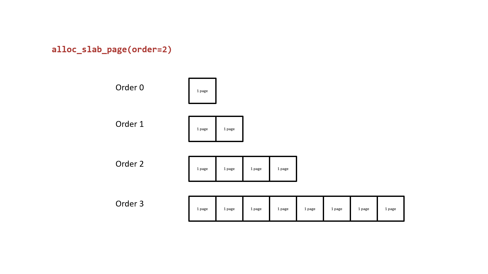
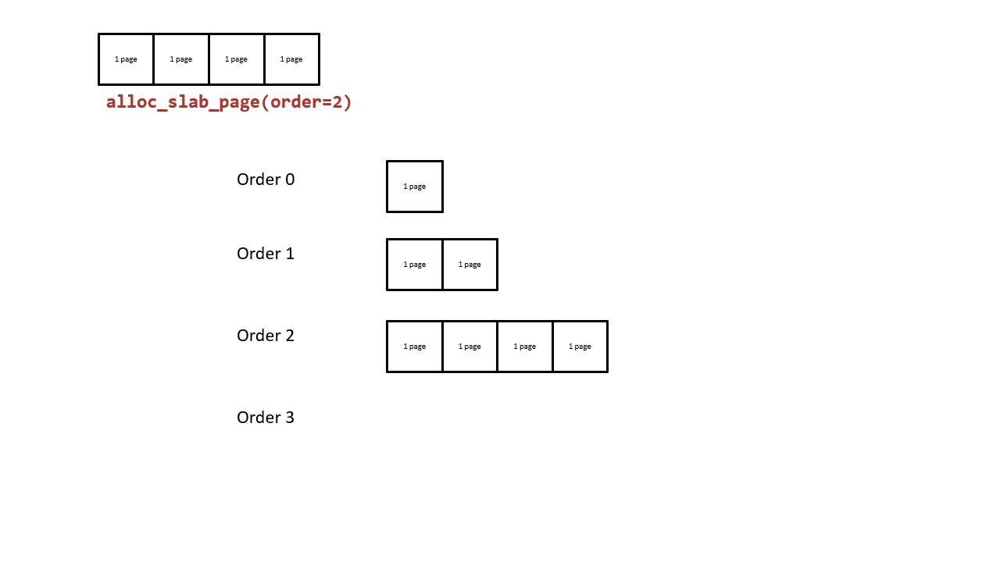
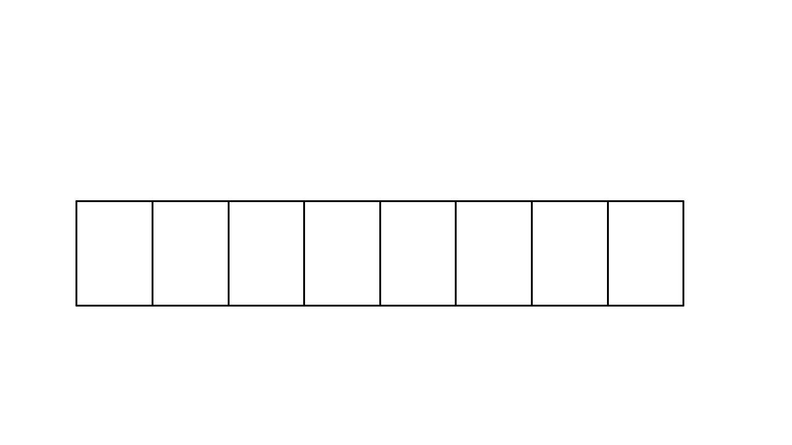

# 介绍

|属性|值|
|-|-|
|编号|CVE-2022-27666|
|版本|v5.17-rc8之前|
|目的|OOB|
|参考|[官方](https://etenal.me/archives/1825)|

# 概述

ESP6协议申请接收缓冲区的大小默认为8页，但是发送的数据可以大于8页，所以可以造成OOB写。

# 背景

Linux的*页面分配器*在内核中负责管理物理页面。
* 页面分配器在如SLUB、SLAB、SLOB这些*内存分配器*之后管理内存。
  * 比如内存分配器kmalloc-4k的所有slab都被消耗完了，**该内存分配器将向页面分配器请求一个新的slab**。
* 页面分配器使用free_area来保存释放的页面。
  * free_area是个保存order的数组。
  * 每个order对应一个free_list。
    * 页面从free_list中分配和回收，所以内存页**不保证连续**。
* 不同的内核slab在free_list消耗完时请求不同大小的页面。下面以Ubuntu21.10为例。
  * kmalloc-256请求order-0的页面。
  * kmalloc-512请求order-1的页面。
  * kmalloc-4k请求order-3的页面。

> order是用来区分页面大小的。
> 
> order-N页面的大小为PAGE_SIZE << N，故order-N就是8个页面大小。

如果低order的free_list被消耗完了，它将向高order的借页面。
* 高order的低地址部分被送去相应请求，高地址部分送给低order。



如果有多的释放的内存页，页面分配器将合并相同order的页面并送给高order。



# 原理

## 页面分配器

ESP6调用esp6_output_head()来分配接收缓冲区大小。
* 底层调用skb_page_frag_refill()，在该函数中，**始终分配8页大小的内存**，与实际申请内存大小无关。

```c
bool skb_page_frag_refill(unsigned int sz, struct page_frag *pfrag, gfp_t gfp)
{
        if (pfrag->offset + sz <= pfrag->size)
		return true;
	...
	if (SKB_FRAG_PAGE_ORDER &&
	    !static_branch_unlikely(&net_high_order_alloc_disable_key)) {

		pfrag->page = alloc_pages((gfp & ~__GFP_DIRECT_RECLAIM) |
					  __GFP_COMP | __GFP_NOWARN |
					  __GFP_NORETRY,
					  SKB_FRAG_PAGE_ORDER);
		...
	}
	...
	return false;
}
```

如果发送的数据大小大于8页，则在null_skcipher_crypt()函数发生OOB。
* 调用memcpy()时传入发送数据的长度，该值大于接收缓冲区的大小。

```c
static int null_skcipher_crypt(struct skcipher_request *req)
{
	struct skcipher_walk walk;
	int err;

	err = skcipher_walk_virt(&walk, req, false);

	while (walk.nbytes) {
		if (walk.src.virt.addr != walk.dst.virt.addr)
			// out-of-bounds write
			memcpy(walk.dst.virt.addr, walk.src.virt.addr,
			       walk.nbytes);
		err = skcipher_walk_done(&walk, 0);
	}

	return err;
}
```

# 利用

## 堆布局

由于相同order对应free_list中的内存页不一定连续，所以需要对堆内存进行布局。

首先需要保证一个free_list中的内存页连续。
* 步骤：放空目标order对应的free_list中的内存页，致使目标order向更高order借内存页。
* 一旦它从更高order中借用页面，连续两次分配将分割更高order的页面，此时页面是连续的内存块。

### 降低干扰

> 官方给的示例中，对order-3进行堆梳理。

由于内核daemon程序会使用低order的内存页，从而打乱高order的内存页。这里给出降低干扰的步骤。
1. 放空order-0、1、2的free_list。
2. 分配大量order-2大小的对象，设为N个。此时order-2会向order-3借内存页。
3. 释放第2步中每个对象的一半，保留另一半。这样将创建N/2个对象回到order-2的free_list。
   * **只有当这部分页面找到相邻的页面时**，会回到order-3，否则会一直呆在order-2。
4. 释放第1步中的所有对象。

> 该方法避免order-2向order-3借用/合并内存页。

### 选择对象

由于ESP6协议会在tail字段追加一些数据，导致挑选的结构体最后的字段会被覆盖。

```c
static inline void esp_output_fill_trailer(u8 *tail, int tfclen, int plen, __u8 proto)
{
	/* Fill padding... */
	if (tfclen) {
		memset(tail, 0, tfclen);
		tail += tfclen;
	}
	do {
		int i;
		for (i = 0; i < plen - 2; i++)
			tail[i] = i + 1;
	} while (0);
	tail[plen - 2] = plen - 2;
	tail[plen - 1] = proto;
}
```

最后选择了结构体user_key_payload，因为它最后的字段是个数组。
* rcu：可以直接设置为NULL。
* datalen：设置为计划覆盖的大小。
* data[]：用于接受esp_output_fill_trailer()覆盖的数据。

```c
struct user_key_payload {
	struct rcu_head	rcu;		/* RCU destructor */
	unsigned short	datalen;	/* length of this data */
	char		data[] __aligned(__alignof__(u64)); /* actual data */
};
```

由于Ubuntu用户最大能申请的内存大小为20000，所以设置user_key_payload的大小为2049（最少需要4k的空间）。
* 为了填满一个slab需要2049*8=16392字节，此时仅剩下20000-16392=3608字节可以申请，即1个user_key_payload结构体。



上述布局最多影响2个slab，为了解决这个问题，作者重新将9个user_key_payload对象放在9个连续的slab中。
* 由于free_list分配的随机性，每个user_key_payload在slab中的位置上随机的。
* 这样一来就能为堆布局创建9个slab，而不是2个了。且只要有slab的布局是在正确的位置就可以成功。


