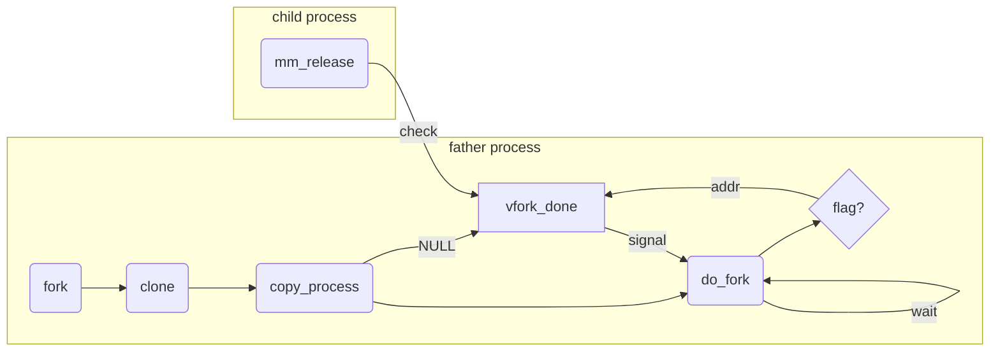

# 第三章 进程管理

## 进程

进程就是处于执行期的程序。
* 进程=代码段+数据段+打开的文件+挂起的信号+内核内部数据+处理器状态+具有内存映射的内存地址空间+线程。

线程是进程中活动的对象。
* 每个线程都有一个独立的程序计数器、进程栈和一组进程寄存器。
* Linux的线程实现中**不区分线程和进程**，将线程视为特殊的进程。

进程提供两种虚拟机制。
* 虚拟处理器：让进程认为自己独占处理器。
* 虚拟内存：让进程认为自己拥有整个系统的所有内存资源。

> 线程之间可以共享虚拟内存，但是虚拟处理器独立。

Linux系统使用fork()派生新进程。
* fork()返回两次：分别回到父进程和子进程。
* fork()实际上是由clone()系统调用完成的。

一个进程退出后进入**僵死状态**，直到其父进程调用wait()或waitpid()。

## 进程描述符

内核将进程的列表放在**任务队列**中。
* 任务队列是一个**双向循环链表**，链表节点的类型是task_struct，被称作进程描述符。
* task_struct在linux/sched.h中被定义，包含了**内核管理一个进程所需的所有信息**。

### 分配进程描述符

Linux使用**slab分配器**分配task_struct结构。
* 这是为了达到**对象复用**和**缓存着色**的目的。
* slab分配器动态生成task_struct，即**在内核栈的尾端自高向低创建一个新的thread_info结构体**，其中会包括进程描述符的地址。

### 进程描述符的存放

内核通过一个唯一的PID来标识每个进程。
* PID是一个数，类型为pid_t（实际上就是int），默认最大值为32768。
* PID放在各自的进程描述符中。
* 最大值可以通过/proc/sys/kernel/pid_max来修改。

内核访问任务需要获得指向其task_struct的指针。
* 内核通过current宏查找当前运行进程的进程描述符，所以这个过程的速度很重要。
  * 有的体系结构可以给出专门的寄存器来存放进程描述符的指针。
  * x86寄存器不够，只能通过偏移间接计算task_struct结构的地址。

### 进程状态

进程描述符中的state字段表示了进程当前的状态。
* TASK_RUNNING（运行）——进程在等待执行或者正在执行中。
  * 用户空间中的进程只有这一种状态。
* TASK_INTERRUPTIBLE（可中断）——进程正在阻塞中。
  * 进程获得所需条件后，内核会将其状态设置为TASK_RUNNING。
  * 同时进程接收到信号被唤醒。
* TASK_UNINTERRUPTIBLE（不可中断）——大致同TASK_INTERRUPTIBLE。
  * 区别在于，该状态接收到信号也不会被唤醒。
  * 常用于*等待不受干扰*和*等待条件很快发生*的情况。
* __TASK_TRACED（跟踪）——被其他进程跟踪。
  * 例如：ptrace跟踪对应进程。
* __TASK_STOPPED（停止）——进程已停止执行。
  * 进程无法再重新投入运行。
  * 通常是接收到了SIGSTOP、SIGTSTP、SIGTTIN、SIGTTOU信号，或者是在调试期间接受到任何信号。

### 设置当前进程状态

使用`set_task_state(task, state)`函数。
* 该函数将task的状态设置为state。
* 在SMP系统中，必要的时候，该函数会设置**内存屏障**来强制其他处理器**重新排序**。
* `set_current_state(state)`雷同。

> 函数在linux/sched.h中。

### 进程上下文

可执行程序代码从可执行文件中**载入到进程的地址空间**，这个过程一般在**用户空间**执行。

程序执行了系统调用/触发了异常时，进程会陷入内核空间。
* 此时，内核**代替进程执行**并**处于进程上下文中**，在此上下文中current宏是有效的（除非被调度了）。
* 内核退出时，程序会在用户空间恢复执行。

### 进程家族树

所有进程都是PID为1的init进程后代。
* 内核**在系统启动的最后阶段**启动init进程。
* init进程读取系统的初始化脚本(initscript)并执行其他相关程序。
* init进程的进程描述符是静态分配的，称作init_task。

每个进程都必有一个父进程。
* 进程的子进程通过children的子进程链表管理。
* 进程的父进程通过parent指针记录。

## 进程创建

Unix将派生分为了两部分。
* fork()通过**拷贝当前进程创建一个子进程**。父子进程的区别在于PID、PPID、某些资源和统计量（比如挂起的信号）。
* exec()负责**读取可执行文件并将其载入地址空间开始运行**。

### 写时拷贝

Linux的fork()使用**写时拷贝**，写时拷贝可以推迟甚至免除拷贝数据。
* 内核不复制整个进程地址空间，而是让父进程和子进程共享同一个拷贝。
* 只有在需要写入时，数据才会被复制。在写入之前，都是以只读的方式共享资源。
* 这样一来，fork()的开销只有复制父进程的页表和创建新的进程描述符给子进程。

### fork()

Linux使用clone()系统调用来实现fork()。
* clone()通过参数标志来指明父子进程需要共享的资源，
* fork()、vfork()、__clone()都是根据特定的参数标志来调用clone()。
* clone()底层调用do_fork()。

do_fork()完成创建的大部分工作。
* 定义在kernel/fork.c。
* 该函数调用copy_process()，然后让进程开始运行。

copy_process()完成了如下工作：
* 调用dup_task_struct()创建一个内核栈+thread_info+task_struct。
  * 这些内容的值和父进程的内容相同=>父子进程描述符相同。
* 检查当前用户所拥有的进程数是否超过限制。
* 子进程重置进程描述符中的部分字段，使其与父进程区别开来。
* 设置子进程的状态为TASK_UNINTERRUPTIBLE，保证不会被投入运行。
* 调用copy_flags()更新task_struct中的flags字段为PF_FORKNOEXEC。
  * 表示该进程还没有调用过exec()。
  * 之前的标志为PF_SUPERPRIV，表示拥有超级用户权限。
* 调用alloc_pid()获取一个有效的PID。
* 解析传递给clone()的参数标志。
* 做扫尾工作并返回一个子进程的指针。

copy_process()结束后回到do_fork()。
* 若copy_process()执行成功，则新创建的子进程被唤醒并投入运行。
* 内核有意选择子进程先运行。
  * 因为子进程一般会马上调用exec()，这样可以避免写时拷贝的额外开销。
  * 父进程先执行的话，可能会开始向地址空间写入。

TODO：为什么子进程先运行？
TODO：扫尾工作是什么？

### vfork()

vfork()和fork()区别在于：**vfork()不拷贝父进程的页表**。
* 子进程作为父进程的一个**单独的线程**在父进程的地址空间运行。
* 父进程会被阻塞，直到子进程退出或执行exec()。
* 子进程无法向地址空间写入。

> exec()调用失败会导致父进程持续阻塞，所以尽量不要调用vfork()。

vfork()底层向clone()传递一个特殊标志位。
* 调用copy_process()时，task_struct的vfork_done成员被设置为NULL。
* 在do_fork()时，如果指定了特殊标志，则vfork_done会指向一个特定地址。
* 子进程开始执行后，父进程**等待**子进程通过vfork_done指针向它发送信号。
* 函数mm_release()让进程退出内存地址空间，并检查vfork_done是否为NULL，若不为NULL，则向父进程发出信号。
* 回到do_fork()，父进程醒来并返回。



## 线程在Linux中的实现

线程机制提供了**在同一程序中共享地址空间运行**的一组线程。
* 这些线程可以共享打开的文件和其他资源。
* 线程机制支持并发程序设计技术，在多处理器系统上可以完成真正的并行处理。

内核并没有线程这个概念。
* Linux**把所有线程都当作进程来实现**。
* 线程被视为和其他进程共享资源的进程。
* 每个线程都有自己唯一的task_struct。

> 其他系统中都是实现了专门的线程机制——轻量级线程。

### 创建线程

线程创建类似于进程创建，不过在调用clone()时**需要传递一些参数标志来指明需要共享的资源**。

```C
//创建线程
clone(CLONE_VM | CLONE_FS | CLONE_FILES | CLONE_SIGHAND, 0)

//实现fork()
clone(SIGCHLD， 0)

//实现vfork()
clone(CLONE_VFORK | CLONE_VM | SIGCHLD, 0)
```

> [查看clone()标志位](https://man7.org/linux/man-pages/man2/clone.2.html)

### 内核线程

内核通过内核线程完成后台任务。
* 内核线程是独立运行在内核空间的标准进程。
* 内核线程不会切换到用户空间，所以只会被内核线程创建（通过kthreadd内核进程衍生）。
  * 创建内核线程的方法是`kthread_create()`
* 内核线程**没有独立的地址空间**，即指向地址空间的mm指针被设置为NULL。
* 内核线程可以被调度和抢占。

```C
struct task_struct *kthread_create(int (*threadfn)(void *data), //需要执行的函数
void *data, //传给threadfn的参数
const char namefmt[], //进程的名称
...
)
```

刚创建的进程处于不可运行状态，需要调用`wake_up_process()`来唤醒。
* 创建并且运行内核线程通过`kthread_run()`实现。
  * 传入参数同`kthread_create()`，故本身是由宏实现的。

内核线程的退出有两种方式。
* 自身do_exit()退出。
* 内核其他部分调用kthread_stop()指定task_struct地址退出。

