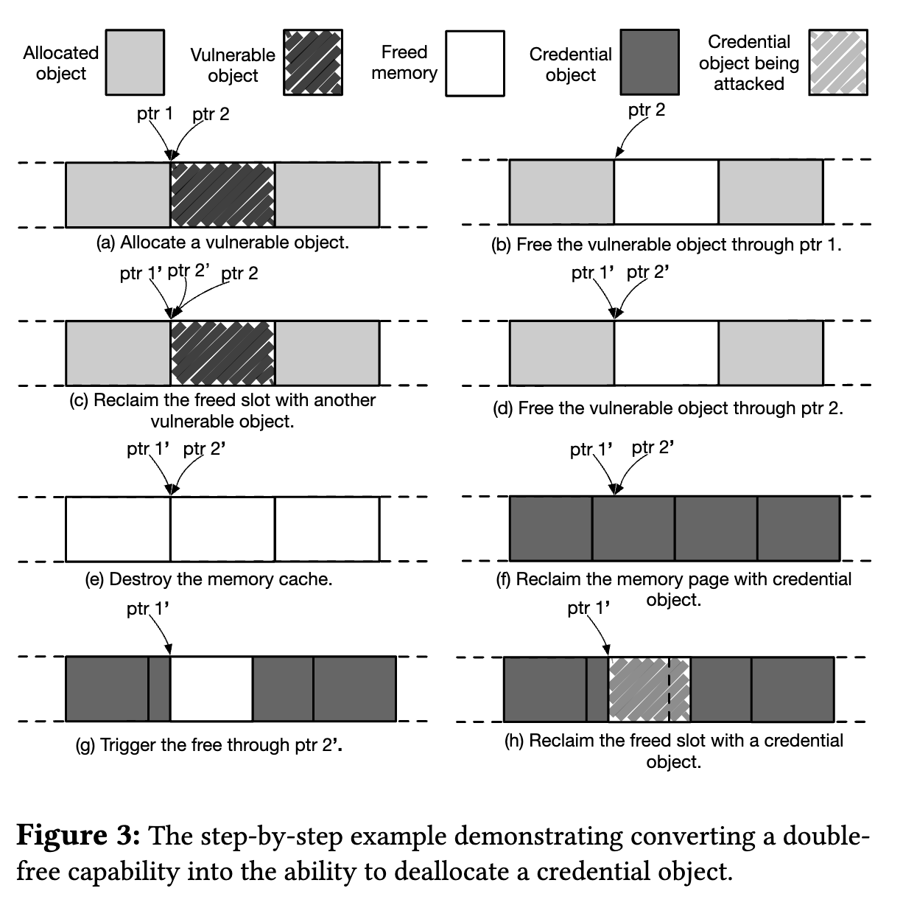

# 简介

DirtyCred是利用一些原始内核漏洞实现和DirtyPipe相同的效果。
* DirtyCred的利用方式不依赖于Linux的管道机制，而是利用**堆内存破坏漏洞**。
  * 堆内存破坏漏洞需要**将低权限的证书对象替换成高权限的**。
* Linux内核会误认为非特权用户拥有高权限对象的操作许可。

DirtyCred的*特性*：
1. 是一个通用的漏洞利用方式，可以基于任意堆漏洞提权。
2. 很好的迁移性。
3. 能很有效的绕过漏洞防御。
4. 可以实现Android提权和容器逃逸。

# 背景

## Linux内核中的证书

[证书](https://www.kernel.org/doc/html/latest/security/credentials.html)指向一些包含权限信息的内核属性。
* 内核通过这些属性检查用户的访问权限。
* 证书作为<u>带有权限信息的内核对象</u>被实现。
* 这里只使用了**cred对象**和**file对象**。
  * inode对象只有在创建新文件时才会被分配==>不够灵活。

所有task都包含一个cred对象指针。
* cred对象包含的*UID域*，表明task权限。
  * GLOBAL_ROOT_UID：管理员权限。
* cred对象包含的*cap值*，表明task的细粒度权限。
  * CAP_NET_BIND_SERVICE：绑定套接字到因特网域特权端口的能力。
* cred对象遵循**copy-and-replace**的原则。

每个文件都带着它所有者的UID、GID、其他用户的访问权限和cap。
* 可执行文件的**SUID/SGID标志**，表明允许其他用户以所有者的权限运行。
* 每个文件都与一个链接着证书的inode对象绑定。
* 当一个task打开一个文件时，首先检查inode记录的权限；文件被打开后，内核**将证书从inode对象上脱钩并链接到file对象上**。
  * **通过file对象可以索引到cred对象**从而检查权限。

> struct task_struct和struct file都包含const struct cred*域。

## 内存管理

内核使用缓存来维护相同大小的内存。
* 每个缓存中，内核会分配内存页并划分为相同大小的内存块，每个内存块是寄放对象的内存槽。
* 缓存中内存页用完之后，内核会分配新的内存页；如果内核页上的对象都被释放，内核会回收该内存页并分配给其他缓存。

内核中主要有2种缓存。
* **通用缓存**
  * 如果分配请求没有明确分配内存的缓存种类，则默认在通用缓存中分配。
  * 属于相同通用缓存的分配，它们可能共享内存地址。
* **专用缓存**
  * 为一些频繁使用的对象专门分配缓存。
  * 专用缓存与通用缓存是隔离开的。

# 技术挑战

## 例子

> CVE-2021-4154是由于一个类型混淆错误，即对象的源字段fs_context错误地引用文件对象。

1. 以可写模式打开一个文件，然后将内容写入文件。写入之前检查文件的写权限，检查结束后暂停一段时间。
2. DirtyCred触发fs_context对象的释放点来解分配文件对象，使得文件对象位置成为*释放过的内存点*。
3. DirtyCred在*释放过的内存点*分配一个只读文件（重要文件）的文件对象。
4. DirtyCred继续第1步中暂停的写入操作，内容实际被写入到只读文件中。

## 难点

DirtyCred的*技术难点*：
1. 需要将普通漏洞[转换](#转换漏洞能力)为对证书对象的交换。
2. 需要为证书对象的交换[延长](#延长时间窗口)时间窗口。
3. 需要让非特权用户能[主动分配](#分配特权对象)特权的证书对象。

针对技术难点的*解决方案*：
1. 提供一系列漏洞转换方案。
2. 利用三个内核特性延长时间窗口。
3. 利用多个内核机制派生高权限线程。

# 转换漏洞能力

## OOB&UAF

假设存在一个能够在缓存覆盖数据的OOB漏洞或者UAF漏洞。
1. DirtyCred找到分配在相同缓存并且包含证书对象指针的对象。
2. DirtyCred利用堆操作在将发生覆写的区域分配对象。
   * 若是OOB漏洞，则保证被攻击对象在有漏洞的对象之后。
3. DirtyCred修改被攻击对象包含的指针，使其指向另一个证书对象。
4. 内核可以正常释放指针新指向的对象，指针成为悬空指针。
5. DirtyCred用高权限的证书对象占据释放后的内存点。

## DF

转换DF的功能为交换特权对象。
1. DirtyCred在漏洞发生的缓存中分配很多对象，保留一个有漏洞的对象。
   * 确保缓存充满了新分配的对象。
   * 有两个指针指向有漏洞的对象。
2. DirtyCred利用第一个指针解分配有漏洞的对象。
3. DirtyCred重新分配有漏洞的对象到释放过的内存点。
   * 此时有3个指针指向该有漏洞的对象。
4. DirtyCred解分配新分配的有漏洞的对象和缓存中的其他对象。
   * 缓存中没有对象，立即被回收。
5. 内核将在回收的页面上创建新的缓存用来存储证书对象。
6. DirtyCred使用其中一个指针解分配证书对象，这将空出一个证书对象大小的内存点。
7. DirtyCred分配一个新证书对象到释放过的内存点。
   * 保留的指针指向新的证书对象。

# 延长时间窗口

## Userfaultfd&FUSE

Userfaultfd：某个线程触发Page Fault之后立即陷入睡眠，由其他线程接管该Page Fault。

> 内核v5.11之后，userfaultfd需要特权启动。

FUSE：允许用户实现自己的文件系统，并在其中注册handler，以处理文件操作请求。这样就能实现在实际文件操作之前暂停内核执行。

DirtyCred调用系统调用writev。
* writev使用结构体iovec将数据从用户空间传递到内核空间。
* 为了复制包含在iovec中的数据，内核需要首先将iovec导入内核空间。
* DirtyCred利用userfaultfd特性，在完成权限检查后立即暂停内核执行，从而赢得足够的时间来交换文件对象。

> 上述方法内核v4.13之前可用，接下来介绍新的方法。

为了保证性能和兼容性，在写操作之前，内核会为iovec中包含的用户空间数据触发一个页面错误。
* DirtyCred在iov_iter_fault_in_readable判断时，使用userfaultfd特性暂停内核执行。

## 文件系统锁

文件系统不允许两个进程同时写入一个文件，并使用文件系统锁来实现。
* DirtyCred生成两个进程同时在一个文件上写入数据。
  * 让一个进程写很长时间，此时另一个进程已经完成权限检查了，需要等待前一个进程写完才能继续写。

# 分配特权对象

## 用户空间分配

当二进制文件具有SUID权限时，任意用户都可以像由所有者执行一样执行。
* 低权限用户执行该文件时，会生成root进程，内核会为此分配特权cred对象。

以ReadOnly方式打开特权文件也是分配特权对象的一种。

## 内核空间分配

当Linux内核启动新的内核线程时，它会复制当前的运行进程。
* 内核相应地将拷贝过的cred对象分配到内核堆上，大多数内核线程都有一个特权cred对象，故复制的cred对象也具有高权限。

分配高权限证书对象有两个方法：
1. 与内核代码片段交互，从而触发内核在内部生成特权线程。
   * **为内核工作队列创建工作线程**可以用于生成内核线程。
   * 向工作队列提交更多工作时，内核将动态创建工作线程，每个工作线程都是一个内核线程。
2. 调用用户模式助手。
   * 用户模式助手是一种**允许内核创建用户模式进程**的机制。
   * 用户模式助手API以高特权模式执行modprobe，从而获得高特权证书对象。

# 防御

DirtyCred的*防御方式*：
* 在非重叠内存区域分别管理高/低权限对象。
  * 非重叠区域使用的是**虚拟内存**。
  * vmalloc存储高权限对象，kmalloc存储低权限对象。