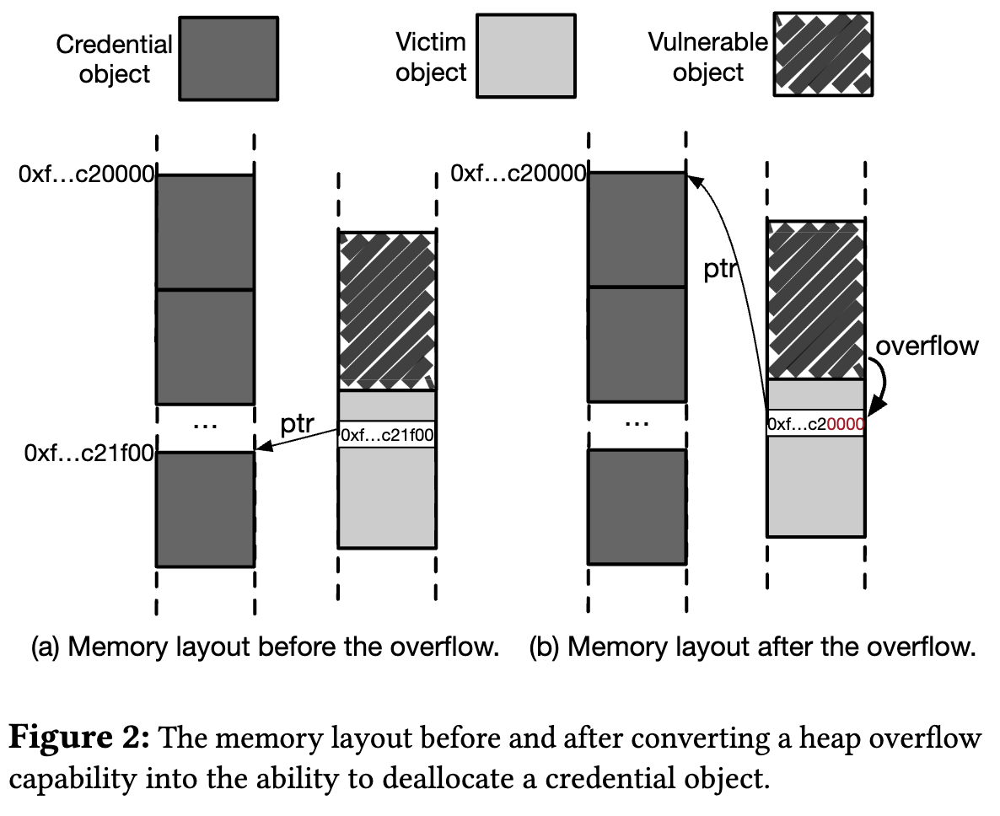

# DirtyCred：逐步提升Linux内核权限

## 摘要

内核漏洞DirtyPipe被报道称在Linux5.8以来的几乎所有版本都出现了。使用该漏洞，一个恶意行为可以在不触发已有的内核保护机制和漏洞缓解机制的情况下，实现逐步提升权限，使得该漏洞格外地令人不安。然而，DirtyPipe的成功很大程度上依赖于这个漏洞的功能——它通过Linux pipe注入数据到任意的文件中。这样一种功能在其他的内核漏洞中是很少见的，使得防御相对容易。只要Linux用户去除该漏洞，系统就能变得相对安全。

这项工作提出了一个新的利用方式——DirtyCred，它将其他的Linux内核漏洞推到DirtyPipe的层面(TODO:level)。从技术上说，给定一个Linux内核漏洞，我们的利用方式会交换非特权和特权的证书(TODO:credentials)并因此提供<u>具有和DirtyPipe类似可利用性</u>的漏洞。通过这个可利用性，一个恶意行为则能够获得提升权限的功能，甚至从容器中逃逸。我们通过24个实际内核漏洞，在一个完全防护的Linux系统上评估了这个利用。我们发现DirtyCred能够在16个漏洞中体现可利用性，说明了DirtyCred的重要性。随着可利用性的评估，这项工作进一步提出一个新的内核防范机制。不像已有的Linux内核防范，我们新的防范机制<u>基于他们自己的权限</u> <u>在不重叠的内存区域</u>隔离了内核证书对象(TODO:credential objects)。我们的实验结果显示出：新的防范机制主要引入了可忽略不计的开销。

## 关键词

操作系统安全；内核漏洞利用；权限提升

## 一、介绍

如今，Linux已经成为黑客喜爱的目标，因为Linux广泛应用于移动设备、云设施和web服务器。为了使Linux更加安全，内核开发者和安全专家引入了多种内核保护机制和漏洞利用缓解技术（比如KASLR和CFI），使得内核漏洞利用史无前例的困难。为了成功实现一个漏洞利用的目标，本文的恶意行为必须通过<u>漏洞禁用相应防护和缓解机制的功能</u>来鉴别强力的内核漏洞。

然而，一个最近的漏洞[CVE-2022-0847](https://cve.mitre.org/cgi-bin/cvename.cgi?name=CVE-2022-0847)和它的利用方法正受到网络安全社区的高度重视。由于它的恶意行为和影响，它被标记了一个昵称——DirtyPipe。不像那些没有标记名称的内核漏洞，DirtyPipe的漏洞利用能够<u>不禁用内核保护和漏洞缓解机制</u>实现提权。这个特性导致已有的Linux防范机制失效并且因此导致许多Linux内核驱动的系统变得危险起来（比如安卓设备）。

虽然DirtyPipe功能强大，但它的漏洞利用和它的漏洞功能（例如，滥用Linux内核管道机制向任意文件注入数据）密切相关。对于其他的Linux内核漏洞来说，滥用管道的功能是几乎不被提供的。结果导致，Linux社区和设备制造商（如谷歌）的做法是迅速发行针对内核故障的补丁，从而消除攻击面(attack surface)。如果没有这个攻击面，这个漏洞利用对抗一个完全防御的Linux内核依然是困难的。对于其他的内核漏洞来说，想要造成和DirtyPipe一样的安全影响还是困难的。

> attack surface是指一系列漏洞点、向量和攻击方法的综合。

在这项工作中，我们呈现一个新颖的、通用的漏洞利用方式，通过它，即使是原始内核漏洞也能实现和DirtyPipe相同的漏洞利用目标。从技术的角度上看，我们的漏洞利用方式和DirtyPipe是不同的，它既不依赖于Linux的管道机制，也不依赖于CVE-2022-0847的漏洞特点。相反，它利用了一个堆内存破坏漏洞，将一个低权限的内核证书对象替换成高权限。这种方法使得Linux内核误以为<u>一个非特权的用户能够获得操纵高权限文件或进程的许可</u>。因此，我们使用DirtyCred命名这个漏洞利用方式。

为了执行漏洞利用，DirtyCred需要处理三个关键的技术难点。首先，它需要将漏洞的功能转化为<u>一个有效的证书对象交换</u>，因为不同类型的漏洞提供不同的内存破坏功能，第一眼看起来可能对于一个证书对象交换是不充分的。第二，DirtyCred需要严格控制启动对象交换的时间窗口(TODO:time window)。我们会在第三部分讲到，给到DirtyCred的有效时间窗口是很短的。如果没有一个实际的机制去延长时间窗口的话，漏洞利用将变得不稳定。第三，DirtyCred需要找到一个有效的机制——允许非特权用户以主动的方式分配特权的证书。因为如果没有这个功能，将导致凭据对象交换失效。

为了解决以上的技术难点，我们首先介绍一系列漏洞转化方案，以允许我们将基于堆的漏洞转换为<u>以无效方式释放证书对象的功能</u>。第二，我们充分利用三个不同的内核特性——[userfaultfd](https://www.kernel.org/doc/html/latest/admin-guide/mm/userfaultfd.html)/[FUSE](https://www.kernel.org/doc/html/latest/filesystems/fuse.html)/文件系统锁，以此延长对象交换所需的时间窗口并使得漏洞利用稳定下来.最后，我们利用多种内核机制在用户空间和内核空间派生高权限线程，从而主动分配高权限对象。在这项工作中，我们通过使用24个实际内核漏洞来评估DirtyCred的漏洞利用。我们惊奇的发现，DirtyCred能在16个漏洞和容器逃逸中实现提权。我们分享新提出的漏洞利用方式到Google Vulnerability Rewards Program([kCTF VRP](https://security.googleblog.com/2022/02/roses-are-red-violets-are-blue-giving.html))并且收到了他们的确认和奖励。

根据强有力的演示证明和有效防范机制的缺乏，我们相信，如果Linux社区不立即采取措施并且部署新的防范机制的话，DiryCred不久之后将成为Linux的巨大威胁。根据我们新的漏洞利用方法，我们进一步的提出了一个新的Linux内核防范机制。这个防范机制的基本点是在非重叠内存区域中托管高权限和低权限对象。在这项工作中，我们利用vmalloc区域来存储高权限对象、利用普通区域来存储低权限对象，以实现上述任务。我们将这个防范机制作为一个Linux内核原型来实施，并且使用一个标准分支评估它的性能。我们表明我们的防御机制主要引入的是可忽略的开销。对于一些涉及文件的操作，它显示了适度的性能开销。

和其他现有的内核漏洞利用比较而言，DirtyCred有许多不同的特性。首先，它是一个通用的利用方法因为它能够在任意基于堆的漏洞中提权。第二，它可以大幅度减轻漏洞利用缓解的阻碍，因为对于DirtyCred来说，人们可以制作一个<u>可以完全不修改，从一个内核版本转移到另一个版本的漏洞利用</u>。第三，它可以绕过许多强力的内核保护机制和漏洞缓解机制（如CFI,KASLR,SMEP/SMAP,KPTI等）。最后，它可以超越提权，从而导致更多严重的安全问题，例如安卓提权和容器逃逸。

总结来说，这篇文章做出了以下贡献。
* 我们提出了一个新的、通用的漏洞利用方式——DirtyCred。它能够绕过广泛利用的内核保护机制和漏洞缓解机制，从而实现在Linux系统中提权。
* 我们表明DirtyCred可能在许多真实的Linux内核漏洞中展现出强大的可利用性。我们同时表明，DirtyCred可以使用的可利用对象是多种多样的。
* 我们分析现有的内核防御限制并提出一个新的防御机制。我们把这个防御机制当作Linux内核的原型来实施，表明它引入的是适度的性能开销。

## 二、背景和威胁模型

这部分介绍一些必需的技术背景，方便理解我们新提出的漏洞利用方式。并且，我们讨论我们的威胁模型和假设。

### Linux内核的证书

证书([credentials](https://www.kernel.org/doc/Documentation/security/credentials.txt))指的是一些能够包含权限信息的内核特性。通过这些特性，Linux内核能够检查用户的访问权限。在Linux内核中，证书作为带有权限信息的内核对象被实现。据我们所知，那些对象包括cred、file和inode。在本文中，我们只使用了cred和file对象来设计了我们的漏洞利用方式。我们排除了inode对象，因为它只有当一个新文件被创建的时候才会被分配，这样无法提供足够的灵活性以操作内存（这是在程序漏洞利用中的关键操作）。我们为了cred、file和inode提供了一些必要的背景如下。

每个Linux任务都包含一个指向cred对象的指针。该cred对象包含UID域，该域表明了该任务的权限。例如，GLOBAL_ROOT_UID表明该任务有管理员权限。当一个任务试图访问一个资源（例如文件）时，内核会检查该任务的cred对象的UID，从而决定该访问是否能够被授权。除了UID，cred对象还包含功能值(TODO:capability)，该功能指定该任务的细粒度特权。例如，CAP_NET_BIND_SERVICE表明该任务能够绑定套接字到因特网域的特权端口。对于每个任务来说，他们的证书是可配置的。当更改任务证书时，内核将遵循复制并替换(copy-and-replace)的原则。它首先拷贝证书。第二步，它修改拷贝。最后，它改变cred指针，使其指向刚修改的拷贝。在Linux中，每个任务都能更改它自己的证书。

在Linux内核中，每个文件都带着它所有者的UID、GID、功能值和其他用户的访问权限。对于可执行文件来说，他们还包含SUID/SGID的标志，表明允许其他用户以所有者的权限去运行。在Linux内核的实现中，每个文件都和一个链接着证书的inode对象绑定。当一个任务试图打开一个文件时，内核会在授予文件访问权限之前，调用inode_permision方法来检查inode和相应权限。在文件被打开后，内核将证书从inode对象上脱钩并且将证书附加到file对象上。除了维护证书，file对象也包含了文件的读写权限。通过file对象，内核能够索引到cred对象从而检查权限。并且它可以检查读写权限从而保证任务不会向一个只读模式的文件写入数据。

### 内核堆内存管理

Linux内核设计内存分配器来管理小内存分配，以此提升性能并避免碎片。尽管有Linux内核三个不同的内存分配器，但是它们都遵循相同的高级设计。具体点说，他们都使用缓存来维护相同大小的内存。对于每个缓存来说，内核分配内存页并且划分内存为多个相同大小的块，每个块都是用于托管对象的内存槽。当一个缓存的内存页消耗殆尽了，内核将会分配新的内存页给缓存。如果一个缓存不再使用内存页，换句话说就是，内存中的所有对象都被释放了，内核将立即回收这些内存页。Linux内核中主要有2种缓存，如下所述。

**通用缓存**。Linux内核有不同的通用缓存来分配不同大小的内存。当从通用的缓存分配内存时，内核首先将请求大小四舍五入并且找到匹配请求大小的缓存。然后它从相应的缓存分配一个内存槽。在Linux内核中，如果一个分配请求没有明确分配内存的缓存种类，本次分配默认发生在通用缓存。对于属于相同通用缓存的分配，他们可能共享相同的内存地址，因为它们在相同的内存页上维护。

**专用缓存**。Linux内核为了性能和安全的目的创建了专用缓存。当一些对象在内核中被频繁使用，为这些对象专门分配缓存能够减少内存分配的时间消耗，从而提升系统性能。专用缓存和通用缓存的内存分配不共享相同的内存页。因此通用缓存和专用缓存分配的对象不相邻，这可以看作是缓存级隔离，它缓解了通用缓存对象的溢出威胁。

### 威胁模型

在我们的威胁模型中，我们假设非特权用户有Linux系统的本地访问权限，以便于在内核中利用堆内存破坏漏洞，从而提升用户的权限。并且我们假设Linux支持上游内核中所有可用的漏洞缓解机制和内核保护机制，这些机制包括KASLR,SMAP,SMEP,CFI,KPTI等。有了这些缓解和保护机制后，实现了内核地址随机、内核在执行中不能直接访问用户空间内存并且保证了它执行流的完整性。最后，我们不假设有可以使内核利用更方便的硬件端通道。

## 三、技术概述&挑战

在这个部分，我们首先用一个实际例子介绍DirtyCred的高级思路。然后我们分析和讨论DirtyCred需要解决的技术挑战。

### 概述

我们将一个实际的Linux内核漏洞(CVE-2021-4154)作为例子来展示DirtyCred在高级模式下的运作方式。CVE-2021-4154是由于一个类型混淆错误，即对象的源字段fs_context错误地引用文件对象。在Linux内核中，文件对象的生命周期被指针计数机制维护。当指针计数变为0时，该文件对象将被释放，意味着该文件对象不再被使用。然而通过触发该漏洞，内核将非法释放文件对象，即使该文件依然在被使用。


正如图1所描述，DirtyCred首先打开一个可写文件`/tmp/x`，即在内核中分配一个可写文件对象。通过触发该漏洞，source指针将指向相应缓存中的文件对象。然后DirtyCred试图将内容写入打开的文件`/tmp/x`。写入实际内容之前，Linux内核检查目前的文件是否有写的权限，以及该位置是否可写等。检查通过后，DirtyCred继续执行实际的文件写入工作并进入第二步骤。在第二步中，DirtyCred触发fs_context对象的空闲地址来释放文件对象，这使得文件对象成为*释放过的内存点*。

然后在第三步，DirtyCred打开一个只读文件`/etc/passwd`，它触发内核为`/etc/passwd`分配文件对象。像图1所展示的那样，刚分配的文件对象继承了之前*释放过的内存点*。完成安装之后，DirtyCred将释放它暂停的写操作，然后内核将执行实际内容写操作。直到文件对象被交换，暂停的内容将被重定向到只读文件`/etc/passwd`。假设写入到`/etc/passwd`的内容是`hacker:x:0:0:root:/:/bin/sh`，恶意行为则能够使用该方案注入一个特权用户，从而实现提权。

上面的例子只是一个案例，演示DirtyCred是如何使用文件对象来利用漏洞的。正如第二部分所提到的，除了file对象，cred对象也被看作证书对象。正如上面的文件交换案例所示，恶意行为能够使用一个类似的方法来交换cred对象，从而实现提权。由于空间有限，我们不多赘述。感兴趣的读者可以参考漏洞利用的[demo](https://hackmd.io/giRE2P2oQHektZzOG053IQ)。

从上述的实际例子中，我们可以观察到DirtyCred不改变控制流而是利用内核内存管理的本质以操作内存中的对象。因此，许多<u>防止控制流篡改的现有防御方式</u>不会影响DirtyCred的漏洞利用。尽管一些最近的调查工作通过重新设计内存管理机制以实现内核防御，但它们在防止DirtyCred方面仍是无效的。我们将会在第八部分讨论，新提出的内存管理方式仍然是粗粒度的，不能有效的阻止我们的内存操作。

### 技术挑战

虽然上述例子阐述了DirtyCred是如何执行漏洞利用从而实现提权的，但是依然有许多技术细节需要被进一步阐明，以及许多需要呗解决的技术问题。
* 正如上面所提到的，DirtyCred需要非法释放的功能来释放低优先级的对象（例如有写权限的文件），从而重新分配高权限的对象（入只读文件对象）。实际上，内核漏洞可能不总是给我们提供这样的功能，例如，漏洞可能只提供越界(out-of-bound)覆盖的功能，而不是直接非法释放证书对象的功能。因此，对于不同功能的漏洞，DirtyCred需要相关方法来转换漏洞的功能。在第四部分，我们会描述如何转换不同类型的内核漏洞。
* 如上述例子所描述，DirtyCred<u>在完成权限检查之后和交换文件对象之前</u>需要持续写入实际文件。然而，持续写入实际文件是困难的。在Linux内核中，权限检查和内容写入是连续发生的。如果没有一个实际方案来精确控制文件对象交换，漏洞利用将变得不稳定。在第五部分，我们介绍一系列有效的机制来保证文件对象交换能够在预期的时间窗口内发生。
* 正如上述所讨论的，DirtyCred最关键的步骤就是用一个高权限证书来替换低权限的。为了实现这个，DirtyCred分配高权限对象来接管释放过的内存点。然而让低权限用户来分配高权限证书是很困难的。虽然简单地等待特权用户的活动可能会解决这个问题，但是这样一个被动的策略极大的影响了漏洞利用的稳定性。首先，DirtyCred不知道什么时候可以重新利用所需的内存点从而继续漏洞利用。第二，DirtyCred无法控制新分配的对象，因此接管所需内存槽的对象很有可能没有预期的高权限。在第六部分中，我们介绍一个用户空间机制和一个内核空间方案来解决这个问题。

## 四、转换漏洞功能

如图1所述，CVE-2021-4154给DirtyCred提供了以非法方式释放文件对象的功能。然而实际中，有的漏洞可能没有这个功能。例如double-free(DF)或者use-after-free(UAF)的功能可能不会直接和证书对象有关联，一些像out-of-bound(OOB)的漏洞没有非法释放的功能。对此，DirtyCred需要转换漏洞功能。接下来，我们描述我们是如何设计DirtyCred以完成功能转换的。

### 转换OOB和UAF写入漏洞



给定一个能在缓存覆盖数据的OOB漏洞或UAF漏洞，DirtyCred首先识别共享相同缓存的对象（即受害对象）并包含一个指向证书对象的指针。然后它利用堆操作技术在发生覆盖的内存区域分配对象。如图2a所示，为了转换OOB漏洞，受害对象刚好在有漏洞的对象之后。DirtyCred使用覆盖写功能进一步修改了对象包含的指针。更具体地说，图2中DirtyCred使用覆盖写的功能将指针的后面两个字节改为了0。

缓存是在连续页面上组织的。在Linux内核中，内存页的地址的最后字节总是为0。当在新的缓存中分配对象时，对象是从内存页的开始分配的。结果就是，本次覆写0的操作强制指针指向了页面的开头。例如，正如图2b所示，在将指向证书对象的指针后2个字节置0后，指针指向另一个证书对象所在的页面开头。

正如图2b所示，在指针操作后，DirtyCred获得对某个内存页第一个证书对象的额外引用。我们认为这个额外的对象引用意味着功能转换的成功。因为内核能够正常的释放对象，使得受害对象中的指针成为悬空指针。然后按照第三部分描述的相同过程，DirtyCred能够施行堆污染——用高权限的证书对象占据释放后的内存点，从而实现提权。

> TODO:如何保证有漏洞的对象在受害对象之前？

### 转换DF漏洞

在Linux内核中，通用缓存（如kmalloc-96）和专用缓存（如cred_jar）是隔离开来的，被包含在其中的对象没有重叠。然而Linux内核有个循环机制，当摧毁一个内存缓存时，内核回收相应没有使用过的内存页，从而将回收的页分配给需要更多空间的缓存。这个特性使得跨缓存内存操作变得可行，使DirtyCred能够转化DF漏洞。


图3展示了DirtyCred如何将DF转换为交换特权对象所需的功能。首先，DirtyCred在漏洞发生的缓存中分配许多对象。在这些新分配的对象中，存在一个有漏洞的对象。使用两个不同的指针，DirtyCred能够非法释放有漏洞的对象两次。因为分配得很多，DirtyCred能够保证缓存充满了新分配的对象（参照图3a）。

在大规模的内存分配之后，DirtyCred利用第一个指针非法释放有漏洞的对象，留在第二个指针在原地（参照图3b）。然后它重新分配有漏洞的对象到释放过的空间。正如图3c所示，重新分配之后，有三个指针指向该有漏洞的对象。其中一个是之前有漏洞的对象留下的指针。另外两个指针和DF的漏洞能力紧密相关以针对新分配的有漏洞的对象。

使用指向有漏洞对象的三指针之一，DirtyCred进一步释放新分配的有漏洞的对象，使得释放过的内存点被两个悬空指针指向（见图3d）。如上所述，如果某个缓存没有被分配的对象的话，Linux内核回收内存页并且将它分配到另一个缓存。因此，有漏洞的对象被释放后，DirtyCred进一步释放其他缓存中的对象从而相应的释放缓存（见图3e）。

在回收后的内存页上，内核创建一个新的缓存用于存储证书对象。新的缓存将页面的内存分配到多个槽。如图3f所示，如果有漏洞的对象的大小和其他证书对象的大小不同，证书对象的地址将不会和有漏洞的对象保持一致，导致两个保留的指针指向证书对象的中间（不一定是正中间）。在这种内存状态下，DirtyCred不能执行第三部分所描述的漏洞利用过程，因为漏洞利用要求具有释放一个证书对象的能力。

为了解决这个问题，DirtyCred首先使用其中一个保留的指针从中间来释放证书对象。如图3g所示，释放之后，内核创造一个释放过的内存点，其大小和证书对象一样。因此，当DirtyCred分配一个新的证书对象时，内核使用新的证书对象填满该释放过的内存点。正如我们在图3h所观察到的，在释放过的内存点被占用后，最终保留的指针指向新分配的证书对象。这说明功能转换成功，因为DirtyCred能够利用保留的指针非法释放证书对象，从而执行对象交换以提权。

## 五、延长时间窗口

Linux内核在执行文件写操作前需要检查文件权限，DirtyCred需要在权限检查和实际写文件之间执行文件对象交换。然而时间窗口对于成功执行漏洞利用来说太短了，因为交换需要出发漏洞并且执行堆布局操作，这些可能花费几秒钟。为了解决这个问题，DirtyCred利用几个技巧来延长该时间窗口，以保证时间窗口比交换过程所花的时间长。在这里，我们描述这些技巧并讨论它们是如何利用漏洞的。

### Userfaultfd&FUSE的漏洞利用

[Userfaultfd](https://www.kernel.org/doc/html/latest/admin-guide/mm/userfaultfd.html)和[FUSE](https://www.kernel.org/doc/html/latest/filesystems/fuse.html)是两个关键的Linux内核特性。userfaultfd允许用户空间处理页错误。当页错误在userfaultfd注册的内存上发生时，页错误处理程序将被通知去处理页错误。和userfaultfd不同，FUSE是个用户空间文件系统框架，允许用户实现用户空间文件系统。用户可以为实现的用户空间文件系统注册他们的处理程序，以指定如何响应文件操作请求。只要用户想，userfaultfd和FUSE都可以被用来暂停Linux内核的执行。对于userfaultfd来说，对手可以为内存页注册页面错误处理程序。当内核企图访问该内存并触发页面错误时，将调用注册的处理程序，允许对手暂停该内核执行。对于FUSE来说，对手能够从用户空间文件系统分配内存。当内核访问该内存，预设的文件访问处理程序将被调用，从而暂停内核执行。

在这项工作中，DirtyCred利用这些特性在文件权限检查之后来暂停内核执行。接下来，我们把userfaultfd当作<u>描述DiryCred如何实现内核暂停和延长漏洞利用时间窗口的例子</u>。对于FUSE来说，内核暂停的过程是一样的。读者可以参考我们开发的[利用例子](https://hackmd.io/giRE2P2oQHektZzOG053IQ)。

``` c
/*代码1*/
struct iovec
{
    void __user *iov_base; /* BSD uses caddr_t (1003.1g requires
void *) */↩→
    __kernel_size_t iov_len; /* Must be size_t (1003.1g) */
};

ssize_t vfs_writev(...)
{
    // permission checks
    if (!(file->f_mode & FMODE_WRITE))
        return -EBADF;
    if (!(file->f_mode & FMODE_CAN_WRITE))
        return -EINVAL;

    ...
    // import iovec to kernel, where kernel would be paused
    // using userfaultfd & FUSE
    res = import_iovec(type, uvector, nr_segs,
        ARRAY_SIZE(iovstack), &iov, &iter);
    ...
    // do file writev
}
```

在执行文件写入时，DirtyCred调用系统调用writev，实现矢量I/O。与系统调用write不同，此系统调用使用结构体iovec将数据从用户空间传递到内核空间。代码1定义了结构体iovec。正如我们所观察到的，它包含一个用户空间地址和一个大小字段，指示将要传输的数据量。在Linux内核空间中，为了复制包含在iovec中的数据，内核需要首先将iovec导入内核空间。因此，在Linux内核版本v4.13之前，如代码1所示，writev的实现首先检查文件对象，确保当前文件处于打开状态并具有写入权限。检查通过后，它将从用户空间导入iovec，并将用户数据写入相应的文件。在这个实现中，iovec导入过程在权限检查和数据写入之间。DirtyCred可以简单地利用前面提到的userfaultfd特性，在完成权限检查后立即暂停内核执行，从而赢得足够的时间来交换文件对象。据我们所知，Jann Horn首次利用此技术开发[CVE-2016-4557](https://bugs.chromium.org/p/project-zero/issues/detail?id=808)，但在内核v4.13之后不再可用。

### Userfaultfd&FUSE的备选漏洞利用

```c
\*代码2*\
//内核v4.13之后的writev实现
ssize_t vfs_writev(...)
{
    ...
    // import iovec to kernel, where kernel would be paused
    // using userfaultfd
    res = import_iovec(type, uvector, nr_segs,
        ARRAY_SIZE(iovstack), &iov, &iter);
    ...
    // permission checks
    if (!(file->f_mode & FMODE_WRITE))
        return -EBADF;
    if (!(file->f_mode & FMODE_CAN_WRITE))
        return -EINVAL;
        ...
    // do file writev
}
```

在Linux内核版本v4.13之后，内核实现得到更改。iovec的导入先于权限检查（参见代码2）。在这个新的实现中，DirtyCred仍然可以在导入iovec时使用userfaultfd特性来暂停的内核执行。然而，它不再允许DirtyCred延长权限检查和实际文件写入之间的时间窗口。为了解决这个问题，DirtyCred利用了Linux文件系统的设计。

```c
/*代码3*/
ssize_t generic_perform_write(struct file *file,
    struct iov_iter *i, loff_t pos)
{
    /*
    * Bring in the user page that we will copy from _first_.
    * Otherwise there's a nasty deadlock on copying from the
    * same page as we're writing to, without it being marked
    * up-to-date.
    */
    if (unlikely(iov_iter_fault_in_readable(i, bytes))) {
        status = -EFAULT;
        break;
    }
    ...
    // call the write operation of the file system
    status = a_ops->write_begin(file, mapping, pos, bytes, flags, &page, &fsdata);
    ...
}
```

在Linux中，文件系统设计遵循严格的层次结构，其中高层接口是文件写入操作的常见接口，而低层接口因文件系统而异。编写文件时，内核首先调用高层接口。正如代码3所示，最后一行generic_perform_write是文件系统操作的高层接口。我们可以看到，generic_perform_write调用执行文件系统的写入操作，并将数据写入文件。为了保证性能和兼容性，就在写操作之前，内核会为iovec中包含的用户空间数据触发一个页面错误。因此，在第10行中使用userfaultfd特性，DirtyCred可以在实际文件写入之前暂停内核执行，从而为特权文件对象交换获得足够的时间窗口。

与在iovec导入点暂停内核执行相比，我们认为利用文件系统的方案更难缓解。首先，正如Linux代码注释中所描述的那样，移除iovec中的页面错误可能会导致死锁问题（请参阅代码3）。如果页面没有预先出错，某些文件系统将不可避免地遇到问题。第二，虽然在权限检查之前移动页面错误可能会解决问题，但这种直接的防御反应会破坏内核性能，更重要的是会受到潜在的规避。例如，DirtyCred可以在触发第一个页面错误后立即删除页面。这样，内核不可避免地再次触发页面错误，从而在权限检查之后暂停内核执行。

> TODO:为什么移除iovec中的页面错误可能会导致死锁？

### 文件系统锁的漏洞利用

```c
/*代码4*/
static ssize_t ext4_buffered_write_iter(struct kiocb *iocb,
    struct iov_iter *from)
{
    ssize_t ret;
    struct inode *inode = file_inode(iocb->ki_filp);
    inode_lock(inode);
    ...
    ret = generic_perform_write(iocb->ki_filp, from,iocb->ki_pos);
    ...
    inode_unlock(inode);
    return ret;
}
```

为了避免弄乱文件的内容，文件系统不允许两个进程同时写入一个文件。在Linux中，它的文件系统通过使用锁机制来实施这种做法。为了说明这一点，代码4显示了在ext4文件系统中执行写操作的简化代码片段。正如我们所观察到的，文件系统首先尝试获取第6行中的inode锁。如果inode在另一个文件的操作下（即其他人持有锁），文件系统将等待直到释放锁。获取锁后，文件系统调用generic_perform_write将数据写入文件。当它完成写入时，文件系统将释放锁并从函数返回。

上面的锁定机制可以确保写入操作不会出错。不幸的是，这给DirtyCred留下了一个机会来延长时间窗口，从而执行对象交换。具体来说，DirtyCred可以生成两个进程（进程A和进程B）来同时在同一文件上写入数据。假设进程A持有锁，写入大量数据。当进程A写入文件时，进程B必须等待很长一段时间，直到第10行中的锁被释放。由于在调用generic_perform_write之前，进程B已经完成了文件权限检查，锁等待所花费的时间为DirtyCred提供了足够大的时间窗口来完成文件对象交换，而无需担心权限检查的阻塞。根据我们的观察，将4GB文件写入硬盘驱动器时，保持时间可能需要几十秒。在这个时间窗口内，触发漏洞和执行内存操作可以完成，而不会在漏洞利用中引发任何不稳定问题。

## 分配特权对象

如第3.2节所述，DirtyCred不能被动等待特权用户的活动，并期望这些活动会导致特权对象接管所需的释放点，从而实现提权。因此，DirtyCred必须采取主动操作来触发内核空间中的特权对象分配。本节讨论作为低特权用户运行的DirtyCred如何执行特权对象分配。

### 从用户空间分配

在Linux内核中，cred对象代表相应内核任务的特权级别：根用户有一个特权cred对象，代表最高特权。因此，如果DirtyCred可以主动触发根用户的活动，内核可以相应地分配特权cred对象。在Linux中，当二进制文件具有SUID权限时，无论是谁执行该二进制文件，它都可以像由所有者执行一样执行。使用此特性，当低权限用户执行根用户拥有的、具有SUID权限的二进制文件时，他/她可以生成根进程。

过去，攻击者专注于利用特权二进制文件中的漏洞，从而实现权限提升。在这项工作中，DirtyCred不依赖特权二进制文件中存在的漏洞。相反，它滥用了上一段所述特性来运行root用户拥有的SUID集二进制文件（派生根进程），分配特权cred对象来占用空闲内存点。在Linux中，与该特性匹配的二进制文件有很多，例如su、ping、sudo、mount、pkexec等可执行文件。

如前所述，除了cred对象外，DirtyCred还可以交换文件对象以进行权限提升。与cred对象不同，文件对象分配相对容易。回想一下，在切换文件对象时，DirtyCred将允许写入的文件对象替换为只读文件的对象。要分配指定只读权限的文件对象，DirtyCred可以只使用读取权限打开多个目标文件。这样，内核将在相应的内核内存中分配许多相应的文件对象。

### 从内核空间中分配

上述方法表明了一种从用户空间分配特权对象的方法。事实上，DirtyCred还可以从内核空间执行特权对象分配。当Linux内核启动新的内核线程时，它会复制当前的运行进程。与进程复制一起，内核相应地将拷贝过的cred对象分配到内核堆上。在Linux内核中，大多数内核线程都有一个特权cred对象。因此，复制的cred对象也处于高权限。使用生成特权内核线程的功能，DirtyCred可以主动分配特权cred对象。

据我们所知，分配高权限证书对象有两种主要方法。第一种是与内核代码片段交互，触发内核在内部生成特权线程。例如，为内核工作队列创建工作线程也可以用于生成内核线程。在Linux内核中，工作队列是为处理延迟函数而设计的。工作队列带有许多工作池，每个工作池都包含工作线程，工作线程是运行提交给工作队列工作的底层执行单元，每个工作池中工作线程的数量最多是CPU的数量。最初，内核只为每个工作池创建一个工作线程。当需要更多工作线程时，或者换句话说，向工作队列提交更多工作时，内核将动态创建工作线程，每个工作线程都是一个内核线程。因此，通过调整提交给内核工作队列的工作，可以相应地控制内核线程生成的活动。

除了上述方法之外，生成内核线程的第二种方法是调用用户模式助手(TODO:helper)。用户模式助手是一种允许内核创建用户模式进程的机制。用户模式助手最直接的应用程序之一是将内核模块加载到内核空间。加载内核模块时，内核调用用户模式助手API，后者以高特权模式进一步执行用户空间程序——modprobe，从而在内核中创建高特权证书对象。modprobe功能的一部分是搜索标准安装的模块目录，以查找必要的驱动程序。在搜索期间，内核需要继续执行。因此，为了避免modprobe阻塞内核执行，在调用用户模式助手API时，内核还会生成一个新的内核线程。

