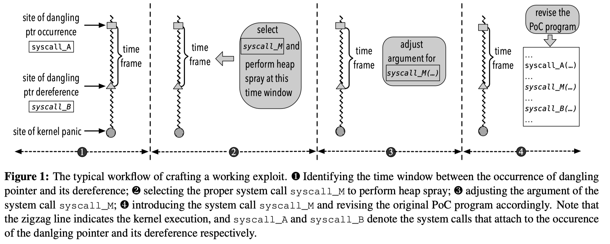
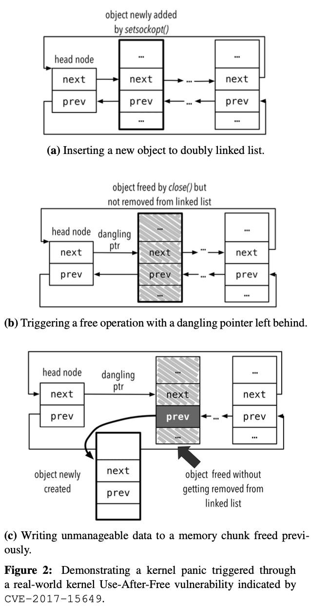
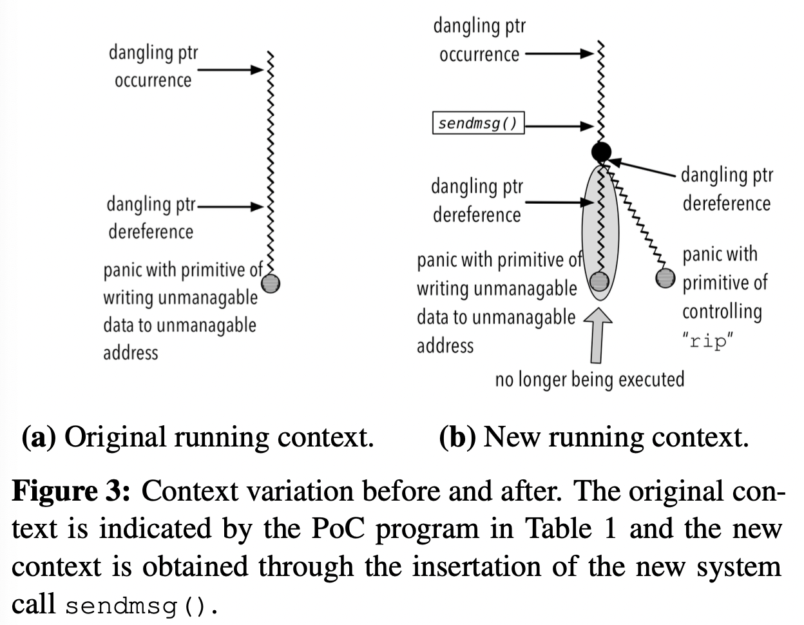
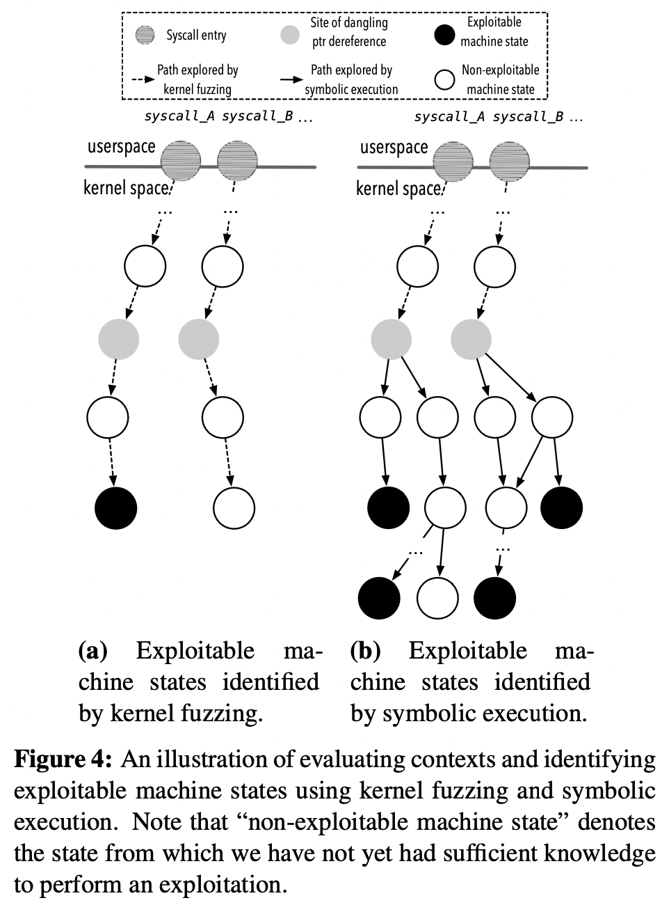
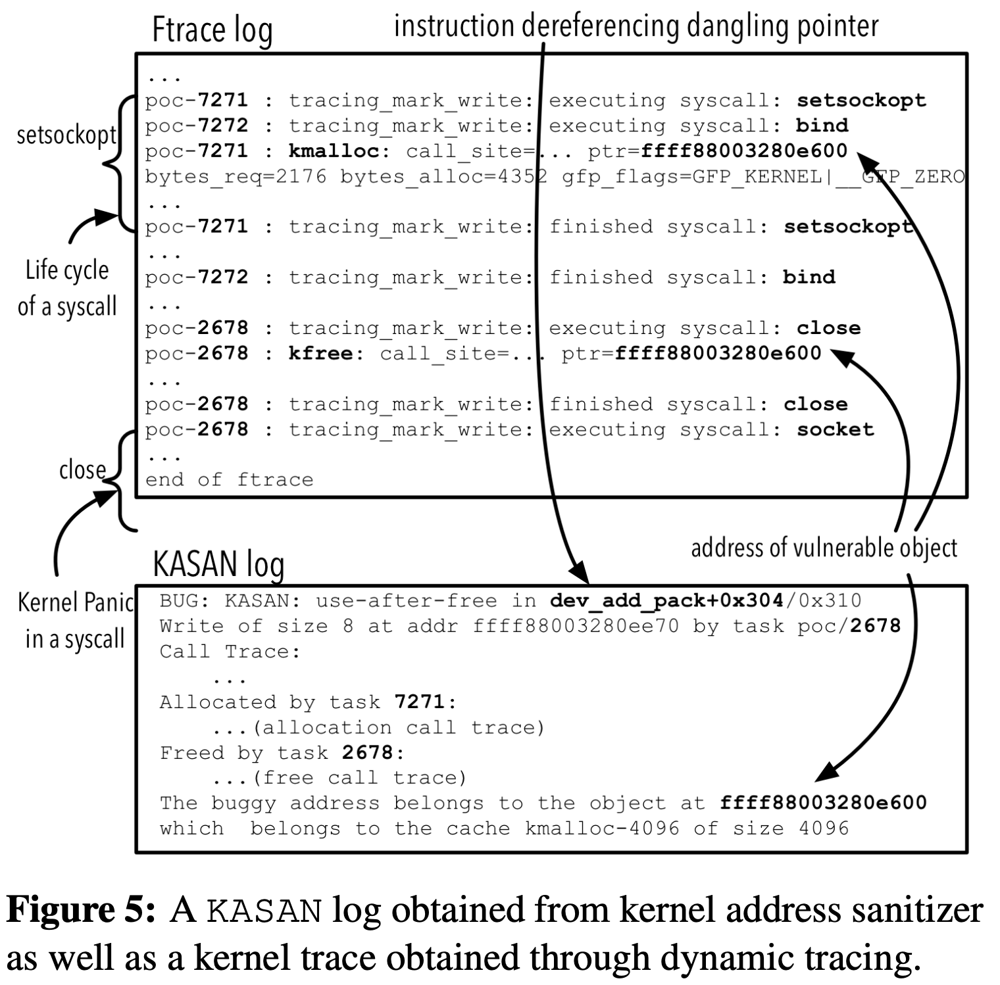

# FUZE：为内核UAF漏洞提供利用生成

## 摘要

软件供应商通常会根据其利用的容易程度来确定其缺陷修复的优先级。然而，准确确定可利用性通常需要大量时间，并且需要大量的人工工作。为了解决这个问题，可以采用自动利用生成技术。然而，在实践中，它们显示出足够的能力来评估可利用性，特别是针对UAF漏洞。这主要是因为UAF利用的复杂性以及OS内核的可扩展性。

因此，在本文中，我们提出了一种新的框架FUZE，以促进内核UAF利用过程。这项技术背后的设计原则是，我们希望利用漏洞的简易性可以帮助安全分析器评估内核UAF漏洞的可利用性。从技术上讲，FUZE利用内核fuzzing和符号执行来识别、分析和评估系统调用，这些调用对内核UAF利用有用。此外，它利用动态跟踪和现成的约束求解器（TODO:constraint solver）来指导易受攻击对象的操作。

为了演示FUZE的实用性，我们通过扩展二进制分析框架和内核模糊器在64位Linux系统上实现了FUZE。通过在Linux系统上使用15个真实世界内核UAF漏洞，进而演示FUZE不仅可以提高内核UAF的可利用性，还可以使可利用性多样化。此外，我们还表明，FUZE可以促进安全缓解绕过，使可利用性评估更具挑战性和效率。

## 一、引言

对于一个软件团队来说，拥有足够的资源来解决每一个软件错误是非常罕见的。因此，微软和Ubuntu等软件供应商设计并制定了各种策略，以确定修复工作的优先级。在所有这些策略中，具有可利用性的补救优先级是最常见的策略，它基于软件包的易利用性来评估软件包。然而，在实践中，确定可利用性是一个复杂而漫长的过程，特别是对于那些驻留在OS内核中的UAF漏洞。

UAF漏洞是一种特殊的内存损坏漏洞，它可能会损坏有效数据，从而可能导致任意代码的执行。当发生在OS内核中时，它们还可能导致提权和关键数据泄漏。为了利用这些漏洞，特别是在OS内核中，攻击者需要手动查明释放对象（即易受攻击的对象）发生的时间帧，以便将数据喷洒到其区域，并据此修改其内容。为了确保操作系统内核的安全执行会受到喷洒数据的影响，他还需要利用自己的专业知识，根据释放对象的大小以及堆分配器的类型，手动调整系统调用和相应的参数。我们在第2节中通过一个具体的例子来展示这个过程。

为了促进可利用性评估，本能的反应是借助为利用生成提出的研究工作，其中程序分析技术通常用于分析程序故障并相应地产生利用。然而，所提出的技术不足以解决上述问题。一方面是因为用于利用生成的程序分析技术*仅适用于简单程序*，而不适用于具有更高复杂性和可扩展性的OS内核。另一方面是因为他们的技术方法*主要集中在栈或堆溢出漏洞上*，通过简单地改变PoC程序的上下文就可能有助于利用这些漏洞，因为UAF漏洞的利用需要对易受攻击对象进行空间和时间控制，在这些约束条件下，微小的上下文变化通常不利于可利用性探索。

在这项工作中，我们提出了FUZE，一个评估内核UAF漏洞可利用性的攻击框架。原则上，该框架类似于先前提出的技术方法，通过自动探索漏洞的可利用性来实现可利用性评估。从技术上讲，我们的框架遵循完全不同的设计，它利用fuzzing技术使<u>内核panic的上下文</u>多样化，然后利用符号执行来探索不同上下文中的可利用性。

更具体地说，我们的系统首先将一个PoC程序作为输入，该程序不执行利用，但会导致内核panic。然后，它利用内核fuzzing来探索各种系统调用，从而改变内核panic的上下文。在每个环境下，每一个不同的内核panic，FUZE进一步执行符号执行的目标是追踪潜在的有用的原语利用。为了找出真正有价值的UAF漏洞利用甚至绕过安全缓解的原语，FUZE总结了一套常用的利用方法，然后利用它们对原语进行相应的评估。在第3节中，我们将详细描述这个利用框架。

与现有的技术不同，提出的利用框架不是为了实现完全自动化的利用生成。相反地，它通过简化利用制造过程来促进可利用性评估。更具体地说，FUZE从以下几个方面促进了利用制造。

首先，它增强了安全分析器**自动化识别系统调用**的能力，他需要利用这些系统调用进行UAF漏洞利用。其次，它允许安全分析器**自动计算他需要喷洒到脆弱对象区域的数据**。第三，它有助于安全分析器**确定需要执行堆喷洒和漏洞利用的时间范围**。第四，它为安全分析器提供了实现**安全缓解绕过**的能力。

正如我们将在第6节中所展示的，在上述所有方面的促进下，我们不仅可以升级内核UAF的可用性，而且还可以从各种内核panic中使可用性多样化。另外，我们证明，FUZE甚至可以帮助安全分析器设计漏洞，绕过广泛部署的安全缓解措施，如SMEP和SMAP。据我们所知，FUZE是第一个能够促进内核UAF漏洞可用性评估的利用框架。

综上所述，本文有以下几点贡献。
* 我们设计了FUZE，一个利用内核fuzzing和符号执行来促进内核UAF利用的利用框架。
* 通过在64位Linux系统上扩展二进制分析框架和内核fuzzer，我们实现了FUZE以促进漏洞生成过程。
* 我们通过在Linux内核中使用15个真实的UAF漏洞，演示了FUZE在制作可运行利用以及促进安全规避方面的效用。

本文的其余部分组织如下。第二节介绍了我们研究的背景和所面临的挑战。第三节是FUZE的概述。第四节详细介绍了FUZE的设计。第五节介绍FUZE的实现，第六节演示FUZE的实用性。第七节总结了与我们最相关的工作。最后，我们在第八节对本文的工作进行了总结。

## 二、背景和挑战

为了利用驻留在操作系统内核中的UAF漏洞，安全分析器需要分析一个PoC程序，该程序演示了一个带有内核panic的UAF漏洞，但没有利用真正的目标。从该程序中，他通常需要采取以下步骤，以执行成功的利用。



首先，安全分析器需要确定*导致悬浮指针出现*以及*解引用该指针*的系统调用(参见图1中的1)。其次，他需要根据对象的大小和堆分配器的类型分析悬浮指针指向的释放对象。因此，他可以<u>在与悬浮指针的出现和解引用相关联的时间框架内</u>确定*执行堆喷洒的*系统调用(参见图1中的2)。

一般来说，堆喷洒的目标是**接管释放的对象**，从而利用所喷洒的数据将系统的控制流重定向到未经授权的操作，例如权限提升或关键数据泄漏。因此，安全分析器还需要根据PoC程序的语义仔细计算所喷洒数据的内容，从而调整为执行堆喷洒而选择的系统调用的参数，然后才最终修改以手动方式利用的PoC程序。正如在3和4中指定的那样，我们在图1中描述了最后一步。

在过去，研究主要关注如何增强安全分析器的能力，使其能够选择系统调用并执行有效的堆喷洒(例如，促进图1中所示的步骤2)。在某种程度上，这确实促进了利用利用的过程。然而，通过简单地遵循上面提到的典型工作流以及步骤2的帮助，对于安全分析器来说，为实际的UAF漏洞设计一个可运行利用仍然是具有挑战性的，而且通常是不可实现的。正如我们将在下面通过一个真实的UAF漏洞详细说明的那样，这是因为PoC程序几乎没有提供有用的运行上下文，只有在此背景下，安全分析器菜可以成功地执行利用。

### 内核UAF漏洞的PoC程序

表1
```c
void *task1(void *unused) {
    ...
    int err = setsockopt(fd, 0x107, 18, ..., ...);
}

void *task2(void *unused) {
    int err = bind(fd, &addr, ...);
}

void loop_race() {
    ...
    while(1) {
        fd = socket(AF_PACKET, SOCK_RAW, htons(ETH_P_ALL));
        //create two racing threads
        pthread_create (&thread1, NULL, task1, NULL);
        pthread_create (&thread2, NULL, task2, NULL);
        pthread_join(thread1, NULL);
        pthread_join(thread2, NULL);
        close(fd);
    }
}
```



表1显示了一个用C代码编写的PoC程序，能够触发CVE-2017-15649指出的内核UAF漏洞。如第3行所示，setsockopt()是Linux中的一个系统调用。当它在特定类型的套接字上(在第13行中创建)赋值时，它在Linux内核中创建一个新对象，然后将它放在双链表的开头(参见图2a)。

在第16行和第17行，PoC程序创建两个线程，分别调用系统调用setsockopt()和bind()。通过无限循环重复调用这两行代码，PoC创建了一个竞态条件，导致对<u>驻留在新添加对象中的标志</u>的意外操作。

在每次迭代结束时，PoC调用系统调用close()来释放新添加的对象。由于意外的操作，Linux内核无法覆盖头节点中的next指针，从而留下一个指向已释放对象的悬浮指针(参见图2b)。

在悬浮指针出现的连续迭代中，PoC程序调用系统调用并再次创建一个新对象。如图2c所示，在将对象前置到列表中时，系统调用解引用悬浮指针，从而修改位于被释放对象中的prev指针中的数据，导致一个意外的写操作，进一步在连续的内核执行中触发内核panic。

### 制造可运行利用的难点

按照图1中指定的典型工作流，在步骤2中针对上面的漏洞设计一个攻击，安全分析器需要识别一个适当的系统调用，使用它执行堆喷洒，从而将PoC变成一个可用的攻击。但是，通过仔细观察前面提到的PoC留下的意外写原语，我们可以很容易地观察到，这个写操作只向分析器提供了将新对象的地址写入内核堆区域的能力，如图2c中深灰色框所示。

考虑到堆对象的分配由Linux内核控制，分析器对分配的影响有限，我们可以有把握地得出这样的结论:意外的写原语只给予分析器将不可管理的数据(即新对象的地址)写入Linux内核中不可管理的堆地址的特权。换句话说，这意味着分析器不能利用意外的写操作来操作指令指针rip，从而执行控制流劫持，也不能利用它来操作Linux内核中的关键数据，从而实现权限提升。

## 三、概述

虽然上面运行的示例显示了制造一个可用漏洞的难度，但这并不意味着上述漏洞不可利用。事实上，通过将<u>带有精心设计的参数的系统调用sendmsg()</u>插入到前面提到的PoC程序的第22行后面，我们可以在悬浮指针出现和解引用之间引入新的操作。由于系统调用sendmsg()具有*解引用双链表中新添加的对象中的数据*的能力，当意外的释放操作发生并出现悬浮指针时，它具有在原始PoC中定义的系统调用之前解引用悬浮指针的能力，从而改变内核panic的方式。



如图3所示，新的内核panic(或者换句说，新的PoC程序)表示一个新的运行上下文，其中系统调用sendmsg()检索已释放对象中的数据，将其作为无效函数指针解引用，从而将内核驱动到一个新的panic状态。与表1中PoC程序指示的原始运行上下文不同，我们可以很容易地观察到，这个新上下文为安全分析人员提供了一个新的原语，他可以使用该原语喷射精心制作的数据，操作指令指针rip，从而执行控制流劫持。正如我们将在第6节中演示的那样，这个上下文甚至为安全分析人员提供了绕过内核安全缓解(如SMEP和SMAP)的能力。

基于这种观察，我们提出了一种技术方法来促进PoC程序的上下文变化。我们将它们与下面几节将介绍的其他技术一起命名为FUZE，这是一个利用框架。该框架背后的设计理念是，**上下文变化可以促进识别利用原语**，有了上下文变化，可以潜在地加快制作工作利用，并可以显著升级内核UAF漏洞的可利用性。接下来，我们将讨论FUZE设计的考虑因素以及该利用框架的高层设计。

### 设计要求

正如前面在第1节中提到的，FUZE的最终目标不是自动生成一个可运行利用，而是激发安全分析人员编写一个可运行利用的能力。因此，我们决定从以下四个方面设计FUZE，以促进制造利用。

首先，FUZE必须为安全分析人员**提供追踪脆弱对象、悬浮指针的出现及其解引用的能力**。有了这种能力，分析人员可以快速、轻松地选择适当的系统调用，并确定执行堆喷的正确时间窗口(例如，促进图1中的步骤1和2)。其次，FUZE必须**增强安全分析人员合成新的PoC程序的能力**，这些程序会在不同的环境下导致内核恐慌。有了这一点，分析人员可以以一种高效的方式以最少的人工努力执行上下文变化。第三，FUZE必须能够**扩展分析人员自动选择有用上下文的能力**。这是因为新生成的上下文没有揭示它们是否可以被利用，而安全分析人员通常难以确定哪些上下文对成功的利用有用。考虑到广泛部署的内核安全缓解措施很容易阻碍利用尝试，这种确定通常变得更加困难，通常需要大量的人工努力。最后，FUZE必须使安全分析人员能够**自动派生在悬浮指针出现和解引用之间需要喷洒的数据**。这是因为制作数据来接管被释放的区域并执行利用通常需要大量的专业知识和大量的人力。

### 高级设计

为了满足上述要求，我们设计了FUZE，首先运行PoC程序，并使用现成的ASAN进行分析。随着动态追踪方法的便利，FUZE可以识别与脆弱对象有关的关键信息，以及连续利用所需的时间窗口。

利用识别出的信息，我们设计FUZE自动改变该PoC的上下文，以简化合成新PoC程序的过程。回想一下，我们通过插入一个新的系统调用来改变PoC程序的上下文，该系统调用在悬浮指针出现和解引用之间解引用脆弱对象(参见图3b)。因此，从技术上讲，我们设计并开发了一种上下文中fuzzing方法，它自动探索<u>确认过的时间窗口内的内核代码空间</u>，从而确定可能导致内核panic的系统调用(和相应的参数)。



与原始PoC所代表的上下文类似，一个新的上下文(即新的内核恐慌)不一定能帮助分析人员创建一个有效的漏洞。此外，正如上面所提到的，安全分析人员通常很难确定在什么情况下可以设计一个有效的利用程序。因此，我们进一步设计了FUZE来自动评估每一个新的上下文。直觉表明，我们可以**根据通常采用的利用方法总结一组可利用的机器状态**。对于每个上下文，我们可以检查相应的终止内核状态是否与这些可用的机器状态之一相匹配。如图4a所示，这将允许FUZE筛选出那些真正有用的上下文。

然而，这种直观的设计是有问题的。除了所选择的系统调用之外，终止的内核状态(即，内核经历panic的站点)依赖于释放对象中的剩余内容。假设攻击者完全控制释放对象中的内容，使用前面提到的只考虑系统调用的方法，我们可能会**不可避免地忽略一些<u>允许安全分析人员成功执行利用的上下文</u>**。因此，我们的设计没有遵循上面的直观方法，而是将释放对象的每个字节设置为一个符号值，然后在每个上下文中执行符号执行。如图4b所示，这允许FUZE以更完整的方式探索可利用的机器状态，从而彻底查明对利用有用的上下文集。

应该注意的是，如图4b所示，上下文中的符号执行并**不意味着在内核panic的位置**符号化地执行内核代码。相反，这意味着我们**在悬空指针解引用之后**立即执行符号执行。正如我们将在下一节中演示和讨论的那样，这样的设计可以防止发生路径爆炸，而不会到达任何有用的利用点。此外，它使FUZE能够使用现成的约束求解器来准确地计算悬浮指针出现和它的解引用之间需要喷射的内容。

## 四、设计

在本节中，我们将讨论FUZE的技术细节。更具体地说，我们首先描述FUZE如何提取利用实现所需的信息。其次，我们描述FUZE如何利用这些信息来初始化运行上下文，执行内核模糊，从而实现上下文变化。第三，我们指定FUZE如何执行符号执行，精确定位可利用的机器状态，从而完成上下文评估以及对喷射数据的计算。最后，我们讨论了一些限制和其他技术细节。

### 关键信息提取

如上所述，FUZE采用PoC程序作为输入。然后，它通过使用现成的Kernel Address Sanitizer(KASAN)以及动态跟踪机制提取连续利用所需的信息。在这里，我们将描述通过KASAN提取的信息以及动态跟踪机制的设计，然后介绍如何利用它们来识别其他用于利用的关键信息。

**来自KASAN的信息**。KASAN是一个Kernel Address Sanitizer，它为我们提供了获取与漏洞有关的信息的能力。具体来说，这些包括(1)易受攻击对象的基址和大小，(2)与释放点留下的悬空指针相关的程序语句，以及(3)与解引用悬浮指针的站点对应的程序语句。

**动态跟踪设计**。除了通过KASAN提取的信息外，连续的利用还需要与触发漏洞的系统调用执行有关的信息。为此，我们设计了一种动态跟踪机制，以提高提取此类信息的能力。具体地说，我们首先跟踪Linux内核中分配和释放的内存地址，以及附加到这些内存管理操作的进程标识符(PID)。通过这种方式，我们可以启用内存管理跟踪，并将内存管理操作关联到目标PoC程序。其次，我们使用Linux内核内部跟踪程序(ftrace)来检测目标PoC程序。这允许我们获得与PoC程序调用的系统调用有关的信息。

**其他关键信息提取**。借助动态跟踪和KASAN日志的帮助，我们可以提取利用所需的其他关键信息。为了说明通过这种组合获得的新信息，我们以图5所示的内核跟踪和KASAN日志为例。使用通过KASAN获得的信息，我们可以轻松地识别易受攻击对象的地址(0xffff88003280e600)，并将其与kfree()对应的释放操作联系起来。通过与每个内存管理操作相关联的PID，我们可以在跟踪上精确地确定系统调用的生命周期，从而识别与释放操作相关联的系统调用close()。

由于系统调用socket()显示为一个不完整的跟踪，我们可以很容易地确定它作为解引用悬浮指针的系统调用。从KASAN日志中，我们还可以识别出dev_add_pack+0x304/0x310，这条指令解除了对悬浮指针的引用。将此信息与调试信息和源代码相关联，我们可以很容易地理解悬浮指针是如何被解引用的，并进一步跟踪该悬浮指针属于哪个变量。



### 内核fuzzing

回想一下，FUZE利用内核fuzzing来探索其他系统调用，从而多样化的运行上下文以实现利用。下面，我们将详细描述我们的内核fuzzing。具体来说，我们首先讨论如何初始化模糊测试的上下文。然后，我们描述了如何为系统调用探索设置内核fuzzing。

#### fuzzing上下文初始化

正如在第3节中提到的，我们利用内核fuzzing来识别对悬浮指针解引用的系统调用。为此，我们必须**在出现悬浮指针之后启动内核模糊测试**，同时，**确保模糊测试不受原始PoC中指定的指针解引用的干扰**。因此，我们首先需要精确地确定<u>悬浮指针出现的位置</u>，以及<u>PoC程序中定义的系统调用解除对指针引用的位置</u>。如上所述，这可以通过使用KASAN和动态跟踪提取的信息轻松实现。

确定了两个关键位置后，我们的下一步是消除<u>原始PoC中指定的、能够解引用悬浮指针的系统调用</u>的干预。要做到这一点，一种直观的方法是监视内存管理操作，然后拦截内核执行，以便在出现悬浮指针后将执行重定向到内核fuzzing。考虑到内核内部执行的复杂性，这种侵入式的方法并不能保证内核执行的正确性，甚至会使内核出现意外的panic。

为了解决这个技术问题，我们设计了一种替代方法。具体地说，我们将PoC程序包装为一个独立的函数，然后对该函数进行修饰，使其具有触发释放操作的能力，但避免触及悬空指针解引用的位置。通过这种设计，我们可以封装用于内核fuzzing的初始上下文构造，而不会危及内核执行的完整性。