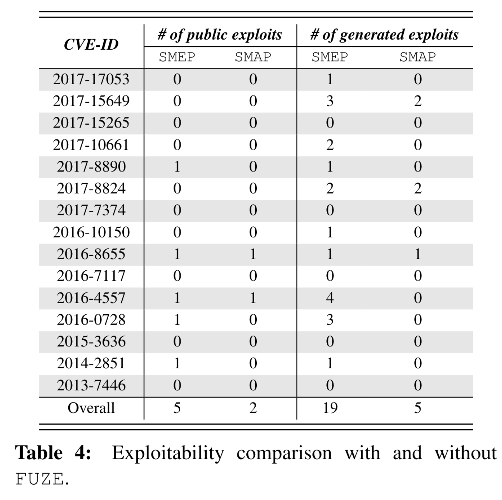
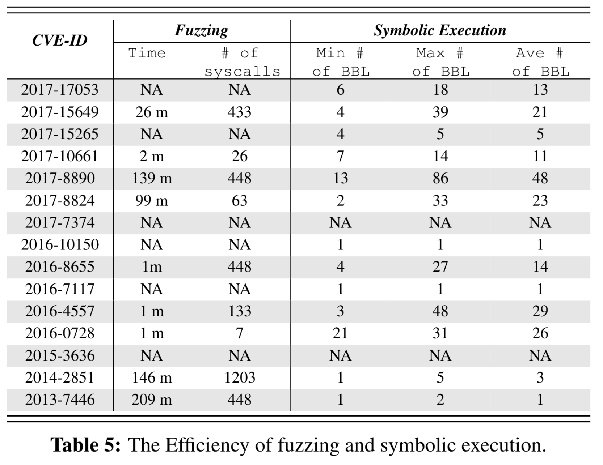

# FUZE：为内核UAF漏洞提供利用生成

## 摘要

软件供应商通常会根据其利用的容易程度来确定其缺陷修复的优先级。然而，准确确定可利用性通常需要大量时间，并且需要大量的人工工作。为了解决这个问题，可以采用自动利用生成技术。然而，在实践中，它们显示出足够的能力来评估可利用性，特别是针对UAF漏洞。这主要是因为UAF利用的复杂性以及OS内核的可扩展性。

因此，在本文中，我们提出了一种新的框架FUZE，以促进内核UAF利用过程。这项技术背后的设计原则是，我们希望利用漏洞的简易性来帮助安全分析人员评估内核UAF漏洞的可利用性。从技术上讲，FUZE利用内核fuzzing和符号执行来识别、分析和评估系统调用，这些调用对内核UAF利用有用。此外，它利用动态跟踪和现成的约束求解器来指导漏洞对象的操作。

为了演示FUZE的实用性，我们通过扩展二进制分析框架和内核模糊器在64位Linux系统上实现了FUZE。通过在Linux系统上使用15个真实世界内核UAF漏洞，进而演示FUZE不仅可以提高内核UAF的可利用性，还可以使可利用性多样化。此外，我们还表明，FUZE可以促进安全缓解机制的绕过，使可利用性评估更具挑战性和效率。

## 一、引言

对于一个软件团队来说，拥有足够的资源来解决每一个软件错误是非常困难的。因此，微软和Ubuntu等软件供应商设计并制定了各种策略，以确定补救工作的优先级。在所有这些策略中，具有可利用性的补救优先级是最常见的策略，它基于软件包的易利用性来评估软件包。然而，在实践中，确定可利用性是一个复杂而漫长的过程，特别是对于那些驻留在OS内核中的UAF漏洞。

UAF漏洞是一种特殊的内存损坏漏洞，它可能会损坏有效数据，从而可能导致任意代码的执行。当发生在OS内核中时，它们还可能导致提权和关键数据泄漏。为了利用这些漏洞，特别是在OS内核中，攻击者需要手动查明释放对象（即漏洞对象）出现的时间帧，以便将数据喷洒到其区域，并据此修改其内容。为了确保操作系统内核的安全执行会受到喷洒数据的影响，他还需要利用自己的专业知识，根据释放对象的大小以及堆分配器的类型，手动调整系统调用和相应的参数。我们在第2节中通过一个具体的例子来展示这个过程。

为了促进可利用性评估，本能的反应是借助为利用生成提出的研究工作，其中**程序分析技术**通常用于分析程序故障并相应地产生利用。然而，所提出的技术不足以解决上述问题。一方面是因为用于利用生成的程序分析技术*仅适用于简单程序*，而不适用于具有更高复杂性和可扩展性的OS内核。另一方面是因为他们的技术方法*主要集中在栈或堆溢出漏洞上*，通过简单地改变PoC程序的上下文就可能有助于利用这些漏洞，因为UAF漏洞的利用需要对漏洞对象进行空间和时间控制，在这些约束条件下，微小的上下文变化通常不利于可利用性探索。

在这项工作中，我们提出了FUZE，一个评估内核UAF漏洞可利用性的攻击框架。原则上，该框架类似于先前提出的技术方法，通过自动探索漏洞的可利用性来实现可利用性评估。从技术上讲，我们的框架遵循完全不同的设计，**它利用fuzzing技术使得 内核panic的上下文 多样化，然后利用符号执行来探索不同上下文中的可利用性**。

更具体地说，我们的系统首先将一个PoC程序作为输入，该程序不执行利用，但会导致内核panic。然后，它利用内核fuzzing来探索各种系统调用，从而改变内核panic的上下文。在每个环境下，每一个不同的内核panic，FUZE进一步执行符号执行的目标是追踪潜在的有用的原语利用。为了找出真正有价值的UAF漏洞利用甚至绕过安全缓解的原语，FUZE总结了一套常用的利用方法，然后利用它们对原语进行相应的评估。在第3节中，我们将详细描述这个利用框架。

与现有的技术不同，提出的利用框架不是为了实现完全自动化的利用生成。相反地，它通过简化利用制造过程来促进可利用性评估。更具体地说，FUZE从以下几个方面促进了利用制造。

首先，它增强了安全分析人员**自动化识别系统调用**的能力，他需要利用这些系统调用进行UAF漏洞利用。其次，它允许安全分析人员**自动计算他需要喷洒到漏洞对象区域的数据**。第三，它有助于安全分析人员**确定需要执行堆喷和漏洞利用的时间范围**。第四，它为安全分析人员提供了实现**安全缓解绕过**的能力。

正如我们将在第6节中所展示的，在上述所有方面的促进下，我们不仅可以升级内核UAF的可用性，而且还可以从各种内核panic中使可用性多样化。另外，我们证明，FUZE甚至可以帮助安全分析人员设计漏洞，绕过广泛部署的安全缓解措施，如SMEP和SMAP。据我们所知，FUZE是第一个能够促进内核UAF漏洞可用性评估的利用框架。

综上所述，本文有以下几点贡献。

* 我们设计了FUZE，一个利用内核fuzzing和符号执行来促进内核UAF利用的利用框架。
* 通过在64位Linux系统上扩展二进制分析框架和内核fuzzer，我们实现了FUZE以促进漏洞生成过程。
* 我们通过在Linux内核中使用15个真实的UAF漏洞，演示了FUZE在制作可运行利用以及促进安全规避方面的效用。

本文的其余部分组织如下。第二节介绍了我们研究的背景和所面临的挑战。第三节是FUZE的概述。第四节详细介绍了FUZE的设计。第五节介绍FUZE的实现，第六节演示FUZE的实用性。第七节总结了与我们最相关的工作。最后，我们在第八节对本文的工作进行了总结。

## 二、背景和挑战

为了利用驻留在操作系统内核中的UAF漏洞，安全分析人员需要分析一个PoC程序，该程序演示了一个导致内核panic而不是真实漏洞利用的UAF漏洞。从该程序中，他通常需要采取以下步骤，以执行成功的利用。


首先，安全分析人员需要确定*导致悬浮指针出现*以及*解引用该指针*的系统调用(参见图1中的1)。其次，他需要根据对象的大小和堆分配器的类型，来分析悬浮指针指向的释放对象。因此，他可以 `<u>`在与悬浮指针的出现和解引用相关联的时间框架内 `</u>`确定*执行堆喷的*系统调用(参见图1中的2)。

一般来说，堆喷的目标是**接管释放的对象**，从而利用所喷洒的数据将系统的控制流重定向到未经授权的操作，例如权限提升或关键数据泄漏。因此，安全分析人员还需要根据PoC程序的语义仔细计算所喷洒数据的内容，从而**调整**为执行堆喷而选择的系统调用的**参数**，然后才最终修改以手动方式利用的PoC程序。正如在3和4中指定的那样，我们在图1中描述了最后一步。

在过去，研究主要关注如何增强安全分析人员的能力，使其能够选择系统调用并执行有效的堆喷(例如，促进图1中所示的步骤2)。在某种程度上，这确实促进了利用利用的过程。然而，通过简单地遵循上面提到的典型工作流以及步骤2的帮助，对于安全分析人员来说，为实际的UAF漏洞设计一个可运行利用仍然是具有挑战性的，而且通常是不可实现的。正如我们将在下面通过一个真实的UAF漏洞详细说明的那样，这是因为PoC程序几乎没有提供有用的运行上下文，只有在此背景下，安全分析人员才可以成功地执行利用。

### 内核UAF漏洞的PoC程序

```c
// Table 1: A PoC code fragment pertaining to the kernel UAF vulnerability (CVE-2017-15649).
void *task1(void *unused) {
  ...
  int err = setsockopt(fd, 0x107, 18, ..., ...);
}

void *task2(void *unused) {
  int err = bind(fd, &addr, ...);
}

void loop_race() {
  ...
  while(1) {
    fd = socket(AF_PACKET, SOCK_RAW, htons(ETH_P_ALL));
    ...
    //create two racing threads
    pthread_create (&thread1, NULL, task1, NULL);
    pthread_create (&thread2, NULL, task2, NULL);
    pthread_join(thread1, NULL);
    pthread_join(thread2, NULL);
    close(fd);
  }
}
```


表1显示了一个用C代码编写的PoC程序，能够触发由CVE-2017-15649表示的内核UAF漏洞。如第3行所示，setsockopt()是Linux中的一个系统调用。当它在特定类型的套接字上(在第13行中创建)赋值时，它在Linux内核中创建一个新对象，然后将它放在双链表的开头(参见图2a)。

在第16行和第17行，PoC程序创建两个线程，分别调用系统调用setsockopt()和bind()。通过无限循环重复调用这两行代码，PoC创建了一个竞态条件，导致对 `<u>`驻留在新添加对象中的标志 `</u>`的意外操作。

在每次迭代结束时，PoC调用系统调用close()来释放新添加的对象。由于意外的操作，Linux内核无法覆盖头节点中的next指针，从而留下一个指向已释放对象的悬浮指针(参见图2b)。

在悬浮指针出现的连续迭代中，PoC程序调用系统调用并再次创建一个新对象。如图2c所示，在将对象前置到列表中时，系统调用解引用悬浮指针，从而修改位于已释放对象中的prev指针中的数据，导致一个意外的写操作，进一步在连续的内核执行中触发内核panic。

### 制造可运行利用的难点

按照图1中指定的典型工作流，在步骤2中针对上面的漏洞设计一个攻击，安全分析人员需要识别一个适当的系统调用，使用它执行堆喷，从而将PoC变成一个可用的攻击。但是，通过仔细观察前面提到的PoC留下的意外写原语，我们可以很容易地观察到，这个写操作只向分析人员提供了将新对象的地址写入内核堆区域的能力，如图2c中深灰色框所示。

考虑到堆对象的分配由Linux内核控制，分析人员对分配的影响有限，我们可以有把握地得出这样的结论：意外的写原语只给予分析人员将不可管理的数据(即新对象的地址)写入Linux内核中不可管理的堆地址的特权。换句话说，这意味着分析人员不能利用意外的写操作来操作指令指针rip，从而执行控制流劫持，也不能利用它来操作Linux内核中的关键数据，从而实现权限提升。

## 三、概述

虽然上面运行的示例显示了制造一个可用漏洞的难度，但这并不意味着上述漏洞不可利用。事实上，通过将 `<u>`带有精心设计的参数的系统调用sendmsg()`</u>`插入到前面提到的PoC程序的第22行后面，我们可以在悬浮指针出现和解引用之间引入新的操作。由于系统调用sendmsg()具有*解引用双链表中新添加的对象中的数据*的能力，当意外的释放操作发生并出现悬浮指针时，它具有在原始PoC中定义的系统调用之前解引用悬浮指针的能力，从而改变内核panic的方式。


如图3所示，新的内核panic(或者换句说，新的PoC程序)表示一个新的运行上下文，其中系统调用sendmsg()检索已释放对象中的数据，将其作为非法函数指针解引用，从而将内核驱动到一个新的panic状态。与表1中PoC程序指示的原始运行上下文不同，我们可以很容易地观察到，这个新上下文为安全分析人员提供了一个新的原语，他可以使用该原语喷射精心制作的数据，操作指令指针rip，从而执行控制流劫持。正如我们将在第6节中演示的那样，这个上下文甚至为安全分析人员提供了绕过内核安全缓解(如SMEP和SMAP)的能力。

基于这种观察，我们提出了一种技术方法来促进PoC程序的上下文变化。我们将它们与下面几节将介绍的其他技术一起命名为FUZE，这是一个利用框架。该框架背后的设计理念是，**上下文变化可以促进识别利用原语**，有了上下文变化，可以潜在地加快制作工作利用，并可以显著升级内核UAF漏洞的可利用性。接下来，我们将讨论FUZE设计的考虑因素以及该利用框架的高层设计。

### 设计要求

正如前面在第1节中提到的，FUZE的最终目标不是 `<u>`自动生成一个可运行利用，而是激发安全分析人员编写一个可运行利用的能力 `</u>`。因此，我们决定从以下四个方面设计FUZE，以促进制造利用。

首先，FUZE必须为安全分析人员**提供追踪漏洞对象、悬浮指针的出现及其解引用的能力**。有了这种能力，分析人员可以快速、轻松地选择适当的系统调用，并确定执行堆喷的正确时间窗口(例如，促进图1中的步骤1和2)。其次，FUZE必须**增强安全分析人员合成新的PoC程序的能力**，这些程序会在不同的环境下导致内核panic。有了这一点，分析人员可以以一种高效的方式以最少的人工努力执行上下文变化。第三，FUZE必须能够**扩展分析人员自动选择有用上下文的能力**。这是因为新生成的上下文没有揭示它们是否可以被利用，而安全分析人员通常难以确定哪些上下文对成功的利用有用。考虑到广泛部署的内核安全缓解措施很容易阻碍利用尝试，这种确定通常变得更加困难，通常需要大量的人工努力。最后，FUZE必须使安全分析人员能够**自动派生在悬浮指针出现和解引用之间需要喷洒的数据**。这是因为制作数据来接管被释放的区域并执行利用通常需要大量的专业知识和大量的人力。

### 高级设计

为了满足上述要求，我们设计了FUZE，首先运行PoC程序，并使用现成的ASAN进行分析。随着动态追踪方法的便利，FUZE可以识别与漏洞对象有关的关键信息，以及连续利用所需的时间窗口。

利用识别出的信息，我们设计FUZE自动改变该PoC的上下文，以简化合成新PoC程序的过程。回想一下，我们通过插入一个新的系统调用来改变PoC程序的上下文，该系统调用在悬浮指针出现和解引用之间解引用漏洞对象(参见图3b)。因此，从技术上讲，我们设计并开发了一种上下文中fuzzing方法，它自动探索 `<u>`确认过的时间窗口内的内核代码空间 `</u>`，从而确定可能导致内核panic的系统调用(和相应的参数)。


与原始PoC所代表的上下文类似，一个新的上下文(即新的内核恐慌)不一定能帮助分析人员创建一个有效的漏洞。此外，正如上面所提到的，安全分析人员通常很难确定在什么情况下可以设计一个有效的利用程序。因此，我们进一步设计了FUZE来自动评估每一个新的上下文。直觉表明，我们可以**根据通常采用的利用方法总结一组可利用的机器状态**。对于每个上下文，我们可以检查相应的终止内核状态是否与这些可用的机器状态之一相匹配。如图4a所示，这将允许FUZE筛选出那些真正有用的上下文。

然而，这种直观的设计是有问题的。除了所选择的系统调用之外，终止的内核状态(即，内核经历panic的站点)依赖于释放对象中的残留内容。假设攻击者完全控制释放对象中的内容，使用前面提到的只考虑系统调用的方法，我们可能会**不可避免地忽略一些 <u>允许安全分析人员成功执行利用的上下文 </u>**。因此，我们的设计没有遵循上面的直观方法，而是将释放对象的每个字节设置为一个符号值，然后在每个上下文中实施符号执行。如图4b所示，这允许FUZE以更完整的方式探索可利用的机器状态，从而彻底查明对利用有用的上下文集。

应该注意的是，如图4b所示，上下文中的符号执行并不意味着**在内核panic的位置**符号化地执行内核代码。相反，这意味着我们**在悬空指针解引用之后**立即执行符号执行。正如我们将在下一节中演示和讨论的那样，这样的设计可以防止发生路径爆炸（不会到达任何有用的利用点）。此外，它使FUZE能够使用现成的约束求解器来准确地计算悬浮指针出现和它的解引用之间需要喷射的内容。

## 四、设计

在本节中，我们将讨论FUZE的技术细节。更具体地说，我们首先描述FUZE如何提取利用实现所需的信息。其次，我们描述FUZE如何利用这些信息来初始化运行上下文，执行内核fuzzing，从而实现上下文变化。第三，我们指定FUZE如何实施符号执行，精确定位可利用的机器状态，从而完成上下文评估以及对喷射数据的计算。最后，我们讨论了一些限制和其他技术细节。

### 关键信息提取

如上所述，FUZE采用PoC程序作为输入。然后，它通过使用现成的Kernel Address Sanitizer(KASAN)以及动态跟踪机制提取连续利用所需的信息。在这里，我们将描述通过KASAN提取的信息以及动态跟踪机制的设计，然后介绍如何利用它们来识别其他用于利用的关键信息。

**来自KASAN的信息**。KASAN是一个Kernel Address Sanitizer，它为我们提供了获取与漏洞有关信息的能力。具体来说，这些包括(1)漏洞对象的基址和大小，(2)与释放点留下的悬空指针相关的程序语句，以及(3)与解引用悬浮指针位置对应的程序语句。

**动态跟踪设计**。除了通过KASAN提取的信息外，连续的利用还需要与触发漏洞的系统调用执行有关的信息。为此，我们设计了一种动态跟踪机制，以提高提取此类信息的能力。具体地说，我们首先跟踪Linux内核中分配和释放的内存地址，以及附加到这些内存管理操作的进程标识符(PID)。通过这种方式，我们可以启用内存管理跟踪，并将内存管理操作关联到目标PoC程序。其次，我们使用Linux内核内部跟踪程序(ftrace)来检测目标PoC程序。这允许我们获得与PoC程序调用的系统调用有关的信息。

**其他关键信息提取**。借助动态跟踪和KASAN日志的帮助，我们可以提取利用所需的其他关键信息。为了说明通过这种组合获得的新信息，我们以图5所示的内核跟踪和KASAN日志为例。使用通过KASAN获得的信息，我们可以轻松地识别漏洞对象的地址(0xffff88003280e600)，并将其与kfree()对应的释放操作联系起来。通过与每个内存管理操作相关联的PID，我们可以在跟踪上精确地确定系统调用的生命周期，从而识别与释放操作相关联的系统调用close()。

由于系统调用socket()显示为一个不完整的跟踪，我们可以很容易地确定它作为解引用悬浮指针的系统调用。从KASAN日志中，我们还可以识别出dev_add_pack+0x304/0x310，这条指令解除了对悬浮指针的引用。将此信息与调试信息和源代码相关联，我们可以很容易地理解悬浮指针是如何被解引用的，并进一步跟踪该悬浮指针属于哪个变量。


### 内核fuzzing

回想一下，FUZE利用内核fuzzing来探索其他系统调用，从而多样化的运行上下文以实现利用。下面，我们将详细描述我们的内核fuzzing。具体来说，我们首先讨论如何初始化模糊测试的上下文。然后，我们描述了如何为系统调用探索设置内核fuzzing。

#### fuzzing上下文初始化

正如在第3节中提到的，我们利用内核fuzzing来识别对悬浮指针解引用的系统调用。为此，我们必须**在出现悬浮指针之后启动内核模糊测试**，同时，**确保模糊测试不受原始PoC中指定的指针解引用的干扰**。因此，我们首先需要精确地确定 `<u>`悬浮指针出现的位置 `</u>`，以及 `<u>`PoC程序中定义的系统调用对指针解引用的位置 `</u>`。如上所述，这可以通过使用KASAN和动态跟踪提取的信息轻松实现。

确定了两个关键位置后，我们的下一步是消除 `<u>`原始PoC中指定的、能够解引用悬浮指针的系统调用 `</u>`的干预。要做到这一点，一种直观的方法是监视内存管理操作，然后拦截内核执行，以便在出现悬浮指针后将执行重定向到内核fuzzing。考虑到内核内部执行的复杂性，这种侵入式的方法并不能保证内核执行的正确性，甚至会使内核出现意外的panic。

为了解决这个技术问题，我们设计了一种替代方法。具体地说，我们将PoC程序包装为一个独立的函数，然后对该函数进行修饰，使其具有触发释放操作的能力，但避免触及悬空指针解引用的位置。通过这种设计，我们可以封装用于内核fuzzing的初始上下文构造，而不会危及内核执行的完整性。

```c
// Table 2: The wrapping functions preventing dangling pointer dereference.
// (a) Wrapped PoC program that encloses free and dangling pointer dereference in two separated system calls without race condition involvement.
PoC_wrapper(){ // PoC wrapping function
  ...
  syscallA(...); // free site
  return; // instrumented statement
  syscallB(...); // dangling pointer dereference site
  ...
}

// (b) Wrapped PoC program that encloses free and dangling pointer dereference in two separated system calls with race condition involvement.
PoC_wrapper(){ // PoC wrapping function
  ...
  while(true){ // Race condition
    ...
    threadA(...); // dangling pointer dereference site
    threadB(...); // free site
    ...
    // instrumented statements
    if (!ioctl(...)) // interact with a kernel module
        return;
  }
}
```

根据PoC程序中定义的释放操作和悬浮指针解引用的实践，我们设计了不同的策略来实现PoC程序(即包装函数)。如表2a所示，对于单线程PoC程序，它有一个释放操作，并且在两个分离的系统调用中发生了连续的解引用，我们通过在两个系统调用之间插入一个返回语句来检测PoC程序，因为这可以防止PoC本身进入PoC程序中定义的解引用悬浮指针的站点。对于多线程PoC程序(如表1所示)，悬浮指针可能在内核中的任何迭代中出现。因此，对这类PoC程序，我们的实施方案在迭代末尾插入系统调用ioctl。与定制的内核模块一起，系统调用检查悬浮指针的出现并相应地执行PoC重定向(参见表2b)。

KASAN在解引用悬浮指针时检查是否出现悬浮指针，我们需要在解引用悬浮指针之前终止PoC的执行。因此，我们不能简单地使用KASAN来实现内核模块识别悬浮指针的能力。

为了解决这个问题，我们遵循下面的程序。从KASAN日志中获得的信息中，我们首先检索 `<u>`与悬空指针解引用相关的代码语句 `</u>`。其次，我们对内核源代码执行分析，以追踪 `<u>`与被释放的对象对应的变量 `</u>`，但留下一个悬空指针。因为这样的变量通常表示为全局实体，所以我们可以很容易地从内核代码的二进制映像中获得它的内存地址。通过向内核模块提供内存地址(内核模块监视内核内存中的分配和释放操作)，我们可以增强内核模块的能力，使其能够精确定位目标对象的产生，并提醒系统调用ioctl**将包装函数的执行重定向到连续的内核fuzzing处理中**。

#### 上下文中内核fuzzing

为了在上面初始化的上下文中执行内核fuzzing，我们借用了一个最先进的内核fuzzing框架，它通过**使用一系列系统调用**并根据分支覆盖反馈**变异它们的参数**来执行内核fuzzing。考虑到一个初始上下文可能代表不同的触发UAF漏洞的环境，我们采用 `<u>`两种不同的方法 `</u>`建立了这个内核fuzzing框架。

```c
// Table 3: The pseudo-code indicating the way of performing concurrent kernel fuzz testing.
pid = fork();
if (pid == 0)
  PoC_wrapper(); // PoC wrapper function running inside namespaces
else
  fuzz(); // kernel fuzzing
```

在我们的第一种方法中，我们在fuzzing上下文初始化之后立即开始我们的内核fuzzing。由于我们将一个检测PoC程序包装为一个独立的函数，因此可以通过在内核fuzzing之前简单地调用包装函数来轻松实现。在我们的第二种方法中，我们建立了fuzzing框架来执行并发模糊测试。在Linux系统中，命名空间是一种内核特性，它不仅隔离了进程集合的系统资源，而且还限制了进程可以运行的系统调用。对于一些内核UAF漏洞，**我们观察到只有在Linux名称空间中调用系统调用时才会发生释放操作**。在实践中，这自然限制了我们可以为内核fuzzing选择的候选系统调用。为了解决这个问题，我们在PoC程序执行之前fork它，并且只在子进程中执行内核fuzzing。为了说明这一点，我们在表3中展示了一个伪代码示例。正如我们所看到的，这个程序创建了两个进程。一个在负责触发释放操作的命名空间内运行，而另一个则在不受系统资源限制的情况下执行，试图对释放对象中的数据解引用。

除了针对不同的初始上下文设置内核fuzzing之外，我们还设计了两种机制来提高内核fuzzing框架的效率。首先，我们通过在初始上下文和fuzzing框架之间启用参数共享来提高fuzzing效率。对于内核UAF漏洞，其漏洞对象通常与文件描述符相关联，文件描述符是用于访问文件、套接字和设备等资源的抽象指示器。为了加快内核fuzzing处理以命中这些漏洞对象，我们使用初始fuzzing处理上下文中指定的文件描述符来设置系统调用的参数。

其次，我们通过减少fuzzing框架必须检查的系统调用数量来加快内核fuzzing。例如，在Linux系统4.10中，大约有291个系统调用。它们对应于Linux系统内核提供的不同服务。为了识别那些可以解引用悬浮指针的调用，一种直接的方法是对所有系统调用执行模糊测试。很明显，这将大大降低寻找对实现利用真正有用的系统调用的效率。

针对此问题，我们利用上述漏洞分析获得的信息，追踪到漏洞对象。然后，在所有内核模块中搜索该对象。对于包含该对象使用的模块，我们通过查找模块所属目录下的SYSCALL_DEFINEx()宏来检索模块中涉及的系统调用。此外，我们还包括属于子类的系统调用，这些调用与已经检索到但不在模块中出现的调用相同。应该注意的是，这种方法可能会导致丢失能够解引用悬浮指针的系统调用。正如我们将在第6节中所展示的那样，这种方法并不会影响我们寻找对利用有用的系统调用。

### 符号执行

如第3.2节所述，我们在上下文下进行符号执行，目的是确定一个上下文是否可以引导内核执行到一个可利用的机器状态。在下文中，我们首先规定了如何根据通过上述内核模糊测试获得的上下文来设置符号执行。然后，我们讨论了如何通过符号执行来识别真正有利于利用的机器状态。

#### 符号执行设置

被喂到内核模糊测试中的随机输入能够潜在的使得内核执行崩溃，而不需要为了利用提供有用的原语（例如，写入任意数据到任意地址）。因此，我们在内核模糊测试解引用一个悬空指针之前，开始我们的符号执行。为了做到这一点，我们需要定位悬空指针解引用的位置，暂停内核执行并传递运行中的上下文给符号执行。

不同于内核模糊测试，符号执行不能利用内核工具来加速这个过程。这只是因为我们使用符号执行来生成漏洞，而从内测内核衍生出来的漏洞不能在普通的Linux系统中有效。

为了解决这个问题，我们使用从KASAN获取的信息并且动态跟踪。正如4.1节提到的，获得的信息包含了与解引用悬空指针有关的代码语句。由于这些信息在源代码层面上表示，我们能够简单的映射它到普通的Linux系统中，并且在这个位置设置一个断点。

这个方法能够保证捕捉到悬空指针出现的时机。然而，即使悬空指针没有出现，设置断点也能够打断内核执行。这是因为语句可能涉及常规的内核执行。为了减少不必要的打断，我们设计FUZE来自动的检索*从上述动态追踪中获得的日志*，并且在之后检查与语句有关的指针是否指向一个在执行到断点时已经被释放的对象。如果被释放的对象没有被观测到，我们强制内核继续它的执行。否则，我们暂停内核执行，并将其作为连续符号执行的初始设置。

#### 可利用的机器状态识别

从初始化设置开始，我们为被释放对象的每一个字节创建符号化的值。之后，我们符号化地恢复了内核的执行，并探索可能对漏洞探索有用的机器状态。为了识别可利用的机器状态，我们定义一组表明利用所需操作的原语。之后，我们在进行符号执行时查找这些原语，并将它们作为候选的可利用状态。

由于原语只代表利用所需的通用操作，而不能反应它们促进利用的能力，我们在通常采用的利用方法的指导下，进一步评估原语，并将那些通过评估的状态视为我们可利用的状态。在下文中，我们指定FUZE查找的原语，并详细说明执行原语评估的方式。

**原语指定**。我们定义2个原语类型——*控制流劫持*和*非法写入*。它们在一定假设下通常是执行利用的必要条件。

控制流劫持原语描述了一种能力，它允许人们获得对目标目的地的控制。为了在符号执行时捕捉该原语，我们检查所有间接分支指令并确定一个目标地址是否携带符号字节（例如`call rax`，当且仅当rax携带符号字节时）。这是因为符号值表示我们能够控制的数据，并且它的出现是在一个间接目标中，这意味着我们对内核执行的控制。

非法写入原语表示操作一块内存区域的能力。实际上，有很多漏洞利用都基于这个能力。为了在符号执行过程中识别这个原语，我们关注所有的写指令，并检查目标地址或源寄存器或两者是否携带符号字节（例如`mov qword ptr [rdi], rsi`，当且仅当rdi和rsi都包含符号值时）。通过这个原语我们可以发现，符号值表示我们可以控制的数据，它出现在源寄存器或目标地址中，或同时出现在两者中，意味着对一个内存区域有一定程度的控制。

**原语评估**。如上所述，目前还不清楚人们是否可以利用上述的原语来促进他的利用。假设有一个控制流劫持原语，例如，由于现代操作系统中集成了缓解措施（如SMEP和SMAP），所以利用UAF漏洞可能仍然是一个挑战。为了选择真正有利用价值的原语（即可利用的机器状态），我们对原语的评估如下。

正如[这里](https://www.trustwave.com/en-us/resources/blogs/spiderlabs-blog/linux-kernel-rop-ropping-your-way-to-part-1/)所说，在SMEP启用的情况下，攻击者可以使用以下方法来绕过SMEP，从而进行控制流劫持。首先，他需要将控制流重定向到内核代码片段`xchg eax, esp`; `ret`。然后，他需要通过将eax的值设置为用户空间的一个地址，将堆栈转到用户空间。由于攻击者拥有对转换堆栈的完全控制权，他可以利用堆栈和Linux内核中的指令准备一个ROP链。这样一来，攻击者就不会直接执行用户空间的指令。因此，他可以完成一个成功的控制流劫持攻击而不触发SMEP。

在这项工作中，我们使用这种方法来指导对原语的评估。在控制流劫持原语发生的地方，我们检索与该原语有关的目标地址以及寄存器eax中的值。由于目标地址带有一个符号值，我们检查与符号值相关的约束条件，并检查目标是否可以指向上述代码片段的地址。然后，我们进一步检查eax的值是否在（0x10000，t）范围内。这里，（0x10000，t）表示有效的内存区域。0x10000代表未映射的内存区域的末端，t表示用户空间中内存区域的上限。

假设SMEP被启用，另一种绕过SMEP并进行控制流劫持的[常见方法](https://argp.github.io/2012/01/03/linux-kernel-heap-exploitation/)是利用非法写入来操纵被释放对象的元数据。在这种方法中，人们可以利用这种非法操作来误导内存管理，以分配一个新的对象到用户空间。由于攻击者可以完全控制用户空间，所以能够修改新对象的数据（例如，一个函数指针），从而劫持Linux内核的连续执行。

为了利用这种替代方法来辅助我们的评估，我们检索了与每个非法写入原语相关的源和目的地。然后，我们检查目的地中的值。如果该值指向被释放对象的元数据，我们就进一步检查与源绑定的约束条件。只有当*源指示一个有效的用户空间地址*或*提供一个能够将元数据改变为用户空间地址的能力*时，我们才认为该原语符合这种替代性利用方法。

除了绕过SMEP的方法外，有一种[常见的方法](https://googleprojectzero.blogspot.com/2017/05/exploiting-linux-kernel-via-packet.html)来绕过SMAP并实现控制流劫持。首先，攻击者需要将寄存器rdi设置为一个预先定义的数字（例如，在我们的实验中为0x6f0）。然后，他需要将控制流重定向到函数native_write_cr4()。由于该函数负责设置寄存器CR4--其第21位控制SMAP的状态--而rdi是该函数的参数，指定CR4的新值，他可以禁用SMAP，从而进行控制流劫持攻击。

为了用这种方法来指导我们的原语评估，我们检查每个控制流劫持原语，同时检查寄存器rdi的值。具体来说，我们检查与寄存器rdi绑定的约束以及间接分支指令的目标。然后，我们使用定理求解器进行计算，确定目标是否可以指向native_write_cr4()的地址，以及rdi是否等于预先定义的数字。

需要注意的是，这项工作并不涉及利用信息泄露来绕过KASLR和获取内核代码段的基址。这是因为已经有丰富的工作可以轻松地促进内核代码段基址的获取，而FUZE提供的信息泄露功能既不是成功利用的必要条件也不是充分条件。此外，需要注意的是，上面应用的符号执行自然为FUZE提供了计算需要喷射到被释放对象的数据的能力。因此，在这项工作中，我们利用现成的约束解算器（即SMT）来计算所有符号变量的值，而符号探索则达到可利用的机器状态。

### 技术讨论

在这里，我们讨论了一些技术上的限制和其他与内核模糊和符号执行有关的设计细节。

**符号地址**。当在Linux内核中符号化地执行指令以探索可利用的状态时，符号化的执行可能会遇到一个不确定的情况，即指令访问一个由符号化数值指示的地址。如果没有对符号值的具体化，符号地址可能会阻止执行，而不能为我们提供对利用有用的原语。为了解决这个问题，我们的设计用一个有效的用户空间地址来具体化符号值，该地址承载着我们可以完全控制的内容。

在这种设计下，我们不难注意到，在制作一个涉及符号地址的漏洞利用时，人们将很难绕过SMAP，因为对用户空间的访问明显违反了对用户空间读写的保护。然而，正如我们将在第6节中证明的，在实践中，这并不危及FUZE在绕过安全缓解方面的有效性。这是因为FUZE能够通过<u>不涉及符号地址的不同执行路径</u>来识别有用的原语。

**纠缠的释放和解引用**。回想一下，FUZE执行上下文模糊处理，并根据PoC程序执行对象释放和解引用的方式，使上下文多样化（见表3中的两种不同方法）。在实践中，一个PoC可能利用一个系统调用来执行对象释放和解引用。对于这种情况，FUZE使用符号执行来探索可利用的状态，但无法执行内核模糊处理。这只是因为我们无法消除悬空指针出现后紧接着解引用的干预，而留给模糊处理的时间窗口相对较短。虽然这样的设计限制了我们可以探索的环境，但它并没有明显影响FUZE的效用。正如我们将在第6节中所展示的，即使只有一个上下文可以探索，FUZE仍然为我们提供了UAF利用的便利。

## 五、部署

我们已经实现了FUZE的原型，它包括三个主要部分：1.动态跟踪，2.内核模糊和3.符号执行。为了进行漏洞可利用性的探索，FUZE采用了一个容易被UAF利用的64位Linux系统，并在启用KVM的QEMU模拟器上运行。在本节中，我们介绍一些重要的实现细节。

**动态追踪**。为了追踪Linux内核中的系统调用和内存管理操作，我们使用ftrace来记录与内存分配和释放相关的信息，如kmalloc()、kmem_cache_allocate()、kfree()和kmem_cache_free()等。

由于Linux内核可能会利用RCU（一种同步机制）来释放一个对象，这有可能使我们的动态跟踪无法在正确的位置找到一个悬空的指针，所以我们也强制我们的动态跟踪组件调用sleep()。具体来说，我们的实现是在负责释放操作的系统调用之后插入sleep()函数，特别是对于PoC程序，释放和解引用操作被分开在两个不同的系统调用中，但不会引入竞态条件。对于那些通过竞态条件触发悬空指针的PoC程序（例如表1所示的PoC程序），我们在每个迭代结束时插入函数sleep()。

**内核模糊测试**。正如第4.2节所描述的，我们需要使用内核模糊法来识别可能有助于漏洞利用的候选系统调用。要做到这一点，我们可以利用syzkaller，一个无监督的覆盖引导的内核模糊器。然而，syzkaller只定义和总结了sys/linux/*.txt中指定的一组有限的系统调用。考虑到这套系统调用可能不包括我们要进行模糊测试的系统调用，我们的实现补充了16个系统调用的声明性描述（见附录）。

此外，我们增强了syzkaller的能力，以区分真正归因于syzkaller使用的系统调用的内核panic。在进行内核模糊测试时，我们希望syzkaller使用的系统调用可以解引用悬空指针，从而获得一个新的运行环境，以便连续利用。然而，悬空指针有可能被其他进程解引用，从而导致内核panic。为了解决这个问题，我们对syzkaller进行了扩展，根据进程的ID以及进程的名字来检查内核panic。

**符号执行**。我们通过使用angr，一个二进制分析框架来开发我们的符号执行组件。为了使它能够符号化地执行Linux内核，我们首先在悬空指针解引用之前拍摄了一个内核快照。然后，我们使用QEMU控制台接口来检索当前的寄存器值、内核代码部分和漏洞对象所在的页面。考虑到符号执行可能会要求访问未加载的页面，作为angr连续执行的输入，我们还通过hook绑定angr的操作（例如，mem_read，mem_write）来检测未初始化的内存访问，并根据符号执行的需求，用中介代理迁移目标页面。最后需要注意的是，我们通过添加具体化策略类型来扩展angr以处理符号地址问题。

## 六、样例研究

在本节中，我们使用真实世界的内核UAF漏洞来证明FUZE的效用。更具体地说，我们介绍了FUZE在促进利用方面的有效性和效率。此外，我们还讨论了那些FUZE未能提供简化方案的内核UAF漏洞的利用。

### 设置



为了证明FUZE的效用，我们详尽地搜索了过去5年存档的Linux内核UAF漏洞。我们排除了那些与特殊硬件设备相关的UAF漏洞，以及那些我们未能发现与CVEs对应的PoC程序。我们总共得到了一个数据集，其中有15个驻扎在不同版本的Linux内核中的内核UAF漏洞。我们在表4中显示了这些漏洞。

回顾一下，FUZE需要在两种不同的设置下进行模糊处理和符号执行。因此，对于每个对应于所选CVE的Linux内核，我们启用了调试信息，并以两种不同的方式进行编译——启用或者不启用KASAN和KCOV。对于某些漏洞，我们还通过在较新版本的Linux内核中反转相应的补丁，将UAF漏洞从目标版本的Linux内核迁移到较新的版本。这是因为一些过时的Linux内核与KASAN不兼容。正如第4.3节所提到的，地址空间布局随机化不在这项工作的范围之内。我们因此在所有实验的Linux内核中禁用了CONFIG_RANDOMIZE_BASE选项。

关于FUZE的配置，我们使用一台配备Intel(R) Xeon(R) CPU E5-2630 v3 2.40GHz CPU和256GB内存的机器进行内核模糊测试和符号执行。我们将内核模糊处理限制在4个实例的12小时内，并对我们的符号执行进行了如下微调。首先，我们限制了单一路径上基本块的最大数量，使其少于200。其次，我们只进行了5分钟的符号化执行。最后需要注意的是，对于循环，我们将符号执行设定为最多执行10次。通过这种设置，我们可以防止符号执行的爆炸。

为了展示FUZE能够真正有利于漏洞利用，我们使用确定的可利用机器状态进行了端到端的利用。具体来说，我们根据与可利用状态相联系的约束条件，计算出需要喷出的数据。然后，我们通过三个不同的系统调用——add_key()、msgsnd()、sendmsg()，按照[这里](https://dl.acm.org/doi/10.1145/2810103.2813637)介绍的技术进行堆喷。为了实现确定的可利用状态进行漏洞利用，我们最终将执行重定向到通常用于漏洞利用的ROP链。为了展示通过FUZE的促进作用产生的利用，我们在[这里](https://github.com/ww9210/Linux_kernel_exploits)发布了一些利用实例和虚拟机。

### 效果

表4列出了每个内核UAF漏洞公开可用的不同漏洞数量，以及它们绕过普遍采用的缓解机制（即SMEP和SMAP）的能力。我们将此作为基线，与在FUZE的帮助下产生的漏洞进行比较。我们在表4中显示了这种并列的比较。

关于表4中说明的进行利用和绕过SMEP的能力，我们首先观察到只有5个公开的利用能够绕过SMEP，而FUZE能够对另外5个漏洞进行利用和绕过SMEP。这表明FUZE的促进作用不仅可以显著提高产生漏洞的可能性，而且更重要的是，可以提高安全分析员（或攻击者）绕过安全缓解措施的能力。

对于攻击者可以利用并绕过SMEP的所有漏洞，我们也观察到能够绕过SMEP的独特漏洞的数量明显增加。这表明，我们的内核模糊处理可以使运行环境多样化，从而促进我们的符号执行，以确定对利用有用的机器状态。应该注意的是，我们根据能够促进利用的上下文的数量，而不是我们确定的可利用状态，从而计算表4中显示的不同的利用数量。这意味着，为同一个UAF漏洞制作的利用程序，都利用不同的系统调用来执行控制流劫持和缓解绕过。

关于表4中显示的禁用SMAP的能力，我们发现只有2个公开的、能够绕过SMAP的漏洞。它们依附于两个不同的漏洞——CVE-2016-8655和CVE-2016-4557。使用FUZE来促进漏洞的生成，我们观察到FUZE可以使能和多样化漏洞利用，以及对另外两个漏洞的SMAP绕过（见表4的CVE-2017-8824和CVE-2017-15649）。此外，我们注意到FUZE未能促进CVE-2016-4557的SMAP绕过，即使一个公开的漏洞已经证明它有能力进行利用并绕过SMAP。这是由以下原因造成的。正如第4.3节所述，FUZE通过控制流劫持来探索可利用性。对于一些利用，如权限提升，控制流劫持不是一个必要条件。在这种情况下，公开的漏洞执行权限提升以绕过SMAP，而不需要利用控制流劫持。

除了绕过缓解和多样化利用的能力之外，表4还揭示了FUZE在促进可利用性方面的能力。正如我们将在下面的环节讨论的那样，有4个内核UAF漏洞，FUZE不能进行模糊处理，因为获得的PoC程序都在同一个系统调用中进行释放和解引用操作。然而，我们观察到，FUZE仍然可以促进漏洞的生成，特别是与CVE-2017-17053和CVE-2016-10150相关的漏洞。这是由以下原因造成的。内核模糊是用来使运行环境多样化的。如果没有它的帮助，FUZE只执行符号执行和探索在与PoC程序相关的上下文中可利用的机器状态。对于上述两个漏洞，它们与PoC程序相连的运行上下文已经携带了有价值的原语，符号执行可以追踪到这些原语并将其暴露出来，以便生成漏洞。

最后需要注意的是，表4还具体说明了FUZE未能促进利用的一些情况。然而，这并不意味着FUZE的无效性。对于与CVE-2015-3636相关的情况，该漏洞只能在32位Linux系统中被触发，在这种情况下，Linux内核必须在非法释放之前访问一个由宏LIST_POISON定义的固定地址。在x86机器上的64位Linux系统中，这个地址是无法映射的，因此这个漏洞不能被触发。对于与CVE-2017-7374绑定的案例，NVD网站将其归类为内核UAF漏洞。在仔细调查了PoC程序并分析了该漏洞的根源后，我们发现该漏洞背后的根源其实是一个空指针的解引用。换句话说，这个漏洞只有在系统调用解引用空指针的时候才能使内核恐慌。直到提交这项工作，对于与CVE-2013-7446、CVE-2017-15265和CVE-2016-7117相关的案例，详尽搜索和FUZE都还没有发现任何表明其能够进行利用的漏洞。这大概是因为这些漏洞可能只导致对目标系统的拒绝服务，或者它们可能只在支持其他漏洞的情况下才被利用。

### 效率



表5列出了识别第一个能够促进利用的上下文所花费的时间，或者说，连续的符号执行能够成功追踪到可利用机器状态的上下文所需的时间。我们观察到，FUZE可以对9个漏洞进行模糊测试。对于所有这些漏洞，FUZE可以在大约200分钟内确定有价值的上下文，这表明在支持漏洞生成方面有较高的效率。对于其余的案例，我们的模糊测试失败的原因主要有两个。首先，我们的内核模糊测试必须在悬空指针出现后开始。然而，对于与CVE-2015-3636相关的案例，在64位Linux内核中无法触发非法释放操作。其次，对于其他4种情况，释放和解引用在同一个系统调用中纠缠在一起。正如第4.4节所提到的，这种做法给内核模糊测试留下了很短的时间，而FUZE只执行了符号执行。

为了以更有效的方式进行内核模糊测试，syzkaller定制了这些系统调用，并将其数量扩展到1203个。正如在第4.2节中提到的，为了提高FUZE的效率，我们修剪了FUZE必须探索的系统调用的集合。在表5中，我们显示了FUZE在12小时的内核模糊测试中，需要探索的系统调用的数量。对于所有的案例，除了与CVE-2014-2851相关的案例，我们可以很容易地观察到，FUZE削减了超过60%的系统调用。其中，大约有一半的案例，内核模糊处理只需要探索大约100个系统调用。这意味着对利用效率的促进作用。

除了内核模糊的效率外，表5还展示了符号执行的性能。更具体地说，该表显示了从悬空指针解除用点到控制流劫持或非法写入原语的路径的最小、最大和平均长度。在所有案例中，除了CVE-2015-3636（我们无法在64位Linux系统中触发UAF漏洞），我们观察到，路径上基本块的最大数量是86。这表明原语通常出现在接近悬空指针解引用的地方。通过设置符号执行，在200个基本块的最大深度内探索可利用的机器状态，我们不仅可以确保识别可利用的状态，还可以减少遭遇路径爆炸的风险。

## 七、相关工作

如上所述，我们的工作可以加快内核UAF漏洞的利用生成，以及促进规避操作系统内核的安全缓解措施的能力。因此，与我们最相关的工作包括那些促进绕过广泛部署的安全机制的能力，以及那些为先前已知的漏洞自动生成漏洞的工作。在下文中，我们将描述这两种类型的现有工作，并讨论其局限性。

**绕过缓解措施**。有大量的工作在研究绕过操作系统内核中的安全缓解措施，目的是增强内核漏洞的可利用性。通常，这些工作可以分为两大类：绕过内核地址空间布局随机化（KASLR）和绕过监督员模式执行/访问预防（SMEP / SMAP）。应该注意的是，我们没有讨论规避其他内核安全机制的技术，只是因为：出于性能方面的考虑，它们通常没有在现代操作系统中广泛部署。

关于绕过KASLR的方法，大部分的研究工作集中在利用测信道来推断操作系统内核的内存布局。例如，Hund等人展示了一种通过利用内存管理系统来推断内核内存布局的定时侧信道攻击；Evtyushkin等人提出了一种侧信道攻击，它可以识别已知分支指令的位置，从而通过创建分支目标缓冲区碰撞，来推断内核内存布局；Gruss等人通过利用预取指令来推断内核地址信息；Lipp等人通过利用现代CPU引入的投机执行特性来泄露内核内存布局。在这项工作中，我们并不注重通过促进绕过KASLR来加速利用。相反，我们从制作漏洞和绕过SMEP和SMAP方面来促进利用。

关于绕过SMEP和SMAP的问题，有两种常用的方法。一种是利用面向返回的编程（ROP）来禁用SMEP或SMAP，另一种是利用隐式页框共享来将用户空间的数据投射到内核地址空间，这样就可以在不被SMEP或SMAP打断的情况下运行驻留在用户内存中的shellcode。在这项工作中，我们遵循第一条路线，以促进绕过SMEP和SMAP的能力。然而，与该类型的现有方法不同，我们专注于探索各种系统调用，以促进ROP链的构建。这是因为为了绕过SMEP和SMAP，在操作系统内核中建立不相连的小工具链需要探索不同系统调用的能力，这通常需要大量的领域专家和人工工作。

生成漏洞。在促进漏洞生成方面，有大量的研究工作。为了帮助寻找合适的对象来接管无效的释放操作留下的内存区域，Xu等人提出了两种内存碰撞攻击：一种是采用驻留在内核分配器中的内存回收机制，另一种是利用physmap和SLAB缓存的重叠。为了能够控制内核堆栈上的数据，从而方便Use-BeforeInitialization的利用，Lu等人提出了一个有针对性的喷射机制，包括一个确定性的堆栈喷射方法和一个详尽的内存喷射技术。为了减少制作用于利用的shellcode的努力，Bao等人开发了ShellSwap，它利用符号跟踪以及shellcode布局补救和路径揉捏的组合，将shellcode从一个利用中移植到另一个。为了加快制作利用程序以执行面向数据的编程（DOP）攻击的过程，Hu等人介绍了一种自动技术，以识别面向数据的代码片，并以预期的顺序将这些不相干的代码片连接起来。

除了上述技术外，过去的研究还探索了完全自动化的漏洞生成技术。Brumley等人分别利用预设条件的符号执行和协程执行，探索了堆栈溢出和格式化字符串漏洞的自动漏洞生成。Mothe等人利用前向和后向污点分析，为用户模式应用程序中的简单漏洞制作工作漏洞。Repel等人利用符号执行来产生对用户模式应用程序中堆溢出漏洞的利用。Shellphish团队引入了两个系统（PovFuzzer和Rex）来把崩溃变成一个有效的漏洞。对于PovFuzzer，它反复巧妙地改变输入到有漏洞的二进制文件，并观察崩溃和输入之间的关系。对于Rex，它象征性地执行输入，目的是跳转到shellcode或执行ROP攻击。

与上面提到的漏洞生成技术相比，我们工作的独特性主要体现在三个方面。首先，我们的技术有利于利用内核UAF漏洞，这些漏洞比其他漏洞具有更高的复杂性。第二，我们的技术有利于在利用生成和缓解绕过阶段利用内核UAF。第三，正如前几节所讨论的，我们提出的技术可以探索不同的运行环境，这对内核UAF的成功利用至关重要。

## 八、总结

在本文中，我们证明了为内核UAF漏洞制作一个利用程序通常是具有挑战性的。虽然有大量的工作在探索自动生成漏洞，但由于UAF的复杂性和内核代码的可扩展性，它们对这项任务几乎没有用处。我们提出了FUZE，一个有效的框架来促进对内核UAF漏洞的利用。我们表明，FUZE可以探索操作系统的内核，并识别对利用UAF漏洞和绕过安全缓解措施至关重要的各种系统调用。

我们用15个真实世界的内核UAF漏洞证明了FUZE的效用。我们表明，FUZE可以为安全分析人员提供加速生成内核UAF漏洞的能力，甚至促进绕过现代操作系统中广泛部署的安全缓解机制的能力。根据这一发现，我们有把握地得出结论：从安全分析师的角度来看，FUZE可以大大促进对内核UAF漏洞的可利用性评估。作为未来的工作，我们将扩展这个利用框架，在没有人工干预的情况下进行端到端的利用。此外，我们还将探索更多促进利用的原语。