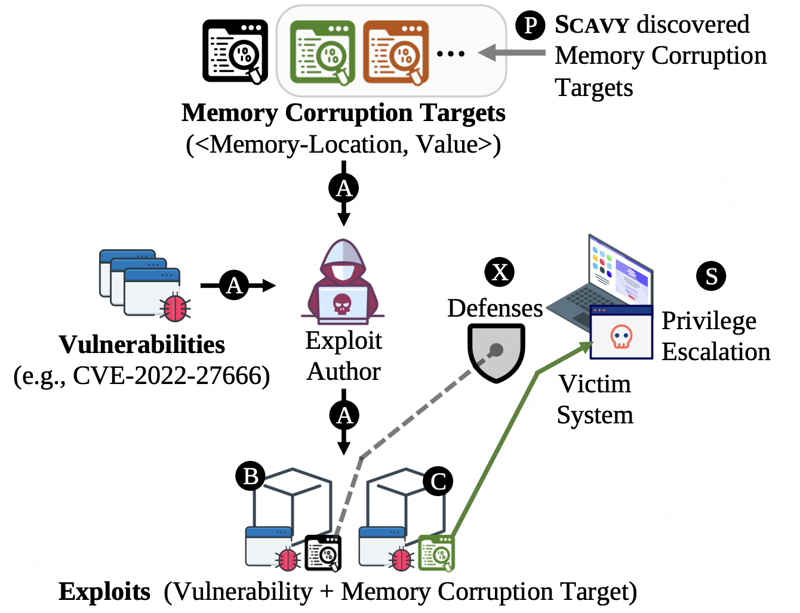
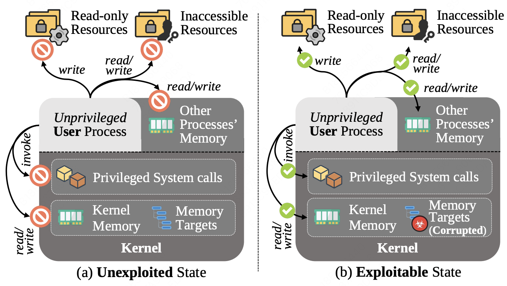
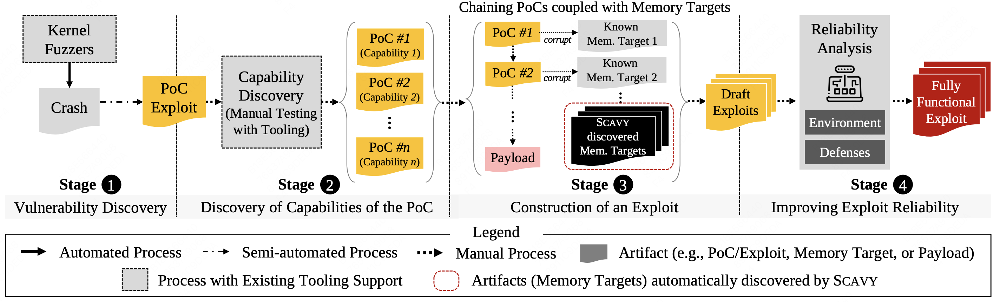

# Scavy：自动化发现Linux内核中能够提权的内存破坏目标

## 摘要

我们提出了 SCAVY，一个自动发现内存损坏目标以实现 Linux 内核权限提升的框架。SCAVY 的关键创新在于将搜索范围扩展到之前研究中未涉及的 Linux 内核数据结构，重点不仅仅是函数指针或指向包含函数指针的结构的指针，还包括剩余的 90% 的内核结构。此外，SCAVY 的搜索是与漏洞类型无关的，因为它考虑了任何形式的内存损坏能力。

为此，我们开发了新颖且可扩展的技术，结合模糊测试和差异分析，通过比较存在内存损坏与无损坏执行之间资源可访问性的差异，自动探索并检测权限提升。这使得 SCAVY 能够判断某个字段的损坏是否会使系统进入可利用的状态，而不依赖于所利用的具体漏洞。SCAVY 共发现了 955 个 PoC，并从中识别出 12 个结构中的 17 个新字段，这些字段能够实现权限提升。我们利用这些目标开发了 6 个针对 5 个 CVE 漏洞的利用方法。我们的研究结果表明，新发现的内存损坏目标可能会改变漏洞的安全影响，这提示研究人员应主动发现内存损坏目标。

## 一、简介



内核漏洞利用通常从触发允许内存损坏的漏洞开始，最终通过用特定值覆盖特定的内存位置，将系统置于可利用的状态，从而攻击者能够改变系统行为。这些用于内存损坏的目标位置，我们称之为“内存目标”，它们与被利用的漏洞是独立的：攻击者可能会在利用其他漏洞时再次使用这些目标，而防御者通常将注意力集中在这些内存目标上，以防止未知漏洞的利用。例如，图 1 展示了通过结合漏洞和内存目标（A）创建的一个利用方式，进而形成多个组合（或利用方式），如B和C。虽然先前的研究主要集中在发现和探索漏洞上，但对于在利用过程的最后一步中需要的内存目标的发现，相对较少受到关注。

假设一个权限提升漏洞（图 1 中的 B）试图通过破坏内核数据结构中的函数指针来执行恶意负载，从而提升特权。不幸的是，攻击者在此漏洞中使用了过于强大的能力，导致利用方法过于明显（即控制流劫持），因此容易被流行的防御机制（如 CFI）阻止。然而，新的内存目标可以使攻击者在不被检测的情况下提升权限（C），避免被防御机制（S）识别。

通过破坏其他内存目标，如用户名、inode 数字或 task_struct::addr_limit 字段，也可以实现权限提升。特别是，addr_limit 字段在 2019 年被 NSO Group 用来在 Android 设备上安装 Pegasus 间谍软件。这一漏洞由 Syzkaller 于 2017 年发现，但由于其安全影响尚未明确，许多已发布的设备在多年内并未修补该漏洞。结果，2020 年，addr_limit 字段在超过 40% 的 Android 内核漏洞攻击中被利用。这导致该字段被从 Linux 内核中移除，以防止此类攻击。因此，新的内存目标的发现使得许多漏洞可以被利用，包括那些此前被认为无法利用或不重要的漏洞。此外，新类型的内存目标还能够使得漏洞避开聚焦于常见内存目标的现有防御机制。发现内存目标在防御性上下文中也具有重要意义，因为多种技术（例如 freelist 指针模糊化）可以用来保护这些内核对象。

尽管发现内存目标非常重要，但这一过程一直具有挑战性，通常需要依赖对 Linux 内核代码库的专业知识进行手动操作。之前关于自动化内核漏洞利用生成的研究（如 [13, 14]）主要集中在探索特定漏洞，且通常只涉及有限类型的内存目标（例如，函数指针或引用计数字段）。因此，针对 Linux 内核数据结构中可能被权限提升利用的字段尚未进行系统化的研究。例如，在 Linux 内核版本 5.15.80 中的 6,582 个结构体中，只有 746 个（11.3%）包含函数指针（142 个；2.1%）或指向包含函数指针的结构体的指针（604 个；9.2%），这些被认为是安全敏感的并且已在先前的工作中得到了积极的处理。其余的 88.7% 代表着一个尚未被探索的攻击面。此外，即使是之前已被处理的 11.3%，也仍然需要进行额外的深入搜索，因为 [13, 14] 只检查了现有的漏洞利用代码中的可达内存区域，而 [15] 仅关注在分析过程中导致崩溃的少数内核对象。

我们提出了 SCAVY，一个用于系统性发现 Linux 内核中权限提升内存目标的框架（图 1 中的 P）。SCAVY 旨在搜索更广泛类型的内存目标，超越现有技术主要关注的指针类型内存目标[16-19]。具体来说，SCAVY 旨在发现能够影响（或启用）许多已知和未知漏洞的新类型内存目标。

在分析内核结构和内存区域以寻找内存目标时，SCAVY 遇到了两个挑战：（1）检查大量潜在的内存目标，和（2）缺乏能够检测多种形式潜在权限提升的预言机。SCAVY 通过利用基于差异分析的多次执行推理来应对这两个挑战，这种方法比现有的依赖符号分析和污点分析的技术更高效。具体而言，SCAVY 通过执行多次带有和不带有内存损坏的执行，检查执行中的程序状态，特别是安全敏感资源的可访问性。分析这些结果后，SCAVY 引导搜索过程并检测权限提升。

SCAVY 生成了 955 个 PoC 漏洞利用，能够通过破坏 275 个独特字段在 86 个内核结构体中潜在地实现权限提升。在 CVE-2022-27666 的 PoC 漏洞利用中，我们基于 SCAVY 识别的新内存目标创建了两个完全功能的权限提升漏洞利用（见第 3.1 节和附录 A.2）。与原始漏洞利用需要绕过流行的内核防御（如 KASLR、SMEP/SMAP 和 CFI）不同，我们的漏洞利用不需要处理这些防御。

总结而言，我们做出了以下贡献：
- 我们重新审视了内存目标和损坏后程序状态的定义，以识别 Linux 内核中更广泛的内存目标类型。
- 我们设计并实现了 SCAVY，一个系统性发现内存目标的框架，能够发现实现权限提升所需的值。我们讨论了搜索过程中的每个步骤的设计选择和基于差异分析的执行推理。
- 我们通过发现 12 个内核结构中的 20 个内存目标来评估 SCAVY 的有效性，其中值得注意的是，17 个目标之前从未在公开的权限提升漏洞利用中被使用过。我们证明了 SCAVY 发现的内存目标是漏洞无关的，具体通过为 5 个不同的 CVE 开发了 6 个漏洞利用来展示这一点。
- 我们将我们的技术开源，供未来研究使用[20]。

## 二、问题陈述

尽管在发现软件漏洞方面取得了重要进展，但对其安全影响的错误评估仍然很常见，且可能带来严重的负面影响。例如，专家在优先修补漏洞的建议中最初忽视了 CVE-2017-0144，这是后来被 WannaCry 和 NotPetya 利用的漏洞；CVE-2019-2215 在 2017 年被发现，但由于其安全影响未知，许多 Android 设备未及时修补，直到该漏洞被 NSO 集团利用[2]。漏洞可利用性评估具有挑战性，因为它们需要对具有未知状态空间和新兴指令语义（即“奇异机器”）的状态机进行推理[23]。尤其对于权限提升漏洞，评估其可利用性需要能够覆盖特定的内存目标。

### 2.1 问题定义

SCAVY旨在解决寻找可能导致权限提升的内存目标的问题。在我们的上下文中，内存目标是指内核数据结构中的某个字段，而权限提升被定义为一种权限的变化，允许在不使用合法方法（例如，修改权限的API）的情况下访问未经授权的资源。为了方便讨论，我们将程序的执行状态分为三种不同的状态，基于利用过程如何推进以达到最终目标（例如，接管系统控制）。

1. **未利用状态（Unexploited State）**：在利用开始之前，进程的执行处于未利用状态。
2. **可利用状态（Exploitable State）**：当利用触发漏洞并破坏系统状态以提升权限，允许访问利用者想要妥协的资源时，状态变为可利用状态。此状态意味着利用已经获得了达到最终目标所需的所有资源访问权限，但尚未完全实现目标（即，系统尚未被完全妥协）。
3. **已利用状态（Exploited State）**：当利用成功实现其目标时，执行状态变为已利用状态。

**威胁模型**。我们假设一个本地的非特权对手，试图通过利用Linux内核中的漏洞，利用SCAVY找到的内存目标来提升权限。这个威胁模型在多种环境中是相关的，例如云计算（如Docker）、Android系统[24]以及恶意软件利用内核漏洞[25]。由于SCAVY为给定的漏洞发现内存目标，我们的威胁模型涵盖了广泛的内存破坏能力的漏洞。需要注意的是，这也意味着SCAVY发现的内存目标可能需要特定能力的漏洞。正如第4节和第3节所描述的，从SCAVY识别出的内存目标创建端到端的功能性利用需要人工干预。因此，自动化利用生成过程不在本研究的范围之内。

#### 2.1.1 不可利用、可利用、已利用状态



**Figure 2** 说明了我们问题定义中的两个关键状态（即未利用状态和已利用状态），包括在这些状态下各种资源的权限。我们首先定义了五种不同类型的特权资源，如下所示：

- **只读资源**：这些是被配置为只读的文件（例如，Apache的配置文件是只读的，以防止未经授权的修改[27]）。setuid 文件也是只读的。
- **不可访问资源**：敏感文件或root拥有的文件/目录（例如，/etc/shadow或/root）对非特权进程是不可读写的。
- **特权系统调用**：某些系统调用具有特权（例如，mount和chroot）。如果非特权进程调用这些系统调用，请求将被拒绝并失败。
- **内核/其他进程的内存**：非特权用户进程不能读取/写入内核内存。由于内存空间隔离，其他进程的内存也不可访问（即，不能读取/写入）。

**未利用状态**：在此状态下，程序的执行遵循每个资源配置的权限。例如，如图 2-(a) 所示，程序无法读取或写入不可访问的文件/文件夹（如 `/etc/shadow` 和 `/root`），也无法写入只读文件（如 `/etc/passwd`），除非调用权限/特权变更的API。内核内存、特权系统调用和其他进程的内存都是不可访问的。

**可利用状态**。假设在未被利用状态下对任何特权资源（例如，读/写操作）的禁止操作在篡改内存目标后变得可用，那么我们认为该执行的状态已经转变为可利用状态。
需要注意的是，存在多个不同的可利用状态实例，这取决于哪个资源的特权被提升。例如，一个可利用状态可能提升了对 `/etc/passwd` 的权限，而另一个可利用状态则提供了对受限内存区域的访问。因此，根据攻击的最终目标和执行环境，可能需要特定的可利用状态。为了确定某个状态是否可以用于实现攻击目标，描述可利用状态中确切的特权提升和先决条件是非常重要的。

**已利用状态**：当利用状态通过特权提升达成了攻击者的最终目标时，利用状态就转变为被利用状态（exploited state）。例如，攻击者通过提升对 `/etc/passwd` 和 `/etc/shadow` 的权限，成功添加了一个 root 用户，便可视为攻击达到了目标。需要注意的是，被利用状态的定义是特定于每个漏洞利用目标的。例如，如果攻击者的目标是更改 Apache 配置，那么在利用状态下必须具备对 `httpd.conf` 文件的写权限，才能实现该目标。

### 2.2 目标和非目标

**目标**：SCAVY的目标是找到一个内存目标，当它被篡改时，能够将一个未被利用的状态转换为一个可利用的状态。为了清晰地定义内存目标的适用性，必须识别以下两方面的内容：

- **先决条件**：  
  - **(1) 分配内存目标所需的权限和方法**：指在分配内存目标时需要的权限（例如，分配特定数据结构时的内存权限）。
  - **(2) 篡改内存目标所需的权限**：指篡改内存目标所需的权限（例如，如果目标是只读的，则需要内存写权限）。
  - **(3) 内存篡改能力**：即内存目标是否可以被篡改，包括可以篡改的内存位置、大小和可能的值。

- **后置条件**：  
  - **(1) 提升的权限/权限**：内存目标篡改后，攻击者获得的权限或访问权限（例如，获得写权限、增加管理员权限等）。
  - **(2) 提升的资源名称或路径**：被攻击者获得的资源的名称或路径（例如，访问到 `/etc/passwd` 或 `/root`）。
  - **(3) 提升资源的范围（即偏移和范围）**：篡改后的资源的范围，指示能够访问或修改的具体资源区域（例如，在 `/etc/passwd` 中的特定位置）。

**非目标**。SCAVY 并不专注于识别新的漏洞。SCAVY 识别的新内存目标可能在某些情况下修复因系统级防御（例如 SMAP）而无法工作的漏洞，但它们并不会提高漏洞利用的能力或可靠性（如第 4 节所定义）。尽管我们通过开发一些功能性漏洞利用（参见第 3 节）展示了从可利用状态到已利用状态的过渡能力，但自动化这个步骤不在我们的研究范围内。最后，我们的目标不是构建一个自动化的端到端漏洞利用工具。

## 三、动机例子

我们描述了两个由Scavy识别出来的使用内存目标的利用方法，来作为影响和实践性的动机。

### 3.1 破坏vm_area_struct::vm_file

**目标内核结构**。`mmap` 系统调用用于创建一个内存映射文件，并通过已打开的文件描述符映射文件内容。如果映射是以写权限创建的，修改缓冲区的内容将在文件关闭时写回原始文件。Linux 内核使用 `vm_area_struct` 结构来管理内存映射文件，如下所示。该结构包含映射内存的地址范围（`vm_start` 和 `vm_end`）、权限（`vm_page_prot`）以及指向文件的指针（`vm_file`）。

```c
struct vm_area_struct {
    unsigned long vm_start;     /* mmap() retval */
    unsigned long vm_end;
    ...
    pgprot_t      vm_page_prot; /* pg. permissions */
    ...
    struct file*  vm_file;      /* victim field */
};
```

**发现过程**。SCAVY 自动发现，通过篡改 `vm_file` 可以影响对应内存映射文件的内容，可能导致特权提升。具体而言，SCAVY 首先创建两个执行实例访问同一个文件（从而它们将访问 `vm_area_struct::vm_file`）。然后，它在其中一个执行实例中用随机值篡改 `vm_file`。SCAVY 比较这两个执行实例（即有和没有篡改的情况），发现两个执行实例访问到了不同的文件内容。

接下来，SCAVY 创建第三个执行实例来检查是否能够实现特权提升。这一次，SCAVY 不使用随机值，而是使用 `vm_area_struct::vm_file` 的其他有效值实例。具体来说，SCAVY 打开一组既有特权文件也有非特权文件，以获得 `vm_file` 实例的值。SCAVY 将这些值复制到 `vm_file` 中进行篡改，并检查第三个执行实例是否能够访问其 `vm_file` 值所复制的文件内容。

这检查了将 `vm_file` 的内容从特权文件复制到攻击者拥有的文件，是否允许攻击者使用攻击者拥有的文件权限访问特权文件的内容。例如，如果攻击者将 `vm_area_struct::vm_file` 从密码文件（即 `/etc/passwd`）复制到一个无特权的临时文件的 `vm_area_struct::vm_file`（例如 `/tmp/file`），那么攻击者可以读写密码文件。为此，SCAVY 将 `vm_area_struct::vm_file` 识别为一个内存目标。

**完成漏洞利用**。我们使用 CVE-2022-27666，它提供了越界写入能力 [28]，来破坏内存目标。该漏洞利用首先打开两个文件：（1）一个具有读/写权限的虚拟文件，和（2）具有只读权限的密码文件（/etc/passwd）。接着，它使用 `mmap` 创建几千个文件的内存映射（例如在这个例子中是 3000 次）。需要注意的是，每次调用 `mmap` 都会在内核中分配一个 `vm_area_struct` 实例。然后，我们利用漏洞泄露已创建结构的相邻页面，以读取映射到 `/etc/passwd` 的 `vm_file`。接下来，我们再次利用漏洞将 `/etc/passwd` 的 `vm_file` 内容复制到虚拟文件的 `vm_file` 中。

> FIXME: 漏洞需要先泄漏特定文件指针（越界读），之后再覆盖到另一个特定文件的指针（越界写）。

最终，漏洞利用调用 `msync`，并传入已损坏的 `vm_area_struct::vm_start`。这会使内核同步映射页面的内容，将 `/etc/passwd` 的内容写入到映射的页面中，而使用的是虚拟文件的权限（即读写权限）。通过这种方式，攻击者能够修改 `/etc/passwd`，从而添加一个新的 root 级别账户。

附录 A.2 提供了该漏洞利用的更多细节，并介绍了使用 `file::f_mapping`（SCAVY 发现的另一个内存目标）来利用 CVE-2022-27666 的选项。在第 7.3.3 节中，我们讨论了通过破坏 `vm_area_struct::vm_file` 来利用另外两个漏洞的情况。

### 3.2 破坏key::description

**目标内核结构**。`keyctl_instantiate` 系统调用在内核中分配了 `key` 结构，如列表 2 所示。该结构包含存储权限（`perm`）、所有者标识符（`uid` 和 `gid`）以及密钥的文本描述（`description`）等字段。这次，我们的攻击目标是 `description` 字段，它是一个字符串指针，其中的文本会被 `keyctl_search` 系统调用使用，后者允许用户搜索密钥环。

```c
struct key {
    refcount_t      usage;
    ...
    kuid_t          uid;
    kgid_t          gid;
    key_perm_t      perm;
    ...
    unsigned long   len_desc;
    char*           description;
    ...
};
```

**发现**。SCAVY 发现，一旦 `description` 字段被篡改，攻击者可以通过调用 `keyctl_describe` 来从被篡改的地址读取字符串值，从而实现**任意内存读取**。具体来说，SCAVY 创建了两个进程：(1) 使用构造的描述字符串（包括有效负载）调用 `add_key()` 来创建一个密钥；(2) 使用 `keyctl_read()` 访问创建的密钥。在一个进程中，SCAVY 注入一个篡改操作，覆盖 `key::description` 字段，使用另一个密钥实例的值。另一个进程则没有进行任何内存篡改。在两个执行结束时，SCAVY 比较 `keyctl_read()` 的返回缓冲区，检测偏差，发现对内核内存的特权升级，而这些内存是普通用户进程无法访问的。

**完成利用**。我们修改了现有的 CVE-2016-0728 漏洞利用代码，该漏洞通过覆盖 `key::key_type::revoke` 字段来实现。该字段是一个函数指针，因此攻击者可以劫持控制流。然而，实际上，这使得该利用在 Android 设备上变得不可靠，原因可能是缺乏内核符号 [29] 或受到了 SMEP/SMAP [30] 的限制。

为了替代篡改函数指针，我们将重点放在 `key::description` 字段上。与原始方法类似，我们的利用首先通过将 `key::usage`（引用计数）溢出至“0”来触发漏洞。这会提前释放该结构，从而为我们提供了一个“使用后释放”（use-after-free）原语。我们通过分配一个 `msg_msg` 对象来使用这个原语，该对象包含一个缓冲区，在该缓冲区中我们可以插入任意数据（如消息）。该缓冲区与 `key` 对象的字段重叠，允许我们覆盖长度字段 (`len_desc`) 和描述指针 (`description`)，后者是攻击目标。如果操作得当，攻击者可以从任意的内核地址读取数据。利用这个能力，攻击者可以绕过 KASLR（内核地址空间布局随机化），泄露内核内存，甚至可以从其他 Android 应用的密钥环中读取秘密密钥，可能会泄露会话 Cookies 等敏感信息。

> FIXME: 使用了msg_msg填充UAF的空槽。

## 四、Scavy在内核利用中的开发流水线



在本节中，我们将我们的工作与先前的 Linux 内核漏洞利用研究进行对比。正如图 3 所示，一个功能性的内核漏洞利用可以通过以下四个阶段创建：

1. **识别导致崩溃的漏洞**：在这个阶段，研究人员发现了一个能够引起程序崩溃或不稳定行为的漏洞，这通常是通过崩溃堆栈、内存损坏或其他不正常的行为来识别的。

2. **发现漏洞的其他能力，这些能力可以篡改不同的内存目标**：此时，漏洞不仅仅被当作崩溃的根源来看待，还可以被深入挖掘，发现它有可能用来影响内核中不同的内存区域，例如数据结构或关键内存字段。通过发现这些可能的内存目标，攻击者可以逐步揭示漏洞的其他利用途径。

3. **将这些能力组合起来以提升特权**：一旦发现漏洞具有影响多个内存目标的潜力，攻击者便可以将这些能力组合在一起，利用它们实现从普通权限到更高特权的升级。这个阶段是漏洞利用的核心，涉及对内核结构和安全机制的深入了解。

4. **创建一个可靠的漏洞利用，能够提升特权并绕过防御机制**：最后，漏洞利用需要具备可靠性，能够在不同的环境和防御措施下顺利工作。这包括绕过常见的防御机制，如 KASLR（内核地址空间布局随机化）、SMEP/SMAP（用户空间和内核空间的执行保护）和控制流完整性（CFI）。这个阶段强调的是漏洞利用的最终稳定性和可用性。

这四个阶段展示了内核漏洞利用从发现漏洞到创建实际攻击工具的过程，而 SCAVY 的创新之处在于，它为阶段 2 和阶段 3 提供了新的自动化发现内存目标的方法，并为后续阶段的漏洞利用开发提供了潜在的内存攻击目标。

### 阶段1：漏洞挖掘

抱歉，我理解错了。以下是翻译：

**模糊测试方法**。为了发现能够改变系统行为的漏洞，已经提出了多种测试技术，其中之一就是模糊测试（Fuzz Testing）。**Syzkaller** 是一种专门用于发现 Linux 内核漏洞的流行模糊测试工具。近年来，已经提出了多种先进的模糊测试方法，这些方法利用了混合模糊测试（Hybrid Fuzzing）、符号执行（Symbolic Execution）和基于状态的探索（State-Based Exploration）等技术，以提高漏洞发现的效果。

**利用违规检测器**。违规检测器 [37–41] 是一种运行时技术，当检测到操作违反期望的属性时，会引发异常（例如，越界读取/写入 [37]、使用后释放 [38] 和竞争条件 [39,40]）。当这些检测器应用于目标系统时，它们实际上将违规操作转化为崩溃，帮助模糊测试工具识别那些可能是潜在漏洞的违规操作。近年来，在 Linux 内核模糊测试中，利用这种检测器已成为一种典型的策略 [41]。

> 其实就是sanitizer。

**与 SCAVY 的关联**。一个漏洞需要能够破坏特定内存的能力，这种破坏可能导致权限提升。在这一阶段，漏洞通常会导致崩溃，通常是因为它破坏了关键内存。然而，是否能够破坏特定内存目标并赋予其期望的值仍不明确。SCAVY 的重点是发现内存目标，而不是发现漏洞。

### 阶段2：能力探索

**漏洞的能力**。一个漏洞通常会在发布时附带一个单一的内存破坏目标，这个目标在触发时通常会导致内核崩溃。然而，这样的初始能力可能不足够强大和多样化，无法实现权限提升。因此，研究一个漏洞的其他能力成为了关键步骤，用以判断该漏洞是否具有可利用性。已有一系列研究专注于探索漏洞的完整能力[13–15]。具体来说，文献[13]提出了能力引导的模糊测试来研究越界写漏洞；[14]利用模糊测试和符号执行来探索一个使用后释放（UAF）漏洞的各种上下文，并确定攻击者是否能够控制系统达到可利用状态；[15]探索相同漏洞的多个崩溃，以观察更多可利用的崩溃。AlphaExp [42]发现了内核结构中的字段，这些字段能够被利用以实现任意代码执行（ACE）或任意地址写入（AAW）能力，但不能实现权限提升。它专注于一组不同的结构字段，缺少如SCAVY所发现的`vm_area_struct`结构。

**与SCAVY的相关性**。这一阶段探索漏洞是否能够破坏更多样的内存范围。由于SCAVY发现的内存目标本质上是内核数据结构的字段，**漏洞的能力对于判断是否可以利用来破坏SCAVY的内存目标至关重要**。要利用SCAVY的内存目标，漏洞必须具备能够破坏该内存目标的能力。

### 阶段3：构造利用

**提权**。提权通常通过以下两种方式实现：(1) 获得任意代码执行权限，或(2) 将当前用户/资源的权限提升为root。

首先，现有的方法[13, 14, 43]会自动测试漏洞是否能破坏已知的数据结构字段，这些字段可能会劫持控制流（例如，函数指针/数据指针）。其次，现有的脚本[44]会搜索与已知的关键系统配置（例如，uid、gid或凭证[5]）相关的内核结构字段，如果这些字段被破坏，可能导致提权。然而，这些方法主要集中在已知字段或有限类型的字段上（例如，代码或数据指针[13, 14, 43]以及引用计数器[45-47]）。虽然也有一些方法寻找其他类型的内存目标[45-49]，但它们通常是手动执行的，或者专注于某些特定类型。例如，[48]聚焦于处理可变长度数据的结构，这些结构如果被破坏，可能会导致越界读取；[49]则搜索包含数据指针的结构，破坏这些结构后，攻击者可以控制被引用的数据。

一些漏洞利用需要链式组合多个漏洞（或PoC）来破坏多个内存目标（例如，先泄漏一个值，然后用这个值破坏一个字段），从而实现**提权**。最终，通过有效载荷来实现漏洞利用的最终目标（例如，接管系统）。

**与SCAVY的相关性**。通常，只有能够破坏少数已知内存目标的漏洞才会被用来构建利用链。而能够破坏其他内存目标但不是已知目标的漏洞，则被认为是不可用的。SCAVY发现了新的内存目标，使得更多的漏洞能够用于构建利用。SCAVY发现的内存目标使得利用能够以更多样且微妙的方式实现**提权**。

### 阶段4：提高漏洞利用的可靠性

**一致性地破坏内存目标**。在前一阶段创建的漏洞可能无法可靠地实现提权，这是因为内存布局和执行漏洞时的时序具有随机性。因此，漏洞开发者采用各种技术[43, 51, 52]来创建可靠的内存破坏环境。具体而言，[52]展示了一种叫做堆风水（heap feng-shui）的方法，这种方法扩展到所有的 slab 缓存，因此可以被多次回收用于内核漏洞。[43]自动查找系统调用，以在期望的堆内存布局中分配感兴趣的对象。[51]测试了常见的堆布局操控和漏洞稳定化方法，以帮助漏洞开发。

**绕过防御措施**。一个可靠的漏洞利用还应该绕过现有的防御机制[10, 53, 54]。为此，研究人员提出了各种技术来绕过这些防御。具体而言，[55]链式使用内核端的ROP gadgets以绕过基于控制流完整性（CFI [10]）的现代保护。[56, 57]提出了绕过内核地址空间布局随机化（KASLR）[53]的方法。[54]和[58]分别提出了绕过监督模式执行防护（SMEP）[59]和监督模式访问防护（SMAP）的方法。[50]展示了提高漏洞利用可靠性的实用技巧。

**与SCAVY的相关性**。虽然SCAVY与这个阶段没有直接关系，但使用一些SCAVY发现的内存目标可以更容易地实现漏洞利用的可靠性。例如，分析CVE-2016-0728的已发布PoC漏洞利用时提到，现有的防御措施如SMEP/SMAP [9, 59]可能会降低漏洞利用的成功率[30]，而一些SCAVY发现的内存目标可以避免这些防御的检测。

## 五、设计

图4展示了SCAVY的整体过程，包含三个阶段：（1）仪器化与分析（第5.1节），（2）潜在内存破坏目标的发现（第5.2节），以及（3）用于提权的内存破坏目标的检测（第5.3节）。

### 5.1 插桩和分析

类型转换插桩。为了识别内存破坏目标，SCAVY需要识别内核中分配的内存类型（例如，结构体的类型）并进行破坏。像GREBE [15]这样的技术依赖于大开销的污点分析，但它们无法处理SCAVY所涉及的庞大数量的潜在内存破坏目标。为此，SCAVY对类型转换操作进行了插桩。

请注意，Linux内核编码风格指南文档[60]指出，内存分配应该进行类型转换。在LLVM中，它使用CastInst [61]来进行类型转换操作。因此，我们通过插入一个调用虚拟函数的方式对CastInst进行插桩，该虚拟函数接受两个参数：(1) 正在进行类型转换的变量的内存地址，(2) 其新的数据类型，这个类型作为字符串在编译时传递。需要注意的是，我们仅在源类型和目标类型不同时才对CastInst进行插桩（例如，将‘void*’分配给一个结构体）。在运行时，**我们使用Kprobe [62]将虚拟函数的参数以及内存分配器（例如kmalloc()）的返回值日志记录到用户空间**。之后，模糊测试器将分配的内存地址与其数据类型关联起来。

> FIXME: 了解一下kprobe。

内核数据结构分析。在插桩和分析过程中，SCAVY旨在提取感兴趣的内核结构的内存布局，以便为后续分析提供指导。虽然我们可以通过LLVM pass从源代码中提取它们，但如果编译器优化了结构体的内存布局，这些信息可能不准确。具体来说，未打包的结构体（即没有使用‘((packed))’属性的结构体）可能在字段之间留有未使用的内存空间，导致结构体字段在二进制中的偏移量与源代码中定义的结构体不一致。例如，如果一个结构体包含一个6字节的字符数组，后面跟着一个整数（即`struct { char s[6]; int n; }`），编译器可能在这两个字段之间插入两个未使用的字节（即在`s[6]`之后和`n`之前，变成`struct { char s[6]; char unused[2]; int n; }`）。因此，我们**使用pahole [63]来查找结构体在二进制级别的大小和偏移量**。我们构建一个查找字典，将结构体名称与结构体字段的偏移量、大小和类型映射起来。需要注意的是，结构体中的结构体会递归解析。

> FIXME: 了解一下pahole。

**内存破坏桥接**。SCAVY的大多数组件运行在用户态，它们无法直接访问内核内存。因此，我们实现了一个内核模块，使得SCAVY的用户态组件可以破坏内核内存。具体来说，内核模块通过`ioctl()`提供了一个接口，使用户态程序能够读取和写入内核内存。在插桩过程中，我们将桥接模块加载到内核中。

### 5.2 潜在内核对象挖掘

