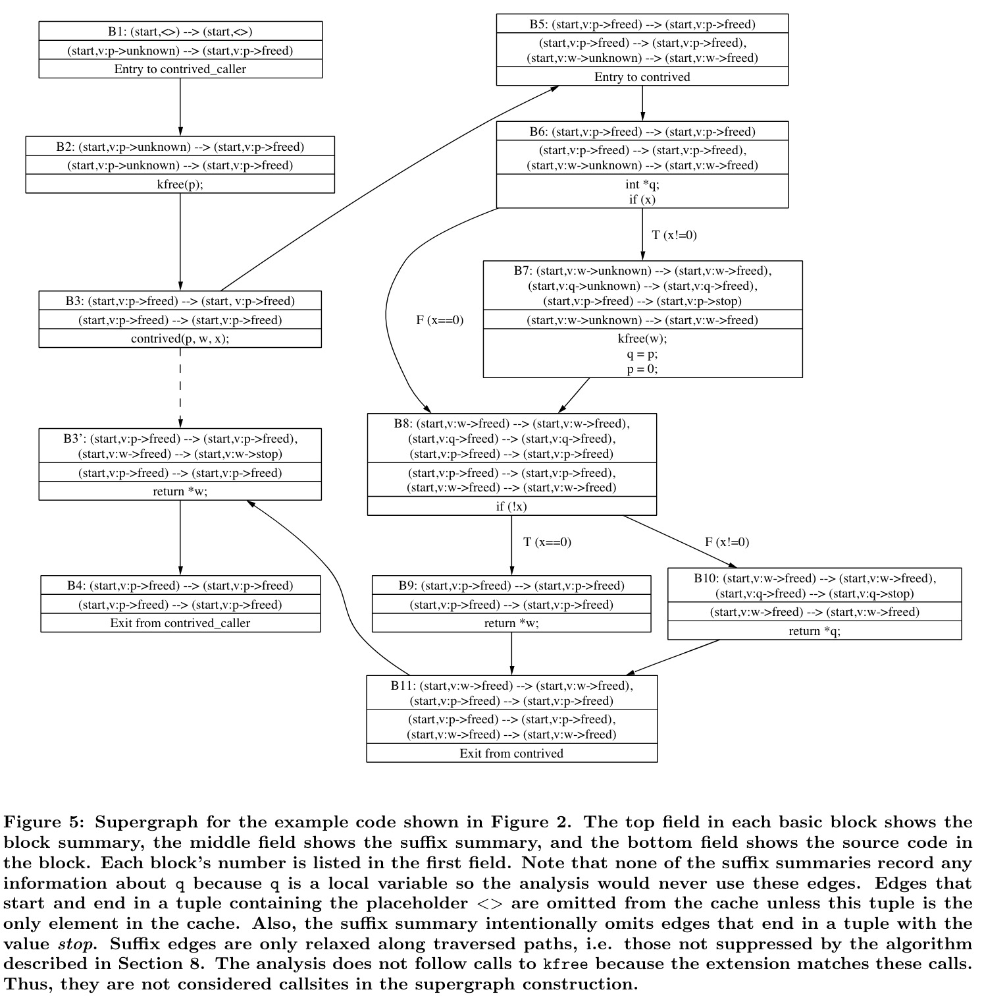

# 一种用于构建特定系统的静态分析的系统和语言

## 摘要

本文介绍了一种新颖的**bug查找分析方法以及该方法的部署**。我们的目标是**找到尽可能多的严重漏洞**。为此，我们**设计了一种灵活易用的扩展语言来指定分析，并设计了一种高效的算法来执行这些扩展**。这种名为 metal 的语言允许我们系统的用户以类似于检查规则的直观描述的方式指定一大类分析。xgcc 系统则使用上下文敏感的程序间分析方法高效执行这些分析。

## 一、介绍

本文介绍了一种不同寻常的查找bug的方法，我们称之为元编译（metacompilation，简称MC）。我们方法的重点是实用主义：我们希望找到尽可能多的严重 bug。我们使用程序员编写的<u>编译器扩展（检查器）</u>来实现这一目标。本文介绍了用于实现这些扩展的语言 metal，以及使用上下文相关、跨程序分析来执行扩展的分析引擎 xgcc。

发现错误的最大障碍是：仅仅了解代码必须遵守的正确性规则。可以检查的规则越多，发现的错误也就越多。因此，我们设计的 Metal 要做到：（1）易于使用；（2）足够灵活，能在统一的框架内表达各种规则。metal必须易于使用，因为许多规则只有程序员才知道；如果程序员不能编写扩展，我们就无法检查这些规则。因此，metal是为了系统实现者而不是编译器编写者设计的。metal必须具有灵活性，因为我们希望**检查任意规则**。我们不需要一个仅限于检查特定属性集（如同步约束、时序规则）或特定基本假设（如 "分析必须是保守的"）的系统。

Metal 易于使用，因为它提供了状态机（TODO:SM）作为基本抽象。状态机是一个简单的抽象概念，因为它们是系统编程中一个常见的概念。Metal 很灵活，因为它允许扩展编写者用通用代码、以近乎任意的方式增强状态机抽象。Metal 的灵活性允许扩展程序在不修改语言或底层系统的情况下使分析规则特定化。

我们之前的工作表明， metal 效果很好。它只需要很少的投入就能取得不错的成果：一天的工作就能产生一个能发现实际代码中几十甚至上百个严重错误的扩展。而且，扩展的代码量很小，通常在 10 到 200 行之间，主要取决于它们做的错误报告量。 metal 的灵活性体现在我们能够编写 50 多个检查器，这些检查器表达的分析类型大不相同，包括：(1) 发现违反已知正确性规则的行为 [1, 9] 和 (2) 自动从源代码中推断此类规则 [10]。我们将在第 2 节至第 4 节中介绍 metal 检查器。

我们对 xgcc 有三个主要要求：它必须 (1) 提供查找错误所需的分析；(2) 不显著限制 metal 扩展的功能；(3) 能够适用于大型程序。我们理想的分工是，**扩展程序只编码要检查的属性，而把如何检查规则的细节留给 xgcc**。第二和第三项要求非常重要，因为我们检查的规则越多，分析的代码越多，发现的错误也就越多。xgcc 对扩展的主要限制是determinism（确定性），除此之外它们可以在内部执行任意计算。在本文中，我们将介绍在 xgcc 中实现的分析算法，该算法可执行我们的扩展。我们将在第 5 节和第 6 节介绍 xgcc。

在第 7 节中，我们将讨论我们的分析所做的近似值及其影响。第 8 节讨论了处理误报的几种分析技术，包括消除不可执行路径的简单路径敏感分析。第 9 节继续讨论误报问题，介绍 xgcc 排列错误报告的方法。最后，第 10 节讨论相关工作，第 11 节为结论。

## 二、概述

我们的扩展是用 metal 编写的，它是一种用于表达各种定制化的、静态的、错误查找分析的语言。这些分析之间的共同点是：它们都利用了<u>许多抽象程序限制与源代码操作之间的明确映射</u>[9]。虽然metal扩展的执行方式与传统的数据流分析非常相似，但它们可以轻松地通过超出传统方法范围的方式进行扩展，例如使用统计分析来发现规则[10]。

要检查一条规则，**扩展要做两件事：(1) 识别与给定规则相关的有趣源代码操作；(2) 检查这些操作是否满足某些特定规则的约束**。Metal 围绕状态机（SM）抽象组织扩展。状态机是表示许多程序属性的简明方法。请注意，SM抽象提供了常见操作的便捷方式，*它并不限制扩展只能检查有限状态属性*。如果需要，扩展可以使用通用代码进行扩展。metal 扩展由过程间分析引擎 xgcc 执行。

图 1 显示了free检查器，当已释放指针解引用或双重释放时，该检查器会发出标记。我们在本文中始终使用该检查器和图 2 中的代码示例。扩展将发现示例中的两个错误（第 12 行和第 17 行）。

### 2.1 Metal扩展和状态机

 metal 扩展定义了一个或多个状态机的集合。在扩展执行过程中，扩展的当前状态是扩展定义的底层状态机所有当前状态的简单组合。每个状态机在逻辑上都是独立的：一个状态机中的转换不会影响其他任何状态机。状态机的数量在分析过程中时增时减。

每个 SM 的当前状态由一个全局状态值和一个或多个指定变量的状态值组成。全局状态值捕捉整个程序的属性（如 "中断被禁用"）。指定变量的状态值捕捉与指定源对象相关的程序属性（如 "指针 p 已释放"）。

上述定义的每个状态值都分配给一个状态变量实例。每个扩展都定义了一个全局状态变量和一个可选的指定变量的状态变量。为简单起见，<u>本讨论假定每个扩展都有一个全局状态变量和一个指定变量的状态变量</u>。状态变量有一个或多个实例，每个实例都有一个状态值。**全局状态变量只有一个实例，在整个分析过程中持续存在。指定变量的状态变量为每个具有附加状态的程序对象提供一个实例**。当分析决定跟踪新的程序对象并忽略先前跟踪的对象时，此类实例的数量会对应的增加和减少。**一个 SM 状态由全局实例的值和一个指定变量的实例的值组成**。因此，在分析过程中的某个给定点，<u>每个扩展中定义的 SM 数量等于具有附加状态的程序对象数量</u>。

在free检查器中，指定变量的状态变量 v 是用关键字 state decl 声明的。符号 v.freed 表示状态值 freed 与 v 绑定。因此，只有 v 的实例才能被赋值 freed。状态值 start 与全局状态变量绑定，因为它没有显式绑定。

每个 SM 的字母表由扩展中使用的 metal 模式定义。**模式用于识别与特定规则相关的源代码操作**。free检查程序使用模式来识别释放（使用模式"{kfree(v)}"）和解引用（使用模式"{*v}"）已释放变量。**这些模式中的变量 v 将匹配任何类型的指针**。

每个状态值都定义了一个转换规则列表。在 free 检查器中，start 状态定义了一条转换规则，v.freed 状态定义了两条转换规则。start状态的转换规则（第 3 行）规定，当全局实例的值为 start，且当前程序点与 {kfree(v)} 模式匹配时，应执行一个转换，将状态 freed 连接到与 v（即已释放指针）匹配的抽象语法树（AST）上。从 start 到 v.freed 的转换是一种特殊类型的转换，它创建了一个新的 v 实例，从而创建了一个新的状态机。

v.freed 状态值有两条转换规则：第一条在释放的变量被解引用时触发，第二条在释放的变量再次被释放时触发。这两个转换都会打印一条错误信息，描述错误并指出错误操作所应用的特定变量。**以指定变量的特定状态值开始的<u>转换</u>是由绑定到该值的状态变量的特定实例触发的**。因此，v.freed 状态中的两个转换是在扩展跟踪的一个已释放变量被双重释放或解引用时触发的。这些转换会将触发转换的实例值更新为特殊值 stop。当一个实例被赋予值stop时，跟踪该实例的状态机将从扩展的SM集合中移除。然而，如果与该实例相关联的变量再次被释放，那么start状态中的转换将执行，并重新实例化已删除的SM。

扩展的初始状态包含一个状态机，表示在分析开始时对程序一无所知。因此，free检查器中的全局状态变量初始值为 start，而 v 的特殊值为 <>，表明扩展不知道任何已释放变量。

xgcc按照深度优先顺序，逐个执行路径，从源代码基础的调用图的入口点开始，将扩展应用于单个函数的控制流图（CFG）。在每个程序点，扩展会查找当前所有SM中是否存在可执行的转换。在遍历所有SM之后，分析会继续到下一个程序点。正如第8节中所述，xgcc还通过附加分析来增强扩展，以修剪不可执行的路径，跟踪简单的值流，并删除重新定义的表达式所附带的状态。

### 2.2 free检查器的执行

我们通过跟踪free检查器在图 2 示例中的执行情况，将所有这些部分串联起来。

1. 第 14 行：contrived_caller 没有已知的调用者，因此是我们示例中调用图的入口。我们假设所有输入参数都没有别名。扩展从初始状态开始。
2. 第 15 行： kfree 调用将匹配start状态中的模式，检查器第 3 行的转换将执行，并将freed状态附加到 p。
3. 第 16 行：xgcc 在调用 contrived 时跟踪变量 p，因为它是作为参数传递的。
4. 第 4 行： 分析会沿着true和false路径进行拆分，首先是true路径。当分析分支时，扩展状态的独立副本会应用于每条路径。分析会沿着每条路径分别跟踪 x 等于 0 和不等于 0 的情况。
5. 第 6 行： 调用 kfree 会将 w 置为freed状态。此时，v 有两个值为 freed 的实例：p 和 w。
6. 第 7 行： 赋值会导致 xgcc 为变量 q 透明地创建另一个 v 实例，也是 freed 状态。
7. 第 8 行： 给变量 p 赋值会导致 xgcc 将 p 转换到stop状态，从而将 p 从扩展的状态中移除。
8. 第 10 行：xgcc 并没有在条件处拆分，而是利用 x 在此路径上为非零的信息来剪切true分支。如果遵循true分支，第 11 行将出现错误报告，因为 w 已附加状态freed（第 6 行）。
9. 第 12 行：v.freed 的解引用模式与 *q 匹配，并报告了一个释放后使用错误。分析返回后，分析回溯到第 4 行的false分支。
10. 第 10 行：xgcc 并没有在条件处拆分，而是利用 x 在此路径上等于 0 的信息来剪切false分支。
11. 第 11 行：路径结束。我们已经探索了通过 contrived 的所有路径。
12. 第 17 行：控制权返回调用者。v 的输出实例集是所有在通过 contrived 的路径的出口处活跃的实例的集合。有两个这样的实例，即 p 和 w，分别在第 11 行和第 12 行处于活跃状态。扩展程序在第 17 行随后的解引用时标记了一个错误。

接下来的两节将更详细地介绍 metal 。

## 三、Metal状态和转换

### 3.1 Metal状态

**每个状态变量的域由绑定到该变量的所有状态值组成**。本节将详细讨论状态变量，并对扩展的状态及其中的每个状态机提供更精确的定义。我们在此描述的扩展状态定义将转化为第 5 节描述的数据结构，从 xgcc 的角度定义扩展。

必须允许扩展使用通用代码扩展状态空间。这种灵活性的优势在于它允许我们的**扩展表达动态定义的状态空间属性**。

我们允许扩展通过在通用代码中扩展每个实例的域来扩大状态空间。为此，我们为每个指定变量的实例增加了一个数据值，该数据值是一个任意大小的 C 结构，扩展程序可以在转义为 C 代码时对其进行操作。扩展程序还可以在转义为 C 代码的过程中直接更新全局实例的值，以实现更复杂的转换。

> TODO: 上一段没懂。

**扩展的状态被定义为一组状态元组，每个状态元组对应该扩展中的一个 SM**。状态元组第一个元素，由全局实例的值填充。在free示例中，这个槽总是包含 start 的值。第二个元素包含指定变量的实例的值（例如，在free检查器中 v 的实例）。例如，分析图 2 中的第 15 行后，自由校验器的状态将包含元组（start, v : p → freed），因为状态变量 v 有一个连接到程序对象 p 的实例，而程序对象 p 的值已被释放。

虽然本文中的状态元组只有两个组件，但 metal 的实际实现允许扩展定义具有更多元素的元组。本文算法的实际实现处理的是更一般的情况。

### 3.2 Metal转换

**简单 metal 转换由一个源状态值、一个模式和一个目的状态值组成**。free检查器第 3 行的转换就遵循了这一模板。扩展通过遍历全局和指定变量的的实例，并确定每个实例的值是否定义了可以执行的转换，来决定执行哪些转换。如果转换的模式与分析中的当前点相匹配，则该转换可以执行。<u>实例不能在创建该实例的语句中触发转换</u>，这一限制可防止首次释放的变量在同一程序点触发双重释放。简单的转换可以通过 *特定路径的目标状态* 和 *C 代码动作* 来增强。

*特定路径转换* 。特定路径转换允许扩展跟踪  简单布尔谓词的值（如 l 为locked，p 为空）或可能有两种结果的模型函数。**如果转换发生在源代码的分支条件处，扩展可以根据分析是遵循条件的真分支还是假分支，指定不同的目标状态**。图 3 显示了锁检查器，当锁（1）在未被获取的情况下被释放（2）被重复获取（3）根本未被释放时，它会发出警告。用于非阻塞锁获取的例程 trylock 在获取锁时返回 1，否则返回 0。因此，在第一次转换中，我们将locked状态附加到真路径上的锁，将stop状态附加到假路径上的锁。当处于locked状态的 l 实例永久离开作用域或程序终止时，最后一个转换中的特殊模式 $end_of_path$ 的值为 true。

*C 代码动作* 。**转换可以包括 C 代码动作，只要转换执行，这些动作就会执行**。动作（Actions）是扩展可以扩展基本SM抽象的另一种方式。C 代码动作允许扩展程序在执行转换时执行任意计算。我们将介绍两类我们认为有用的操作：*执行复杂错误报告的操作* 和 *增强分析机制的操作* 。

为了使错误信息有用，检查程序不仅要报告错误的内容，还要报告错误发生的原因。因此，我们的所有检查程序都会跟踪发现每个错误的计算过程。这些计算取决于扩展的具体特征。跟踪错误标记原因的代码占每个扩展的大部分。

在 [10] 中，我们介绍了几种**使用统计分析来推断检查规则的检查器**。例如，要推断例程 a 和 b 是否必须配对：(1) 假设它们必须配对；(2) 计算它们一起出现的次数；(3) 计算它们不一起出现的次数（违反规则）。然后使用统计显著性检验对报告的违规行为进行排序。在分析过程中，我们使用 C 代码操作来统计正确配对和违规情况，从而实现了这一功能。(第 9 节使用相同的技术对违反规则的情况进行排序。）

默认情况下， metal 扩展的每个状态变量都有一个有限的、静态确定的域。扩展可以通过使用 C 代码操作来扩展这一模型，从而直接使用 xgcc 的内部接口来操作扩展的状态。例如，我们可以扩展上文所述的锁检查器，通过使用每个 l 实例中的数据值来跟踪当前锁的深度，从而处理递归锁。每当锁定操作或解锁操作发生时，由此产生的转换可以在 C 代码操作中递增或递减锁的深度。如果该深度低于 0 或超过一个小常量，扩展程序就会报告错误的锁配对。

组合是扩展可以用来增强 SM 模型的另一种机制。**扩展可以进行组合，使每个扩展都能在自己的分析中使用前一个扩展的结果**。扩展通过使用 xgcc 的内部接口，用任意数据值注释 AST 来实现这种组合。后续扩展可以检索和使用这些值。路径杀死扩展（path-kill extension）[10]就是组合的一种常见用法，它标记了所有对 panic 的调用，这样后续分析就不会在这些调用主导的路径上报错。当后续扩展看到被标记的函数调用时，就会停止遍历当前路径。

## 四、Metal模式

 metal 模式为扩展程序识别与特定规则相关的源操作提供了一种简单的方法。**模式是用源语言（C）的扩展版本编写的**，可以指定几乎任意的语言结构，如声明、表达式和语句。模式很容易使用，因为它们在语法上反映了要匹配的源构造。

基本模式可以用逻辑连接词 && 和 || 组成。metal 中最简单的基本模式在语法上与扩展希望识别的代码相匹配。因为我们**匹配的是 AST**，所以空格和其他词法不会影响匹配。例如，基本模式 {rand()} 将匹配对 rand 函数的所有调用。

例如，一个简单的模式无法匹配所有指针的解引用，因为每个解引用指的都是不同的指针。free检查器中第 5 行的模式匹配所有对 metal 空洞变量的引用（<u>任何使用关键字 decl 声明的 metal 变量都是空洞变量</u>）。空洞变量让模式包含任何适当类型的源结构体都能匹配的位置。

 **metal 中的空洞变量必须是类型化的**。如果给空洞变量分配了一个 C 类型，那么这个空洞就可以被该类型的任何表达式 "填满"。不过，为了匹配free检查器中的所有指针解引用，我们不能为 v 指定任何单一的 C 类型。**Metal 引入了新的元类型，将洞扩展到一整类相关类型**。空洞变量 v 的元类型是任意指针，它可以匹配指向任意类型存储空间的指针。表 1 列出了空洞类型及其含义。

如果同一空洞变量在模式中出现多次，每次出现都必须包含等效的 AST。例如，模式 {foo(x,x)} 匹配 foo(0,0) 和 foo(a[i],a[i]) 形式的调用，但不匹配 foo(0,1)。

在动作（而不是模式）中使用的洞变量指的是与洞匹配的 AST 节点。因此，在 free 检查器中第 8 行使用的 v 指的是与第 7 行匹配的已释放指针的 AST。

Callouts允许程序员通过在C代码中编写布尔表达式来确定匹配是否发生，从而扩展匹配语言以表达未预料或语言上尴尬的特性。

通过在基本模式后附加前缀\$来在语法上识别Callouts。退化的Callouts，\${0}和\${1}分别匹配空和任何内容。Callouts通常用作refine更一般模式的连接词。例如，`{ fn(args) } && ${ mc_is_call_to(fn, "gets") }`将匹配所有函数调用的模式精炼为只匹配 gets 调用的模式。变量 fn 是任意 fn 调用类型的洞变量，变量 args 是任意参数类型的洞变量。这个模式也可以写成字面的 C 代码。

单独使用时，Callouts函数只能引用当前程序点、mc_stmt 以及扩展程序或 xgcc 内的任何全局状态。与其他模式连接或分离使用时，Callouts函数可以引用这些模式中使用的空洞变量作为参数（见上例中的 fn）。

合法模式可以指定任何 C 表达式或语句（包括循环、条件或开关语句），但有两个限制条件。首先，模式中的所有标识符必须是扩展名中定义的空洞变量或被检查代码库范围内的合法名称。其次，模式中使用的 C 结构必须独立编译。非法模式的例子包括不包含任何外层switch语句的单例臂、孤立的 break 等。所有这些构造都可以与调用匹配。

## 五、过程内分析

本节将介绍我们的程序内算法，该算法将 metal 扩展应用于源代码库。该算法的目标是在不影响 metal 灵活性的前提下高效执行检查器。

扩展按<u>执行顺序</u>应用于单个路径中的每个 AST。**执行顺序是指按照相应指令的执行顺序访问每个语句的树**。例如，先访问函数调用的参数，再访问函数调用；先访问赋值的右侧，再访问左侧，最后访问赋值。**我们将 AST 节点称为程序点**。在每个程序点上，扩展会决定是否执行任何转换以及执行哪些转换。

我们通过**对 CFG 进行简单的深度优先搜索（DFS）来实现这种遍历**，搜索从入口区块开始。因此，<u>算法跟随一条控制路径，沿着这条路径遍历每个区块，直到函数结束，然后回溯到最后一个分支点</u>。DFS部分的分析是直接的；分析的重要特性是**使用块级状态缓存来提高速度**。<u>算法在遍历每个基本数据块之前，都会记录该数据块的扩展状态。在随后遍历同一区块时，如果扩展状态包含在该缓存中，则会中止遍历，并回溯到上一个分支点进行分析</u>。

我们首先介绍如何在单个程序点执行扩展。然后，我们将介绍块级缓存。最后，我们将概述 DFS 算法的伪代码。

### 5.1 对单个程序点应用扩展

图 4 显示了 DFS 算法的简化版本。下面我们将对数据结构进行描述。

每个指定变量的实例（var_state）都由一个包含状态值的整数s、一个状态所对应的程序对象树var和一个任意大小的扩展定义数据值data组成。var 字段中的树可以是代码中的任何树（如左值、一般表达式、语句）。

扩展状态由 sm_instance 结构表示，该结构有三个主要部分： (1) 扩展的单一全局状态 gstate；(2) 所有指定变量的实例的列表 active_vars，(3) 扩展代码指针 sm_fn。对 gstate 和 active_vars 的修改对每个路径都是私有的：当扩展回溯时，突变会restore。

扩展代码执行以下功能：(1) 确定要执行的转换；(2) 执行这些转换。这两个步骤共同指定了分析的转换函数。当执行一个转换时，它可能会对 sm_instance 结构产生以下影响：（1）改变 gstate；（2）添加或删除 active_vars 中的元素；（3）改变 active_vars 成员的状态和/或数据值；或（4）保持 sm_instance 不变。

为了提高分析算法的效率，我们利用了这样一个事实，即**如果扩展是确定性的，那么在同一状态下对同一程序点应用扩展将始终产生相同的结果**。因此，我们只需在每个状态下对每个程序点应用一次扩展。更准确地说，我们所要求的确定性条件是：<u>给定一个状态元组和一个程序点，如果我们将扩展的状态设置为该元组，并对程序点应用 sm_fn 函数，那么它将始终对 sm_instance 结构产生相同的转换</u>。此外，我们还要求每个状态元组都是逻辑上独立的状态机。下面我们将再次讨论后一个条件。

### 5.2 缓存

从 xgcc 的角度来看，扩展的状态被视为一组状态元组，以成对的形式表示，即 (gstate, v)，其中 gstate 是扩展的全局实例，v 是 active_vars 中的状态变量实例，或者是区分占位符"<>"。占位符确保在分析开始时，扩展状态正好包含一个状态元组。例如，free检查器的初始状态由集合 {(start, <>)}表示，在第 15 行第一次释放后，状态将变为 {(start, <>), (start, v : p → freed)} 。

正如我们在第 3 节中所述，扩展的状态表示为一组状态元组。**每个基本代码块（b）都包含一个代码块摘要，它记录了到达该代码块的<u>所有扩展状态的总和</u>，还记录了在分析该代码块的过程中，每个元组对应的 SM 是如何转换的**。基本代码块是 xgcc 对函数 CFG 的内部表示。xgcc 可以通过对当前 sm_instance 结构的修改，看到由基本代码块引起的转换。我们将<u>在遍历单个块时sm_instance可能发生的变化</u>分为两类：(1) 改变全局实例或指定变量的实例值的转换；(2) 创建新的指定变量的实例的添加。一个区块的摘要 b 使用两种类型的有向边来表示这些影响：
1. 转换边：（s, v : t → vs）→（s′,v : t → v′s）。初始状态元组表示在进入 b 时，全局实例的值为 s，并且有一个值为 vs 的状态变量 v 实例连接到程序对象 t。最终状态元组表示在分析程序块时，初始状态元组对应的 SM 转换到全局实例的值为 s′，并且 t 的指定变量的实例的值为 v′s 的状态。
   
   图 5 显示了图 2 示例的 CFG。图中每个区块的第一行是区块摘要。代码块摘要中代码块 7 的转换边示例为：（start, v : p → freed）→（start, v : p → stop）。这就是说，free检查器在全局状态 start 中进入第 7 个代码块，p 的实例处于freed状态，在第 7 个代码块的分析过程中，p 被转换到stop状态（被杀死）。
2. 添加边：（s, v : t → unknown）→（s′,v : t → v′s）。添加边表示，当全局实例的初始值为 s 时，在遍历数据块时会创建一个新的 v 实例，将状态 v′ s 附加到 t。添加边的起始元组包含特殊值 v : t → unknown，因为只有当我们在 b 的入口处对 t 一无所知时，这条边才适用。
   
   图 5 中块 2 的添加边示例为：（start, v : p → unknown）→（start, v : p → freed）。在代码块 2 进入时，全局实例的值为 start。在退出时，全局实例的值仍然是 start，但变量 p 现在的附加状态是 freed。如果我们知道在代码块 2 的入口处 p 已被释放，我们就会报告一个双重释放，而不是将 p 转换到已释放状态，那么起始元组中特殊值的必要性就显而易见了。

**块摘要是由该块生成的所有添加和转换边的并集**。在对块应用扩展之前，分析将当前扩展转换为状态元组集合s。然后，它从s中删除 与某个转换边的初始状态元组等效的 所有元组e。在此过程之后，如果s为空，则中止当前路径的遍历。当前块遍历完成后，将每个e ∈ s的转换边和添加边都添加到摘要中。

**请注意，虽然基于过程的算法不使用添加边或转换边的目标元组，但它们对于下一节中描述的过程间缓存是至关重要的**。

我们的算法计算一个定点，类似于传统数据流分析中的路径相遇（TODO:meet-over-paths）解。当每个块的块摘要（即缓存）包含<u>可以沿任何控制路径到达该块的所有状态元组</u>时（即最大定点解），分析停止。

本节中的算法在确定性之外对于metal扩展添加了额外的限制。**程序对象v附加的指定变量的实例在程序点上经历的转换不会受到附加到对象v′的任何其他实例（存在、缺失或状态）的影响**。这种独立条件允许我们**将到达一个块的所有状态元组合并成块摘要中的一个单一集合**，因为这些**状态元组代表着独立的状态机**，可以逻辑上独立地执行。如果没有独立性，那么我们分析每个程序点的次数将随着指定变量的实例数呈指数级增长。有了独立性，这个数量与这些实例的数量成线性比例增长。请注意，指定变量的实例上的转换可以与全局实例的值相关联。

### 5.3 DFS的缓存伪代码

一个扩展sm通过调用图4中的traverse_cfg例程，应用于过程f。traverse_cfg例程需要四个参数：sm（初始化为起始状态）、一个空栈、调用者（与过程间调用有关），以及f的CFG的入口块b。在起始状态中，gstate被初始化为扩展文本中的第一个状态（对于free检查器来说是start状态），**active_vars集合中包含一个特殊的<>状态元素，以确保扩展的状态只包含一个状态元组。这个元素在整个分析过程中持续存在**，但是当active_vars非空时，它会被忽略。因此，在图5中的块摘要中，至少包含另一个元素，因此我们省略了它。

例程traverse_cfg实现了具有缓存的深度优先搜索。这个例程基本上是一个标准的递归深度优先搜索，**不同的是在每个新的基本块b的入口处，它调用函数cache_misses来确定当前扩展状态是否是块摘要的子集**，如上所述。cache_misses返回一个更新后的active_vars集合，**使得具有新集合的sm_instance只包含不在块摘要中的状态元组**。<u>如果当前sm_instance中的所有元组都在块摘要中，深度优先搜索回溯到最后一个分支点。如果不是，traverse_cfg将扩展代码应用于b中的每个树，并按执行顺序遍历b的后继</u>。后继节点应用于当前扩展状态的副本。

## 六、过程间分析

本节描述了我们的上下文敏感的过程间分析。在高层次上，它的工作原理如下：
1. 第一个预处理步骤**以隔离的方式编译每个文件，将AST（抽象语法树）输出到临时文件**。这些输出的文件包括<u>源文件中的所有类型声明、变量声明和代码</u>，通常比文本表示大四到五倍。
2. 第二个分析步骤**读取这些临时文件，重新组装它们的AST，并构建CFG（控制流图）和调用图**。没有调用者的函数被视为根节点。在计算根节点时，递归调用链被任意地打断。
3. **系统从每个callgraph的根开始，使用一个DFS遍历将每个扩展应用于CFG。对于每个函数调用，系统检索被调用方的CFG，并在那里重新开始遍历**。扩展状态在调用边界处是refined，并在返回时是restored。除非扩展另有规定，否则refine和restore的规则遵循C的作用域规则。
   
   默认情况下，如果函数的CFG不可用，系统会默认继续到下一个CFG节点。

为了使DFS算法高效，我们**为每个函数添加了一个摘要缓存，该缓存通过合并块摘要来计算**。在每个函数调用时，会检查该缓存。类似于函数内的缓存，如果命中了缓存，就不会继续跟踪该调用。然而，<u>与函数内部情况不同，当在函数边界处命中缓存时，我们不能简单地中止当前路径。因为对于每个函数，有许多调用点，我们可能没有在当前状态下分析调用后的代码。因此，在缓存命中时，我们使用add和transition边来更新sm_instance，并在函数调用后继续遍历</u>。函数摘要将每个函数定义的状态转换的结果进行了存储。

我们的算法**不要求扩展具有有限的状态空间**，甚至在分析开始时也不需要知道状态空间。我们在这里描述的算法受到[18] (TODO:扩展)中的动态规划算法的启发，但是[18]中的算法要求分析的状态空间是有限的。这导致了实际的区别，即我们的算法自顶向下执行metal扩展。因此，我们不是从所有可能的状态开始分析每个函数，而是只从可以通过合法的过程间路径（即遵守调用和返回点的过程间路径）到达该函数的状态开始分析每个函数。

### 6.1 refine和restore

状态refine发生在遇到函数调用并且该函数调用被跟踪时。当分析从被调用方返回并继续分析调用方时，状态将被restore。扩展的全局实例在函数调用边界上保持不变。

当跟踪函数调用时，从调用方的作用域传递到被调用方的作用域的任何对象都应该保留其状态。这个操作通常**需要将状态从调用方作用域中的对象传递到被调用方作用域中的相应对象**。当函数调用返回时，restore操作可能需要将状态从被调用方作用域中的对象移动回调用方作用域中的适当对象，并且可能需要restore调用方中的原始状态。此外，当函数调用返回时，任何在跟踪函数调用时离开作用域的指定变量的实例应该重新出现。

我们根据表2中的规则列表，在函数调用时refine和restore扩展状态。每个规则列出了<u>实际参数、形式参数、需要传递状态的对象，以及如何将该状态refine给被调用方，然后restore给调用方</u>。表中的规则仅涵盖通过函数参数传递状态的情况。

附有状态的全局变量不受refine和restore操作的影响。如果调用是对不同文件的调用，文件范围的变量将离开作用域。文件范围变量的一个重要细微之处是，如果分析到达了调用链中较远的一个与原始调用方在同一文件中的函数，在被调用方返回之前，它们可能会重新进入作用域。因此，文件范围的变量会跨越函数边界传递，但它们被临时停用（因此，在分析中被忽略），直到分析返回到它们声明的文件为止。与调用方本地变量和表达式相关联的所有状态都保存在调用边界处，在跟踪调用之前从sm_instance中删除，然后在调用返回时restore到sm_instance中。

### 6.2 动态规划摘要

这个小节描述了我们*如何使用块摘要来构建函数级别和后缀级别的附加摘要*。函数摘要存储了add和transition边，它们总结了整个函数如何更新扩展状态。**当在函数调用边界处发生缓存命中时，函数摘要用于重现分析函数的效果**。每个块b还有一个*后缀摘要*，它由<u>从b开始、以退出点ep结束的add和transition边组成，该退出点是封闭函数p的出口点</u>。函数摘要可以被视为从入口块sp开始的后缀摘要。ep的后缀摘要等于它的块摘要。

在图5中，每个块的第二行显示了该块的后缀摘要。例如，块10中的摘要表示如果分析在状态（start，v：w → freed）下到达该块，则分析也将在状态（start，v：w → freed）下到达**退出块**。因此，转换边（start，v：w → freed）→（start，v：w → freed）是块10的后缀摘要的一部分。请注意，后缀摘要中的边都不以包含stop状态的元组结尾。这些边对于分析是不必要的。

后缀摘要是必要的，因为不同的SM可以转换到相同的状态。因此，一个扩展可以在新状态下开始分析函数调用，以便即使在函数边界处没有缓存命中，但在被调用的函数内部仍然发生缓存命中。一个常见的例子是当某个源变量v在程序点p处被终止，它以两种不同的状态到达。为了准确反映函数调用对调用方的影响，分析必须重新创建完整分析被调用函数的效果。后缀摘要提供了确切的这些信息。

**relax函数在计算后缀摘要时起着关键作用**，并<u>在两种情况下进行调用：当分析到达函数内部路径的末尾时，或者当分析由于缓存命中而中止路径时</u>。Figure 6概述了在relax函数中进行边缘计算的算法。该代码**通过反向遍历当前路径上的块列表（存储在回溯中），将每个块摘要中的边与后续块的后缀边组合起来**。每个块都在字段sfx_add和sfx_transition中存储后缀边的集合。初始时，所有块和后缀摘要都为空。

更具体地说，<u>代码首先检查当前块b是否是退出块。如果是，它将b的块摘要添加到其后缀摘要中。然后，它将b的后缀摘要中的add和transition边向后传播到前一个块（prev）的后缀摘要中</u>。这种向后传播使用块摘要来将b中的所有后缀边的长度延长一个块。它通过从块摘要边的起始点和后缀摘要边的终点创建新的边，并将这些扩展边添加到prev的后缀摘要中来实现。

对于块b中的后缀add边（ea），算法会查找prev的块摘要中终点与ea的起点匹配的边。回想一下，如果ea添加了附加到程序对象p的实例，那么ea的起始元组将包含特殊值v : p → unknown。每个块摘要记录了该块如何通过端点为仅包含全局实例和占位符<>的状态元组的边来更新全局实例。对于放松过程而言，如果全局实例的值匹配，这些特殊转换边将与add边的初始状态匹配。对于后缀transition边（et），算法会查找prev的块摘要中的add边或transition边，其终点元组等于et的起点元组。当算法完成遍历回溯或没有传播新边（即前一个块的摘要没有增长）时，算法停止。

**我们算法的输入是源代码基础的超图**，该超图在参考文献[18]中有定义。超图是从源代码基础中每个函数的控制流图（CFG）构建而来，并进行以下修改。首先，算法为每个例程p添加两个节点：入口节点sp和出口节点ep。其次，将对p的调用分割为两个节点：调用点节点cp和返回点节点rp。最后，添加两个有向边：一个从cp指向sp，另一个从ep指向rp。超图确保cp的唯一的例程内后继是rp。

### 6.3 自顶向下算法细节

自顶向下的算法以深度优先的方式遍历超图，从所有函数的根节点开始。如图4所示，当遇到函数调用（function_call）时，将调用follow_call来重新从被调用函数的入口开始遍历。该过程接受sm_instance、调用方的backtrace、调用方的AST、被调用方的AST和返回点节点作为输入，并执行以下操作：
1. 将扩展状态refine到被调用函数的作用域，如第6.1节所述。
2. 使用refine后的sm_instance、空的回溯、被调用函数的AST和被调用函数的入口块调用traverse_cfg。
3. 使用被调用函数的函数摘要计算适用于当前扩展状态的转换边和添加边的集合s。
4. 将s中的边restore到调用者的上下文中。
5. 为每个不相交的退出状态创建新的sm_instance结构。sm_instance只能为每个实例（在gstate和active_vars中）分配一个状态值，active_vars只能包含附加到特定程序对象的一个实例。因此，s被划分为不相交的集合，每个集合包含具有相同值的全局实例的边，以及其指定变量的实例都附加到不同的程序对象。这些分区用于构建新的sm_instance结构。
6. 使用新的sm_instance结构来分析调用方的剩余部分，通过对每个新的sm_instance、保存在调用点的回溯、调用方的AST以及调用点处的返回块调用traverse_cfg。

当被调用函数中的状态变量实例转换为终止状态（stop状态）时，当分析返回到调用方时，应从扩展状态中删除该实例。任何以包含处于停止状态的实例的元组结尾的边都不会包含在函数摘要中。因此，上述列表中的步骤4-6不会将停止的变量添加到传出的扩展状态中。

如果在从每个状态进行有限次转换后，扩展中的每个状态机（SM）都达到了最终状态，那么分析将终止。这个算法的复杂度与参考文献[18]中的算法类似。需要注意的是，我们的算法在实现上与参考文献[5, 18]中的算法存在一个劣势，因为在不同的状态下，我们可能会在分析达到对该函数的调用的时候，对给定的函数进行多次分析。因此，直到我们确定不会再次分析该函数之前，我们不能释放与函数相关联的存储空间。对于大型程序，可能需要创建紧凑的路径摘要，只保留对分析相关的AST部分。然而，这并没有阻止我们的分析在Linux内核上有效运行。我们将这个计算留给未来的工作。

## 七、不健全

我们的扩展的优势在于它们可以以简洁的方式表达许多规则；它们并不是为了表达 sound 的分析而设计的。扩展很容易进行近似或使用不保守的分析。因为扩展并不打算做到 sound，构建一个 sound 的分析引擎是一个错误的努力；相反，分析应该专注于有效地执行这些扩展。

Metal扩展通常通过进行近似或使用产生良好结果但不一定正确的分析技术来引入不sound的情况。例如，使用统计分析来推断哪些例程必须成对出现（如加锁和解锁）是一种有效的技术，但不能保证这些推断是正确的。

xgcc中的跨过程分析算法是不sound的，因为它在分析递归循环时不保守，并且在分析值流时也不保守。当递归循环发生函数缓存命中时，函数摘要可能不完整。保守的解决方案是假设在缓存命中后，扩展可能处于任何可能的状态。相反，我们的算法假设现有的函数摘要是足够的。

我们的方法对于假阴性和假阳性都是脆弱的。假阴性发生在检查器未能对程序中的错误发出警告时。对于某些错误类别，例如安全漏洞，假阴性可能是一个严重的问题。然而，即使在这种情况下，在实际层面上，sound与不sound之间的权衡并不明确。我们专注于表达能力，这意味着我们可以轻松检查许多安全属性。因此，据我们所知，我们能够发现比sound分析更多的安全漏洞[1, 9, 10]。

假阳性则带来了不同的问题：如果检查器经常发出错误的警告，用户就会忽略掉它的所有警告。接下来的两个部分将讨论我们如何通过多种轻量级的抑制技术和后处理排序步骤来对抗假阳性。后处理排序步骤试图对我们报告的规则违反进行排序，以使最重要、最可能的违反出现在最前面。

在理想的情况下，我们可以编写有效且sound的分析来检查我们能想到的每个程序规则。然而，众所周知，证明程序的正确性是不可行的，因此我们很难达到这个目标。因此，理想的方法是在可以时保证sound，在sound方法失败时采用不sound的方法。我们的方法探索了不sound的好处和用途。

程序规则可以分为等价类，其中违反一个规则与违反另一个规则一样重要。常见的等价类包括所有可利用的安全漏洞或非确定性错误的集合。在这种情况下，找到给定类别的1000个错误比该类别中单个规则的10个违反更为重要。实际上，真正重要的是程序的可观察行为，而不是其与这些属性之间的行为。除非系统中的所有错误都被修复，否则可观察的行为将不会是正确的。我们基本上提出了一个端到端的论证[20]：在系统的其他部分的剩余错误率之下，将大量资源用于降低系统的某个部分的错误率是没有多大意义的。一个不sound的分析如果能找到更多的错误，比一个sound的分析找到更少的错误，会更有效地改善系统的端到端行为。

## 八、减少假阳性

