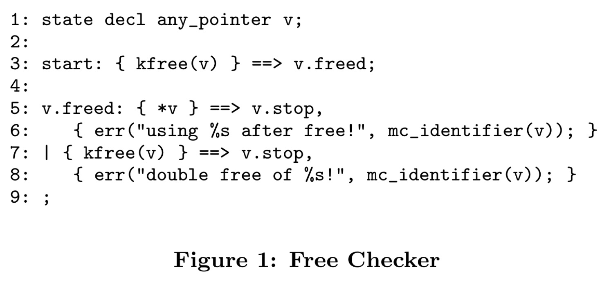

# 一种用于构建特定系统的静态分析的系统和语言

## 摘要

本文介绍了一种新颖的bug查找分析方法和该方法的部署。我们的目标是找到尽可能多的严重漏洞。为此，我们设计了一种灵活易用的扩展语言来指定分析，并设计了一种高效的算法来执行这些扩展。这种名为 metal 的语言允许我们系统的用户以类似于检查规则的直观描述的方式指定一大类分析。xgcc 系统则使用上下文敏感的程序间分析方法高效执行这些分析。

## 一、介绍

本文介绍了一种不同寻常的查找bug的方法，我们称之为元编译（metacompilation，简称MC）。我们方法的重点是实用主义：我们希望找到尽可能多的严重 bug。我们使用程序员编写的编译器扩展（检查器）来实现这一目标。本文介绍了用于实现这些扩展的语言 metal，以及使用上下文相关、跨程序分析来执行扩展的分析引擎 xgcc。

发现错误的主要障碍是简单了解代码必须遵守的正确性规则。可以检查的规则越多，发现的错误也就越多。因此，我们设计的 Metal 要做到：（1）易于使用；（2）足够灵活，能在统一的框架内表达各种规则。metal必须易于使用，因为许多规则只有程序员才知道；如果程序员不能编写扩展，我们就无法检查这些规则。因此，metal是为了系统实现者而不是编译器编写者设计的。metal必须具有灵活性，因为我们希望检查任意规则。我们不需要一个仅限于检查特定属性集（如同步约束、时序规则）或特定基本假设（如 "分析必须是保守的"）的系统。

Metal 易于使用，因为它提供了状态机（TODO:SM）作为基本抽象。状态机是一个简单的抽象概念，因为它们是系统编程中一个熟悉的概念。Metal 很灵活，因为它允许扩展编写者用通用代码以近乎任意的方式增强状态机抽象。Metal 的灵活性允许扩展程序在不修改语言或底层系统的情况下使分析规则特定化。

我们之前的工作表明，金属效果很好。它只需要很少的投入就能取得成果：一天的工作就能产生一个能发现实际代码中几十甚至上百个严重错误的扩展。此外，扩展的代码量很小，通常在 10 到 200 行之间，主要取决于它们的错误报告量。金属的灵活性体现在我们能够编写 50 多个检查器，这些检查器表达的分析类型大不相同，包括：(1) 发现违反已知正确性规则的行为 [1, 9] 和 (2) 自动从源代码中推断此类规则 [10]。我们将在第 2 节至第 4 节中介绍金属检查器。

我们对 xgcc 有三个主要要求：它必须 (1) 提供查找错误所需的分析；(2) 不明显限制金属扩展的功能；(3) 可扩展至大型程序。我们理想的分工是，扩展程序只编码要检查的属性，而把如何检查规则的细节留给 xgcc。第二和第三项要求非常重要，因为我们检查的规则越多，分析的代码越多，发现的错误也就越多。xgcc 对扩展的主要限制是确定性，否则它们可以在内部执行任意计算。在本文中，我们将介绍在 xgcc 中实现的分析算法，该算法可执行我们的扩展。我们将在第 5 节和第 6 节介绍 xgcc。

我们对 xgcc 有三个主要要求：它必须 (1) 提供查找错误所需的分析；(2) 不明显限制金属扩展的功能；(3) 可扩展至大型程序。我们理想的分工是，扩展程序只编码要检查的属性，而把如何检查规则的细节留给 xgcc。第二和第三项要求非常重要，因为我们检查的规则越多，分析的代码越多，发现的错误也就越多。xgcc 对扩展的主要限制是确定性，否则它们可以在内部执行任意计算。在本文中，我们将介绍在 xgcc 中实现的分析算法，该算法可执行我们的扩展。我们将在第 5 节和第 6 节介绍 xgcc。

在第 7 节中，我们将讨论我们的分析所做的近似值及其影响。第 8 节讨论了处理误报的几种分析技术，包括消除不可执行路径的简单路径敏感分析。第 9 节继续讨论误报问题，介绍 xgcc 排列错误报告的方法。最后，第 10 节讨论相关工作，第 11 节为结论。

## 二、概述

我们的扩展是用 metal 编写的，它是一种用于表达各种定制化的、静态的、错误查找分析的语言。这些分析的共同点是，它们都利用了许多抽象程序限制可清晰映射到源代码操作这一事实[9]。虽然金属扩展的执行方式与传统的数据流分析很相似，但它们可以很容易地在传统方法的范围之外进行扩展，例如使用统计分析来发现规则[10]。

要检查一条规则，扩展要做两件事：(1) 识别与给定规则相关的有趣源代码操作；(2) 检查这些操作是否满足某些特定规则的约束。Metal 围绕状态机（SM）抽象组织扩展。状态机是表示许多程序属性的简明方法。需要注意的是，状态机抽象为常见操作提供了 "糖"，它并不限制扩展对有限状态属性的检查。在需要时，扩展可以使用通用代码进行扩充。金属扩展由程序间分析引擎 xgcc 执行。

图 1 显示了free检查器，当释放指针解引用或双重释放时，该检查器会发出标记。我们在本文中始终使用该检查器和图 2 中的代码示例。扩展将发现示例中的两个错误（第 12 行和第 17 行）。

### 2.1 Metal扩展和状态机

金属扩展定义了一个或多个状态机的集合。在扩展执行过程中，扩展的当前状态是扩展定义的底层状态机所有当前状态的简单组合。每个状态机在逻辑上都是独立的：一个状态机中的转换不会影响其他任何状态机。状态机的数量在分析过程中时增时减。

每个 SM 的当前状态由一个全局状态值和一个或多个变量特定状态值组成。全局状态值捕捉整个程序的属性（如 "中断被禁用"）。特定变量状态值捕捉与特定源对象相关的程序属性（如 "指针 p 已释放"）。

上述定义的每个状态值都分配给一个状态变量实例。每个扩展都定义了一个全局状态变量和一个可选的特定于变量的状态变量。为简单起见，<u>本讨论假定每个扩展都有一个全局状态变量和一个特定于变量的状态变量</u>。状态变量有一个或多个实例，每个实例都有一个状态值。全局状态变量只有一个实例，在整个分析过程中持续存在。变量专用状态变量为每个具有附加状态的程序对象提供一个实例。当分析决定跟踪新的程序对象并忽略先前跟踪的对象时，此类实例的数量会对应的增加和减少。一个 SM 状态由全局实例的值和一个变量特定实例的值组成。因此，在分析过程中的某个给定点，每个扩展中定义的 SM 数量等于具有附加状态的程序对象数量。

在free检查器中，特定于变量的状态变量 v 是用关键字 state decl 声明的。符号 v.freed 表示状态值 freed 与 v 绑定。因此，只有 v 的实例才能被赋值 freed。状态值 start 与全局状态变量绑定，因为它没有显式绑定。

每个 SM 的字母表由扩展中使用的金属模式定义。模式用于识别与特定规则相关的源代码操作。free检查程序使用模式来识别释放（使用模式"{kfree(v)}"）和解引用已释放变量（使用模式"{*v}"）。这些模式中的变量 v 将匹配任何类型的指针。

每个状态值都定义了一个转换列表。在 free 检查器中，start 状态定义了一条转换规则，v.freed 状态定义了两条转换规则。开始状态的转换规则（第 3 行）规定，当全局实例的值为 start，且当前程序点与 {kfree(v)} 模式匹配时，应执行一个转换，将状态 freed 连接到与 v（即已释放指针）匹配的抽象语法树（AST）上。从 start 到 v.freed 的转换是一种特殊类型的转换，它创建了一个新的 v 实例，从而创建了一个新的状态机。

v.freed 状态值有两条转换规则：第一条在释放的变量被解引用时触发，第二条在释放的变量再次被释放时触发。这两个转换都会打印一条错误信息，描述错误并指出错误操作所应用的特定变量。从特定变量状态值开始的转换由绑定到该值的特定状态变量实例触发。因此，v.freed 状态中的两个转换是在扩展跟踪的一个已释放变量被双重释放或解引用时触发的。这些转换会将触发转换的实例值更新为特殊值 stop。当实例被赋值为 stop 时，跟踪该实例的状态机将从扩展的 SM 集合中删除。但是，如果与该实例相关的变量再次被释放，则start状态下的转换将被执行，从而重新激活被删除的 SM。(TODO:没懂最后一句)

扩展的初始状态包含一个状态机，表示在分析开始时对程序一无所知。因此，free检查器中的全局状态变量初始值为 start，而 v 的特殊值为 <>，反映了扩展不知道任何已释放变量的事实。

xgcc 以深度优先的顺序对单个函数的控制流图（CFG）进行扩展，每次一条执行路径，从源代码库callgraph的入口点开始。在每个程序点，扩展都会在当前 SM 中查找可执行的转换。在对所有 SM 进行迭代后，分析将进入下一个程序点。如第 8 节所述，xgcc 还通过额外的分析来增强扩展功能，以剪除不可执行路径、遵循简单的值流，以及删除与重新定义的表达式相关的状态。

### 2.2 free检查器的执行

我们通过跟踪free检查器在图 2 示例中的执行情况，将所有这些部分串联起来。

1. 第 14 行：contrived_caller 没有已知的调用者，因此是我们示例中调用图的入口。我们假设所有输入参数都没有别名。扩展从初始状态开始。
2. 第 15 行： kfree 调用将匹配start状态中的模式，检查器第 3 行的转换将执行，并将freed状态附加到 p。
3. 第 16 行：xgcc 在调用 contrived 时跟踪变量 p，因为它是作为参数传递的。
4. 第 4 行： 分析会沿着true和false路径进行拆分，首先是true路径。当分析分支时，扩展状态的单独副本会应用于每条路径。分析会沿着每条路径分别跟踪 x 等于 0 和不等于 0 的情况。
5. 第 6 行： 调用 kfree 会将 w 置为freed状态。此时，v 有两个值为 freed 的实例：p 和 w。
6. 第 7 行： 赋值会导致 xgcc 为变量 q 透明地创建另一个 v 实例，也是 freed 状态。
7. 第 8 行： 给变量 p 赋值会导致 xgcc 将 p 转换到stop状态，从而将 p 从扩展的状态中移除。
8. 第 10 行：xgcc 并没有在条件处拆分，而是利用 x 在此路径上为非零的信息来剪切true分支。如果遵循true分支，第 11 行将出现错误报告，因为 w 已附加状态freed（第 6 行）。
9. 第 12 行：v.freed 的解引用模式与 *q 匹配，并报告了一个使用后释放错误。分析返回后，分析回溯到第 4 行的false分支。
10. 第 10 行：xgcc 并没有在条件处拆分，而是利用 x 在此路径上等于 0 的信息来剪切false分支。
11. 第 11 行：路径结束。我们已经探索了通过 contrived 的所有路径。
12. 第 17 行：控制权返回调用者。v 的输出实例集是所有在通过 contrived 的路径的出口处活跃的实例的集合。有两个这样的实例，即 p 和 w，分别在第 11 行和第 12 行处于活跃状态。扩展程序在第 17 行随后的解引用时标记了一个错误。

接下来的两节将更详细地介绍金属。

## 三、Metal状态和转换

### 3.1 Metal状态

每个状态变量的域由绑定到该变量的所有状态值组成。本节将详细讨论状态变量，并对扩展的状态及其中的每个状态机提供更精确的定义。我们在此描述的扩展状态定义将转化为第 5 节描述的数据结构，从 xgcc 的角度定义扩展。

扩展必须允许使用通用代码来扩展状态空间。这种灵活性的优势在于，它允许我们的扩展表达动态定义状态空间的属性。

我们允许扩展通过在通用代码中扩展每个实例的域来扩大状态空间。为此，我们为每个特定变量实例增加了一个数据值，该数据值是一个任意大小的 C 结构，扩展程序可以在转义为 C 代码时对其进行操作。扩展程序还可以在转义为 C 代码的过程中直接更新全局实例的值，以实现更复杂的转换。

扩展的状态被定义为一组状态元组，每个状态元组对应该扩展中的一个 SM。状态元组有一个组件，由全局实例的值填充。在free示例中，这个槽总是包含 start 的值。第二个分量包含变量特定实例的值（例如，在free检查器中 v 的实例）。例如，分析图 2 中的第 15 行后，自由校验器的状态将包含元组（start, v : p → freed），因为状态变量 v 有一个连接到程序对象 p 的实例，而程序对象 p 的值已被释放。

虽然本文中的状态元组只有两个组件，但金属的实际实现允许扩展定义具有更多组件的元组。本文算法的实际实现处理的是更一般的情况。

### 3.2 Metal转换

简单金属转换由一个源状态值、一个模式和一个目的状态值组成。free检查器第 3 行的转换就遵循了这一模板。扩展通过遍历全局和特定变量的实例，并确定每个实例的值是否定义了可以执行的转换，来决定执行哪些转换。如果转换的模式与分析中的当前点相匹配，则该转换可以执行。实例不能在创建该实例的语句中触发转换；这一限制可防止首次释放的变量在同一程序点触发双重释放。简单的转换可以通过**特定路径的目标状态**和 **C 代码动作**来增强。

**特定路径转换**。特定路径转换允许扩展跟踪简单布尔谓词的值（如 l 为locked，p 为空）或可能有两种结果的模型函数。如果转换发生在源代码的分支条件处，扩展可以根据分析是遵循条件的真分支还是假分支，指定不同的目标状态。图 3 显示了锁检查器，当锁（1）在未被获取的情况下被释放（2）被重复获取（3）根本未被释放时，它会发出警告。用于非阻塞锁获取的例程 trylock 在获取锁时返回 1，否则返回 0。因此，在第一次转换中，我们将locked状态附加到真路径上的锁，将stop状态附加到假路径上的锁。当处于locked状态的 l 实例永久离开作用域或程序终止时，最后一个转换中的特殊模式 $end_of_path$ 的值为 true。

**C 代码动作**。转换可以包括 C 代码动作，只要转换执行，这些动作就会执行。动作是扩展程序扩展 SM 基本抽象的另一种方式。C 代码动作允许扩展程序在执行转换时执行任意计算。我们将介绍两类我们认为有用的操作：执行复杂错误报告的操作和增强分析机制的操作。

为了使错误信息有用，检查程序不仅要报告错误的内容，还要报告错误发生的原因。因此，我们的所有检查程序都会跟踪发现每个错误的计算过程。这些计算取决于扩展的具体特征。跟踪错误标记原因的代码占每个扩展的大部分。

在 [10] (TODO:是什么？) 中，我们介绍了几种使用统计分析来推断检查规则的检查器。例如，要推断例程 a 和 b 是否必须配对：(1) 假设它们必须配对，(2) 计算它们一起出现的次数，(3) 计算它们不一起出现的次数（违反规则）。然后使用统计显著性检验对报告的违规行为进行排序。在分析过程中，我们使用 C 代码操作来统计正确配对和违规情况，从而实现了这一功能。(第 9 节使用相同的技术对违反规则的情况进行排序。）

默认情况下，金属扩展的每个状态变量都有一个有限的、静态确定的域。扩展可以通过使用 C 代码操作来扩展这一模型，从而直接使用 xgcc 的内部接口来操作扩展的状态。例如，我们可以扩展上文所述的锁检查器，通过使用每个 l 实例中的数据值来跟踪当前锁的深度，从而处理递归锁。每当锁定操作或解锁操作发生时，由此产生的转换可以在 C 代码操作中递增或递减锁的深度。如果该深度低于 0 或超过一个小常量，扩展程序就会报告错误的锁配对。

组合是扩展可以用来增强 SM 模型的另一种机制。扩展可以进行组合，使每个扩展都能在自己的分析中使用前一个扩展的结果。扩展通过使用 xgcc 的内部接口，用任意数据值注释 AST 来实现这种组合。后续扩展可以检索和使用这些值。路径杀死扩展（path-kill extension）[10]就是组合的一种常见用法，它标记了所有对 panic 的调用，这样后续分析就不会在这些调用主导的路径上报错。当后续扩展看到被标记的函数调用时，就会停止遍历当前路径。

## 四、Metal模式

金属模式为扩展程序识别与特定规则相关的源操作提供了一种简单的方法。模式是用源语言（C）的扩展版本编写的，可以指定几乎任意的语言结构，如声明、表达式和语句。模式很容易使用，因为它们在语法上反映了要匹配的源构造。

基本模式可以用逻辑连接词 && 和 || 组成。metal 中最简单的基本模式在语法上与扩展希望识别的代码相匹配。因为我们匹配的是 AST，所以空格和其他词法不会影响匹配。例如，基本模式 {rand()} 将匹配对 rand 函数的所有调用。

例如，一个简单的模式无法匹配所有指针的解引用，因为每个解引用指的都是不同的指针。free检查器中第 5 行的模式匹配所有对 metal 孔变量的引用（任何使用关键字 decl 声明的金属变量都是孔变量）。孔变量让模式包含任何适当类型的源结构体都能匹配的位置。

金属中的孔变量必须是类型化的。如果给空洞变量分配了一个 C 类型，那么这个空洞就可以被该类型的任何表达式 "填满"。不过，为了匹配free检查器中的所有指针解引用，我们不能为 v 指定任何单一的 C 类型。Metal 引入了新的元类型，将洞扩展到一整类相关类型。孔变量 v 的元类型是任意指针，它可以匹配指向任意类型存储空间的指针。表 1 列出了孔类型及其含义。

如果同一孔变量在模式中出现多次，每次出现都必须包含等效的 AST。例如，模式 {foo(x,x)} 匹配 foo(0,0) 和 foo(a[i],a[i]) 形式的调用，但不匹配 foo(0,1)。

在操作（而不是模式）中使用的洞变量指的是与洞匹配的 AST 节点。因此，在 free 检查器中第 8 行使用的 v 指的是与第 7 行匹配的已释放指针的 AST。

通过在 C 代码中编写布尔表达式来确定是否发生匹配，调用可以让程序员扩展匹配语言，以表达意料之外或语言上难以表达的特征。通过在基本模式中添加前缀 $，可以在语法上识别调用。

退化调用 ${0} 和 ${1} 分别匹配 什么都不匹配 和 什么都匹配。调用最常用的是作为一种连接词来细化更一般的模式。例如，`{ fn(args) } && ${ mc_is_call_to(fn, "gets") }`将匹配所有函数调用的模式精炼为只匹配 gets 调用的模式。变量 fn 是任意 fn 调用类型的洞变量，变量 args 是任意参数类型的洞变量。这个模式也可以写成字面的 C 代码。

单独使用时，调出函数只能引用当前程序点、mc_stmt 以及扩展程序或 xgcc 内的任何全局状态。与其他模式连接或分离使用时，调出函数可以引用这些模式中使用的孔变量作为参数（见上例中的 fn）。

合法模式可以指定任何 C 表达式或语句（包括循环、条件或开关语句），但有两个限制条件。首先，模式中的所有标识符必须是扩展名中定义的孔变量或被检查代码库范围内的合法名称。其次，模式中使用的 C 结构必须独立编译。非法模式的例子包括不包含任何外层switch语句的单例臂、孤立的 break 等。所有这些构造都可以与调用匹配。

## 五、过程内分析

本节将介绍我们的程序内算法，该算法将金属扩展应用于源代码库。该算法的目标是在不影响金属灵活性的前提下高效执行检查器。

扩展按执行顺序应用于单个路径中的每个 AST。执行顺序是指按照相应指令的执行顺序访问每个语句的树。例如，先访问函数调用的参数，再访问函数调用；先访问赋值的右侧，再访问左侧，最后访问赋值。我们将 AST 节点称为程序点。在每个程序点上，扩展程序会决定是否执行任何转换以及执行哪些转换。

我们通过对 CFG 进行简单的深度优先搜索（DFS）来实现这种遍历，搜索从入口区块开始。因此，算法跟随一条控制路径，沿着这条路径遍历每个区块，直到函数结束，然后回溯到最后一个分支点。DFS 分析部分简单明了；分析的重要特征是使用块级状态缓存来提高速度。算法在遍历每个基本数据块之前，都会记录该数据块的扩展状态。在随后遍历同一区块时，如果扩展状态包含在该缓存中，则会中止遍历，并回溯到上一个分支点进行分析。

我们首先介绍如何在单个程序点执行扩展。然后，我们将介绍块级缓存。最后，我们将概述 DFS 算法的伪代码。

### 5.1 对程序点应用扩展

图 4 显示了 DFS 算法的简化版本。下面我们将对数据结构进行描述。

每个特定变量实例（var_state）都由一个包含状态值的整数s、一个状态所对应的程序对象树var和一个任意大小的扩展定义数据值data组成。var 字段中的树可以是代码中的任何树（如左值、一般表达式、语句）。

