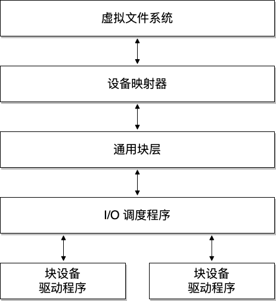
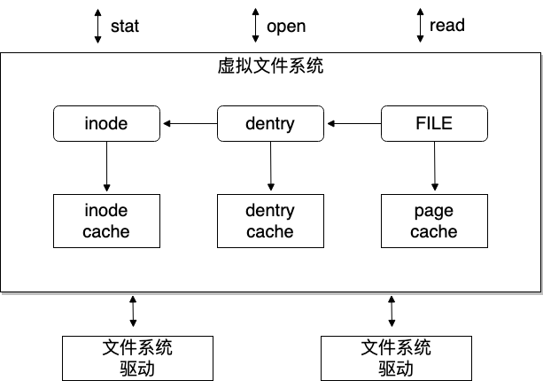
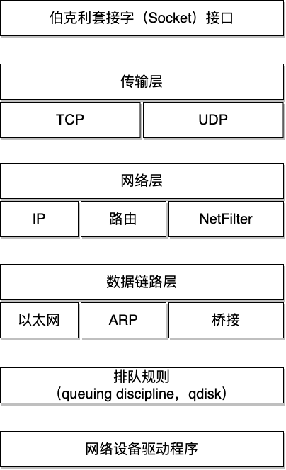

# 操作系统概念

## 内核vs.用户

内核（kernel）和用户（user）是操作系统中常用的两个术语。
* 内核：操作系统的一部分，以较高的权限级别运行。
* 用户：通常指的是那些以较低权限级别运行的应用程序。

用户模式（User Mode）和内核模式（Kernel Mode）是指**处理器执行模式**的专业术语。在内核模式下，代码能够完全控制 CPU，拥有最高权限[1]；而用户模式下的代码则受到限制。例如，只有在内核模式下，才能启用或禁用 CPU 的本地中断；如果在用户模式下尝试这样的操作，则会触发异常，此时内核会介入处理。

你可以将其简单理解为：内核空间是专门为操作系统内核保留的内存区域，而用户空间则是分配给各个用户进程的内存区域。内核空间具有访问保护，用户应用程序无法直接访问这部分空间；相对地，用户空间则可以被运行在内核模式下的代码直接访问[2]。

## 操作系统架构

在典型的操作系统架构中，操作系统内核负责安全且公平地管理多个应用程序对硬件资源的访问和共享。

操作系统内核提供了一组 API 供应用程序调用，通常它们称为“**系统调用**”，它们标志着*执行模式从用户态切换到内核态的界限*。

内核代码可以逻辑上划分为**核心内核代码**和**设备驱动程序代码**。
* 设备驱动程序代码：负责操作特定的设备。
* 核心内核代码：内核中通用的代码，细分为多个逻辑子系统，如文件、网络和进程管理等。

## 宏内核vs.微内核

宏内核是一种内核设计，其中各个内核子系统之间的访问没有特别的保护措施，*允许各个子系统互相直接调用公共函数*。大部分宏内核在子系统间都实现了逻辑上的分隔，尤其是核心内核与设备驱动程序之间，它们通常需要通过较为严格的 API 来互相访问服务。显然，这种做法依赖于内核的具体实现和架构设计。

微内核也是一种内核设计，其中大部分功能以受保护的方式相互作用，并通常作为用户空间中的服务来运行。因为内核的关键功能现在在用户模式下运行，导致在内核模式下运行的代码量大幅减少，微内核由此得名。

在微内核架构中，内核只包含最基本代码（允许不同运行进程间进行消息传递）。在实际应用中，这意味着内核仅实现调度程序和进程间通信（IPC）机制，以及基础内存管理，从而在应用程序和服务之间建立了保护层。

这种架构的优点之一是服务被隔离，因此某一个服务中的错误不会影响其他服务。因此，如果一个服务崩溃，我们可以只重启它而不影响整个系统。然而，实践中很难实现这一点，因为重新启动一个服务可能会影响依赖该服务的所有应用程序（例如，如果文件服务器崩溃，所有打开文件描述符的应用程序在访问文件时会遇到错误）。

这种架构为内核带来了模块化的设计，并在各个服务之间实现了内存隔离，但这样做的代价是牺牲了一定的性能。在传统的单体内核中，两个服务之间可以通过简单的函数调用来交互，而在微内核架构中，这种交互需要通过进程间通信（IPC）和任务调度来完成，从而引入了额外的性能开销 [3]。

## 地址空间

“地址空间”这个术语在不同的上下文中具有不同的含义。
* 物理地址空间：指的是内存总线上可见的 RAM 和设备内存。例如，在 32 位的 Intel 架构中，通常会将 RAM 映射到较低的物理地址空间，而显卡内存则映射到较高的物理地址空间。
* 虚拟地址空间：（有时简称为地址空间）是指启用虚拟内存模块时，CPU 所感知的内存布局（有时也称为保护模式或开启分页）。内核负责建立映射，创建虚拟地址空间，其中某些区域会映射到特定的物理内存区域。与虚拟地址空间相关的还有两个常用术语：“进程（地址）空间”和“内核（地址）空间”。
  * 进程空间：是与单个进程相关联的虚拟地址空间的一部分，它构成了进程的“内存视图”，从零开始并连续延伸。进程地址空间的结束位置取决于具体实现和系统架构。
  * 内核空间：是运行在内核模式下代码的内存视图。

一种典型的用户和内核空间的实现方式是将虚拟地址空间在用户进程和内核之间共享。在这种情况下，内核空间位于地址空间的顶端（高地址），用户空间则位于底部（低地址）。

## 执行上下文

执行上下文（Execution Context）是指代码运行时的环境，它决定了代码的权限级别、所能访问的资源以及行为上的限制。内核中，执行上下文主要分为 **中断上下文** 和 **进程上下文**。

### 中断上下文

中断上下文是指当**中断**发生时，内核*响应中断并执行相应的中断处理程序*的运行环境。这种上下文**没有特定的进程与之关联**，而是由硬件中断或软件中断触发。

- **特性**：
  1. **无进程关联**：中断上下文是异步的，独立于具体的进程。中断处理程序通常不知道当前的执行进程是谁。
  2. **仅内核模式**：中断处理程序始终在内核模式下运行。
  3. **不能睡眠或阻塞**：中断处理程序不能调用可能导致当前任务睡眠的函数（例如内存分配中 `kmalloc` 的阻塞模式），因为中断上下文没有等待队列来恢复挂起状态。
  4. **有限的执行时间**：中断处理程序必须尽可能快速完成工作，以避免延迟其他中断或影响系统响应时间。

- **典型场景**：
  1. 硬件设备发出中断（如网络包到达）。
  2. 定时器中断。

### 进程上下文

进程上下文是指与某个**具体进程**相关联的代码运行环境。这种上下文通常由系统调用或用户空间的请求驱动。

- **特性**：
  1. **与进程关联**：进程上下文与特定的进程绑定。内核在处理系统调用或其他与用户空间交互时运行在进程上下文。
  2. **可以进入用户空间**：进程上下文可以访问用户空间的内存，使用 `copy_to_user` 或 `copy_from_user` 函数与用户空间交互。
  3. **允许睡眠或阻塞**：进程上下文可以调用可能阻塞的内核函数（例如等待某个资源）。

- **典型场景**：
  1. 执行系统调用。
  2. 内核线程的执行。

### 中断vs.进程上下文

| **属性**          | **中断上下文**                             | **进程上下文**                             |
|-------------------|------------------------------------------|------------------------------------------|
| **触发来源**       | 硬件或软件中断                           | 系统调用或内核线程                       |
| **是否关联进程**   | 无进程关联                                | 与具体进程关联                            |
| **运行模式**       | 内核模式                                  | 内核模式或用户模式                        |
| **是否可以睡眠**   | 不可以睡眠或阻塞                          | 允许睡眠或阻塞                            |
| **是否访问用户空间**| 不允许                                    | 可以通过特定函数访问用户空间              |
| **执行时限**       | 必须尽可能短                              | 可以是长时间任务                          |

## 内核堆栈

每个进程都配备了一个内核堆栈，该堆栈用于维护函数调用链和局部变量的状态。当进程因系统调用而运行在内核模式下时，会使用到这个内核堆栈。

由于内核堆栈的容量相对较小（通常在 4 KB 到 12 KB 之间），内核开发人员必须避免在堆栈上分配大型数据结构或进行深度未受限的递归调用。

## 非对称多处理vs.对称多处理

非对称多处理（简称 ASMP）是一种内核支持多处理器（核心）的模式。在这种模式下，有**一个处理器被专门分配给内核**，而**其他处理器则负责运行用户空间的程序**。

与 ASMP 相比，在对称多处理（SMP）模式下，**内核能够在任何可用的处理器上运行**，这与用户进程相似。这种方法实现起来更为复杂，因为**如果两个进程同时运行并访问相同内存位置的内核函数，就会在内核中引发竞态条件**。

为了实现 SMP 支持，内核必须采用同步机制（例如自旋锁）来确保在任何时刻只有一个处理器进入临界区。

# Linux内核概述

## Linux 开发模型

Linux 内核是世界上最大的开源项目之一，拥有成千上万的开发人员贡献代码，每个发布版本都会有数百万行的代码更改。

它**采用 GPLv2 许可证**进行分发，简而言之，要求在交付给客户的软件上对内核所做的任何修改都应提供给客户，但实际上大多数公司都会公开源代码。

目前的开发模型是基于固定时间间隔进行发布（通常为 3、4 个月）。新特性在一两周的合并窗口期间合并到内核中。合并窗口结束后，每周发布一个发行候选版本（rc1、rc2 等）。

为了优化开发流程，Linux 使用了一个层次化的维护模型：
- Linus Torvalds 是 Linux 内核的维护者，他从子系统维护者那里合并拉取请求（pull request）
- 每个子系统都有一个或多个维护者，他们接受开发者或设备驱动程序维护者的补丁或拉取请求。
- 每个维护者都有自己的 git 树，例如：
  - Linux Torvalds: git://git.kernel.org/pub/scm/linux/kernel/git/torvalds/linux-2.6.git
  - David Miller（网络）：git://git.kernel.org/pub/scm/linux/kernel/git/davem/net.git/
- 每个子系统可能维护一个 -next 树，开发者可以在其中提交下一个合并窗口的补丁（patch）。
  - 由于合并窗口最多只有两周时间，大多数维护者都拥有一个 -next 树，这样即使合并窗口关闭，他们也能接受下游开发者或维护者的新功能。

请注意，错误修复（bug fix）即使是在合并窗口外也可以被维护者的树接受，并定期由上游维护者拉取，用于每个发行候选版本。

## Linux 源代码布局

| **目录名**      | **描述**                                                                                                                                                     |
|------------------|-------------------------------------------------------------------------------------------------------------------------------------------------------------|
| **arch**         | 包含架构（architecture）特定的代码；每个架构在特定的子文件夹中实现（例如 arm、arm64 以及 x86）。                                                            |
| **block**        | 包含与读写块设备数据相关的块子系统代码：创建块 I/O 请求、调度（scheduling）请求（有几个 I/O 调度程序可用）、合并请求，并将其通过 I/O 堆栈传递给块设备驱动程序。|
| **certs**        | 使用证书实现签名检查支持。                                                                                                                                   |
| **crypto**       | 各种加密算法的软件实现，以及允许将这些算法分载到硬件中的框架。                                                                                               |
| **Documentation**| 各个子系统的文档、对 Linux 内核命令行选项的描述、对 sysfs 文件和格式的描述以及设备树绑定（支持的设备树节点和格式）。                                         |
| **drivers**      | 各种设备的驱动程序以及 Linux 驱动程序模型实现（对驱动程序、设备总线及其连接方式的抽象描述）。                                                               |
| **firmware**     | 由各种设备驱动程序使用的二进制或十六进制固件文件。                                                                                                           |
| **fs**           | 虚拟文件系统（通用文件系统代码）以及各种文件系统驱动程序的位置。                                                                                             |
| **include**      | 头文件。                                                                                                                                                     |
| **init**         | 在启动过程中运行的通用（而不是特定于架构的）初始化代码。                                                                                                     |
| **ipc**          | 对各种进程间通信系统（Inter Process Communication）调用的实现，例如消息队列、信号量、共享内存。                                                             |
| **kernel**       | 进程管理代码（包括对内核线程、工作队列的支持）、调度程序（scheduler）、跟踪、时间管理、通用中断代码（generic irq code）以及锁定（locking）。                 |
| **lib**          | 各种通用函数，例如排序、校验和、压缩和解压缩、位图操作等。                                                                                                   |
| **mm**           | 内存管理代码，用于物理和虚拟内存，包括页面、SL*B 和 CMA 分配器、交换（swapping）、虚拟内存映射、进程地址空间操作等。                                        |
| **net**          | 各种网络协议栈的实现，包括 IPv4 和 IPv6；BSD 套接字实现、路由、过滤、数据包调度以及桥接（bridging）等。                                                     |
| **samples**      | 各种驱动程序示例。                                                                                                                                           |
| **scripts**      | 构建系统的一部分，用于构建模块的脚本，Linux 内核配置器 kconfig，以及其他各种脚本（例如 checkpatch.pl，用于检查补丁是否符合 Linux 内核的编码风格）。          |
| **security**     | Linux 安全模块框架的位置，允许扩展默认（Unix）安全模型，以及多个此类扩展的实现，例如 SELinux、smack、apparmor 以及 tomoyo 等。                               |
| **sound**        | ALSA（Advanced Linux Sound System，高级 Linux 声音系统）的位置，以及旧的 Linux 音频框架（OSS）。                                                             |
| **tools**        | 用于测试或与 Linux 内核子系统交互的各种用户空间工具。                                                                                                       |
| **usr**          | 支持在内核映像中嵌入 initrd 文件。                                                                                                                          |
| **virt**         | KVM（内核虚拟机）和 hypervisor（虚拟化管理程序）的位置。                                                                                                     |

### 架构特定代码

`arch` 目录包含与架构相关的特定代码，可进一步细分为每个架构的特定机器实现（例如 ARM、x86）。其主要内容包括：

- **架构特定操作**：  
  该目录与引导加载程序和架构特定的初始化程序交互，管理与架构或机器特定的硬件相关的操作，包括：
  - 中断控制器  
  - SMP（对称多处理）控制器  
  - 总线控制器  
  - 异常和中断设置  
  - 虚拟内存管理  

- **优化函数**：  
  提供针对特定架构优化的函数，例如 `memcpy` 和其他字符串操作函数，以在特定硬件上提升性能。

- **支持的架构**：  
  Linux 最初是为 32 位 x86 个人电脑（386 或更高版本）开发的，如今已被移植到多种架构上运行，包括但不限于：
  - Compaq Alpha AXP  
  - Sun SPARC 和 UltraSPARC  
  - Motorola 68000  
  - PowerPC 和 PowerPC64  
  - ARM  
  - Hitachi SuperH  
  - IBM S/390  
  - MIPS  
  - HP PA-RISC  
  - Intel IA-64  
  - DEC VAX  

### 设备驱动程序

Linux 内核采用统一的设备模型，旨在维护一组反映系统状态和结构的内部数据结构。这些数据结构包含以下信息：
- 设备的存在与状态  
- 设备连接的总线类型  
- 设备对应的驱动程序  

这些信息在系统级电源管理、设备发现以及动态移除中至关重要。

- **支持的设备类型**：  
  Linux 支持多种设备驱动程序类型，包括：
  - TTY 和串行设备  
  - SCSI 设备  
  - 文件系统  
  - 以太网设备  
  - USB 设备  
  - 帧缓冲设备  
  - 输入设备  
  - 音频设备  

### 进程管理

Linux 提供标准的 Unix 进程管理 API，例如：
- `fork()`、`exec()` 和 `wait()`  
- 标准的 POSIX 线程实现  

Linux 的进程和线程实现有以下特点：
- **任务抽象**：
  使用通用的 `struct task_struct` 数据结构来表示任务（task），即调度单元，而非明确区分进程和线程。  
- **资源共享**：
  每个任务包含指向资源（如地址空间、文件描述符、IPC id）的指针：
  - 同一进程内的任务共享资源指针。
  - 不同进程的任务指向独立的资源。  

这种设计结合了 `clone()` 和 `unshare()` 系统调用，支持诸如命名空间等高级特性。  

- **虚拟化支持**：  
  命名空间（namespace）与控制组（cgroup）相结合，支持操作系统级别的虚拟化：  
  - **命名空间**：隔离资源，例如网络、进程 ID、文件系统等。  
  - **cgroup**：通过层次结构组织进程，分配和限制系统资源。  

### 内存管理

Linux 内存管理负责以下任务：  

- **物理内存管理**：  分配与释放物理内存  
- **虚拟内存管理**：  
  - 分页（paging）  
  - 交换（swapping）  
  - 需求分页（demand paging）  
  - 写时复制（copy on write）  
- **用户服务**：  管理用户地址空间，例如 `mmap()`、`brk()` 和共享内存  
- **内核服务**：  提供 SL*B 分配器和 `vmalloc()` 等机制  

### 块 I/O 管理

Linux 块 I/O 子系统负责处理块设备数据的读取和写入操作。其主要功能包括：  

- **请求管理**：  
  - 创建块 I/O 请求  
  - 转换块 I/O 请求（例如用于软件 RAID 或 LVM）  
  - 合并与排序请求  

- **调度与传递**：  通过 I/O 调度程序将请求传递给块设备驱动程序。  

支持多种 I/O 调度算法，以适配不同场景下的性能需求。

### 虚拟文件系统（VFS）

Linux 的虚拟文件系统（VFS）是一套**通用的文件系统框架**，旨在减少文件系统驱动程序中的代码重复。它通过一组抽象概念实现不同文件系统之间的统一接口，包括：

- **inode（索引节点）**：描述文件的属性和磁盘上的数据块位置。  
- **dentry（目录项）**：将 inode 与文件名链接起来，管理文件系统的目录结构。  
- **file（文件）**：描述打开文件的属性，例如文件指针和访问权限等。  
- **superblock（超级块）**：描述格式化文件系统的全局属性，例如：
  - 块数
  - 块大小
  - 根目录在磁盘上的位置
  - 加密设置  

此外，Linux VFS 实现了一套高效的缓存机制，进一步提高了文件系统的性能：  

- **inode 缓存**：缓存文件的属性和元数据。  
- **dentry 缓存**：缓存目录层次结构，加速路径解析。  
- **page 缓存**：在内存中缓存文件数据块，以减少磁盘访问的频率。  

### 网络堆栈

### Linux 安全模块（LSM）

Linux 安全模块（LSM）提供了一组扩展默认安全模型的钩子（hook），**允许开发者在不修改内核主代码的情况下添加安全功能**。

常见的 LSM 实现包括：  
- **SELinux**（Security-Enhanced Linux）：一个强制访问控制系统，支持基于策略的安全模型。  
- **AppArmor**：使用文件路径控制访问权限的安全框架。  
- **Tomoyo**：以任务为中心的安全模块。  
- **Smack**（Simplified Mandatory Access Control Kernel）：一种简化的强制访问控制系统。  

# 注释

> [1]	有些处理器可能具有比内核模式更高的特权，例如，虚拟机监视器（hypervisor）模式，在该模式下处理器仅允许在虚拟机监视器（虚拟机监控程序）中运行的代码访问。
> 
> [2]   若CPU开启了SMEP/SMAP（x86架构）或者PXN/PAN（arm架构），则不能直接访问。
>
> [3]   https://lwn.net/Articles/220255/