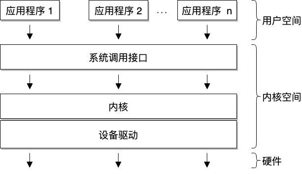
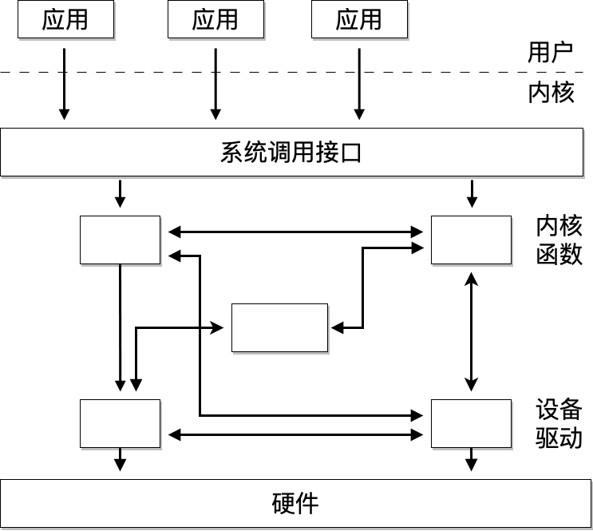
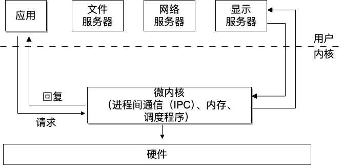

# 操作系统概念

## 内核vs.用户

内核（kernel）和用户（user）是操作系统中常用的两个术语。
* 内核：操作系统的一部分，以较高的权限级别运行。
* 用户：通常指的是那些以较低权限级别运行的应用程序。

用户模式（User Mode）和内核模式（Kernel Mode）是指**处理器执行模式**的专业术语。在内核模式下，代码能够完全控制 CPU，拥有最高权限[1]；而用户模式下的代码则受到限制。例如，只有在内核模式下，才能启用或禁用 CPU 的本地中断；如果在用户模式下尝试这样的操作，则会触发异常，此时内核会介入处理。

你可以将其简单理解为：内核空间是专门为操作系统内核保留的内存区域，而用户空间则是分配给各个用户进程的内存区域。内核空间具有访问保护，用户应用程序无法直接访问这部分空间；相对地，用户空间则可以被运行在内核模式下的代码直接访问[2]。

## 操作系统架构

在典型的操作系统架构中，操作系统内核负责安全且公平地管理多个应用程序对硬件资源的访问和共享。

操作系统内核提供了一组 API 供应用程序调用，通常它们称为“**系统调用**”，它们标志着*执行模式从用户态切换到内核态的界限*。

内核代码可以逻辑上划分为**核心内核代码**和**设备驱动程序代码**。
* 设备驱动程序代码：负责操作特定的设备。
* 核心内核代码：内核中通用的代码，细分为多个逻辑子系统，如文件、网络和进程管理等。

## 宏内核vs.微内核

宏内核是一种内核设计，其中各个内核子系统之间的访问没有特别的保护措施，*允许各个子系统互相直接调用公共函数*。大部分宏内核在子系统间都实现了逻辑上的分隔，尤其是核心内核与设备驱动程序之间，它们通常需要通过较为严格的 API 来互相访问服务。显然，这种做法依赖于内核的具体实现和架构设计。

微内核也是一种内核设计，其中大部分功能以受保护的方式相互作用，并通常作为用户空间中的服务来运行。因为内核的关键功能现在在用户模式下运行，导致在内核模式下运行的代码量大幅减少，微内核由此得名。

在微内核架构中，内核只包含最基本代码（允许不同运行进程间进行消息传递）。在实际应用中，这意味着内核仅实现调度程序和进程间通信（IPC）机制，以及基础内存管理，从而在应用程序和服务之间建立了保护层。

这种架构的优点之一是服务被隔离，因此某一个服务中的错误不会影响其他服务。因此，如果一个服务崩溃，我们可以只重启它而不影响整个系统。然而，实践中很难实现这一点，因为重新启动一个服务可能会影响依赖该服务的所有应用程序（例如，如果文件服务器崩溃，所有打开文件描述符的应用程序在访问文件时会遇到错误）。

这种架构为内核带来了模块化的设计，并在各个服务之间实现了内存隔离，但这样做的代价是牺牲了一定的性能。在传统的单体内核中，两个服务之间可以通过简单的函数调用来交互，而在微内核架构中，这种交互需要通过进程间通信（IPC）和任务调度来完成，从而引入了额外的性能开销 [3]。

## 地址空间

“地址空间”这个术语在不同的上下文中具有不同的含义。
* 物理地址空间：指的是内存总线上可见的 RAM 和设备内存。例如，在 32 位的 Intel 架构中，通常会将 RAM 映射到较低的物理地址空间，而显卡内存则映射到较高的物理地址空间。
* 虚拟地址空间：（有时简称为地址空间）是指启用虚拟内存模块时，CPU 所感知的内存布局（有时也称为保护模式或开启分页）。内核负责建立映射，创建虚拟地址空间，其中某些区域会映射到特定的物理内存区域。与虚拟地址空间相关的还有两个常用术语：“进程（地址）空间”和“内核（地址）空间”。
  * 进程空间：是与单个进程相关联的虚拟地址空间的一部分，它构成了进程的“内存视图”，从零开始并连续延伸。进程地址空间的结束位置取决于具体实现和系统架构。
  * 内核空间：是运行在内核模式下代码的内存视图。

一种典型的用户和内核空间的实现方式是将虚拟地址空间在用户进程和内核之间共享。在这种情况下，内核空间位于地址空间的顶端（高地址），用户空间则位于底部（低地址）。

> [1]	有些处理器可能具有比内核模式更高的特权，例如，虚拟机监视器（hypervisor）模式，在该模式下处理器仅允许在虚拟机监视器（虚拟机监控程序）中运行的代码访问。
> 
> [2]   若CPU开启了SMEP/SMAP（x86架构）或者PXN/PAN（arm架构），则不能直接访问。
>
> [3]   https://lwn.net/Articles/220255/