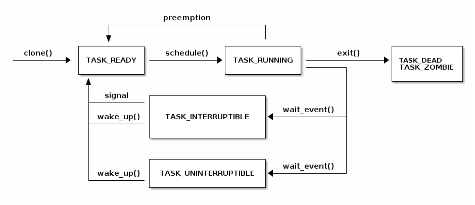

# 调试内核

## Kernel GDB scripts

* `CONFIG_GDB_SCRIPTS`可以通过构建python脚本来简化内核调试(添加新命令和函数)
* 当使用gdb vmlinux时，会自动加载构建根目录中的vmlinux-gdb.py文件
  * lx-symbols: 为vmlinux和模块重载符号
  * lx-dmesg: 显示内核 dmesg
  * lx-lsmod:显示加载的模块
  * lx-device-{bus|class|tree}: 显示设备总线、类和树
  * lx-ps: ps 类似查看任务
  * $lx_current() 包含当前task_struct
  * $lx_per_cpu(var, cpu) 返回一个单-cpu变量
  * apropos lx 显示所有可用的函数

# 进程和线程

进程是操作系统的抽象概念，用于组织多个资源：
* 地址空间
* 一个或多个线程
* 打开的文件
* 套接字（Socket）
* 信号量（semaphore）
* 共享内存区域
* 定时器
* 信号处理程序
* 许多其他资源和状态信息

所有这些信息都被组织在进程控制块（PCB）中。在 Linux 中，PCB 对应的结构体是`struct task_struct`。

## 进程资源查询

我们可以在 /proc/\<pid\> 目录中获取关于进程资源的摘要信息，其中 \<pid\> 是我们要查看的进程的进程 ID。

```
                +-------------------------------------------------------------------+
                | dr-x------    2 tavi tavi 0  2021 03 14 12:34 .                   |
                | dr-xr-xr-x    6 tavi tavi 0  2021 03 14 12:34 ..                  |
                | lrwx------    1 tavi tavi 64 2021 03 14 12:34 0 -> /dev/pts/4     |
           +--->| lrwx------    1 tavi tavi 64 2021 03 14 12:34 1 -> /dev/pts/4     |
           |    | lrwx------    1 tavi tavi 64 2021 03 14 12:34 2 -> /dev/pts/4     |
           |    | lr-x------    1 tavi tavi 64 2021 03 14 12:34 3 -> /proc/18312/fd |
           |    +-------------------------------------------------------------------+
           |                 +----------------------------------------------------------------+
           |                 | 08048000-0804c000 r-xp 00000000 08:02 16875609 /bin/cat        |
$ ls -1 /proc/self/          | 0804c000-0804d000 rw-p 00003000 08:02 16875609 /bin/cat        |
cmdline    |                 | 0804d000-0806e000 rw-p 0804d000 00:00 0 [heap]                 |
cwd        |                 | ...                                                            |
environ    |    +----------->| b7f46000-b7f49000 rw-p b7f46000 00:00 0                        |
exe        |    |            | b7f59000-b7f5b000 rw-p b7f59000 00:00 0                        |
fd --------+    |            | b7f5b000-b7f77000 r-xp 00000000 08:02 11601524 /lib/ld-2.7.so  |
fdinfo          |            | b7f77000-b7f79000 rw-p 0001b000 08:02 11601524 /lib/ld-2.7.so  |
maps -----------+            | bfa05000-bfa1a000 rw-p bffeb000 00:00 0 [stack]                |
mem                          | ffffe000-fffff000 r-xp 00000000 00:00 0 [vdso]                 |
root                         +----------------------------------------------------------------+
stat                 +----------------------------+
statm                |  Name: cat                 |
status ------+       |  State: R (running)        |
task         |       |  Tgid: 18205               |
wchan        +------>|  Pid: 18205                |
                     |  PPid: 18133               |
                     |  Uid: 1000 1000 1000 1000  |
                     |  Gid: 1000 1000 1000 1000  |
                     +----------------------------+
```

## 线程

线程是内核进程调度器调度的基本单位，决定了应用程序在 CPU 上的运行。其主要特点如下：  
- **独立堆栈**：每个线程都有自己的堆栈，与寄存器的值共同决定了线程的运行状态。  
- **共享资源**：线程在进程的上下文中运行，同一进程中的所有线程共享资源。  
- **调度单位**：内核调度的是线程，而非进程。用户级线程（如纤程或协程）在内核级别不可见。  

线程的典型实现通常将线程作为独立的数据结构，并链接到进程数据结构。然而，Linux 采用了不同的方式，其基本调度单位称为“任务”（task），对应结构体 `struct task_struct`。这个结构既可以表示线程，也可以表示进程。资源不直接嵌入到任务结构中，而是通过指针指向相关资源，从而实现灵活的资源管理。

## 克隆

Linux 使用 `clone()` 系统调用来创建线程或进程，允许调用者通过标志位灵活选择资源共享或隔离的方式。以下是常见的标志选项：  
- **CLONE_FILES**：与父进程共享文件描述符表。  
- **CLONE_VM**：与父进程共享地址空间。  
- **CLONE_FS**：与父进程共享文件系统信息（如根目录和当前目录）。  
- **CLONE_NEWNS**：创建独立的挂载命名空间。  
- **CLONE_NEWIPC**：创建独立的 IPC 命名空间（如 System V IPC 对象或 POSIX 消息队列）。  
- **CLONE_NEWNET**：创建独立的网络命名空间（如网络接口或路由表）。  

调用 `clone()` 时：  
- 使用标志 `CLONE_FILES | CLONE_VM | CLONE_FS` 会创建一个新的线程，与父进程共享大部分资源。  
- 不使用这些标志则会创建一个新的进程，资源相对独立。  

## 命名空间与容器

容器是一种轻量级的虚拟化技术，与传统虚拟化方式不同。传统虚拟化依赖虚拟机监视程序（hypervisor），为每个虚拟机提供独立的内核实例。而容器技术共享相同的内核实例，提供更高的性能和资源利用率。  
常见的容器技术包括：  
- **LXC**：支持运行轻量级的“虚拟机”。  
- **Docker**：专注于运行单个应用程序的容器。  

容器的实现依赖于内核特性，其中最关键的就是 **命名空间（namespace）**。命名空间允许对资源进行隔离，防止全局资源的互相干扰。例如，在没有容器的情况下，所有进程在 `/proc` 中可见并可被操作，而容器可以隔离这些进程，使得一个容器中的进程对其他容器不可见。  

命名空间的实现通过内核中的 `struct nsproxy` 结构完成，支持对以下资源类型进行分区：  
- IPC  
- 网络  
- cgroup  
- 挂载点  
- PID  
- 时间命名空间  

例如，网络接口的默认状态是在全局范围内共享。然而，通过创建一个新的网络命名空间（如 `struct net`），系统可以隔离接口列表，新创建的进程指向新命名空间，从而实现资源隔离。

## 访问当前进程

访问当前进程信息是内核中的高频操作，以下是一些常见的场景：  
- 打开文件时需要访问 `struct task_struct` 的 `file` 字段。  
- 映射新文件时需要访问 `mm` 字段。  
- 超过 90% 的系统调用涉及当前进程的结构体操作，因此需要快速的访问路径。  

Linux 提供了 **`current` 宏** 来高效访问当前进程的 `struct task_struct`。  
在多处理器系统中，**每个 CPU 都有一个独立的变量存储指向当前 `task_struct` 的指针**，确保了多核环境下的快速访问。


# 上下文切换


在发生上下文切换之前，我们必须进行内核转换，这可以通过系统调用或中断来实现。此时，用户空间的寄存器会保存在内核堆栈上。在某个时刻，可能会调用 schedule() 函数，该函数决定从线程 T0 切换到线程 T1（例如，因为当前线程正在阻塞等待 I/O 操作完成，或者因为它的时间片已经耗尽）。

此时，context_switch() 函数将执行特定于体系结构的操作，并在需要时切换地址空间：

```c
static __always_inline struct rq *
context_switch(struct rq *rq, struct task_struct *prev,
         struct task_struct *next, struct rq_flags *rf)
{
    prepare_task_switch(rq, prev, next);

    /*
     * paravirt 中，这与 switch_to 中的 exit 配对，
     * 将页表重载和后端切换合并为一个超级调用（hypercall）。
     */
    arch_start_context_switch(prev);

    /*
     * kernel -> kernel   lazy + transfer active
     *   user -> kernel   lazy + mmgrab() active
     *
     * kernel ->   user   switch + mmdrop() active
     *   user ->   user   switch
     */
    if (!next->mm) {                                // 到内核
        enter_lazy_tlb(prev->active_mm, next);

        next->active_mm = prev->active_mm;
        if (prev->mm)                           // 来自用户
            mmgrab(prev->active_mm);
        else
            prev->active_mm = NULL;
    } else {                                        // 到用户
        membarrier_switch_mm(rq, prev->active_mm, next->mm);
        /*
         * sys_membarrier() 在设置 rq->curr / membarrier_switch_mm() 和返回用户空间之间需要一个 smp_mb()。
         *
         * 下面通过 switch_mm() 或者在 'prev->active_mm == next->mm' 的情况下通过 finish_task_switch() 的 mmdrop() 来提供这个功能。
         */
        switch_mm_irqs_off(prev->active_mm, next->mm, next);

        if (!prev->mm) {                        // 来自内核
            /* 在 finish_task_switch() 中进行 mmdrop()。 */
            rq->prev_mm = prev->active_mm;
            prev->active_mm = NULL;
        }
    }

    rq->clock_update_flags &= ~(RQCF_ACT_SKIP|RQCF_REQ_SKIP);

    prepare_lock_switch(rq, next, rf);

    /* 在这里我们只切换寄存器状态和堆栈。 */
    switch_to(prev, next, prev);
    barrier();

    return finish_task_switch(prev);
  }
...
```

它将调用**特定于架构**的 switch_to 宏实现来**切换寄存器状态和内核堆栈**。请注意，寄存器被保存在堆栈上，并且堆栈指针被保存在任务结构体中：

```c
#define switch_to(prev, next, last)               \
do {                                              \
    ((last) = __switch_to_asm((prev), (next)));   \
} while (0)


/*
 * %eax: prev task
 * %edx: next task
 */
.pushsection .text, "ax"
SYM_CODE_START(__switch_to_asm)
    /*
     * 保存被调用者保存的寄存器
     * 其必须与 struct inactive_task_frame 中的顺序匹配
     */
    pushl   %ebp
    pushl   %ebx
    pushl   %edi
    pushl   %esi
    /*
     * 保存标志位以防止 AC 泄漏。如果 objtool 支持 32 位，则可以消除此项需求，以验证 STAC/CLAC 的正确性。
     */
    pushfl

    /* 切换堆栈 */
    movl    %esp, TASK_threadsp(%eax)
    movl    TASK_threadsp(%edx), %esp

  #ifdef CONFIG_STACKPROTECTOR
    movl    TASK_stack_canary(%edx), %ebx
    movl    %ebx, PER_CPU_VAR(stack_canary)+stack_canary_offset
  #endif

  #ifdef CONFIG_RETPOLINE
    /*
     * 当从较浅的调用堆栈切换到较深的堆栈时，RSB 可能会下溢或使用填充有用户空间地址的条目。
     * 在存在这些问题的 CPU 上，用捕获推测执行的条目覆盖 RSB，以防止攻击。
     */
    FILL_RETURN_BUFFER %ebx, RSB_CLEAR_LOOPS, X86_FEATURE_RSB_CTXSW
    #endif

    /* 恢复任务的标志位以恢复 AC 状态。 */
    popfl
    /* 恢复被调用者保存的寄存器 */
    popl    %esi
    popl    %edi
    popl    %ebx
    popl    %ebp

    jmp     __switch_to
  SYM_CODE_END(__switch_to_asm)
  .popsection
```

其中RIP没有在该函数中显式保存。

# 阻塞和唤醒

## 任务状态



## 阻塞任务

1. 将当前线程**状态设置**为 TASK_UINTERRUPTIBLE 或 TASK_INTERRUPTIBLE；
2. 将任务**添加到等待队列**中；
3. 调用调度程序，从 READY 队列中**选择一个新任务**；
4. 进行**上下文切换**到新任务。

内核函数wait_event负责阻塞。其中，等待队列（wait_queue）是带任务结构体指针的链表。

```c
/**
 * wait_event - 在条件满足之前使当前进程休眠
 * @wq_head: 等待队列头
 * @condition: 需要等待的条件表达式
 *
 * 该宏会让当前进程进入不可中断的睡眠状态（TASK_UNINTERRUPTIBLE），直到
 * 条件 @condition 为真为止。在每次唤醒等待队列 @wq_head 时，都会检查
 * @condition。如果 @condition 已经为真，则直接退出。
 *
 * 在任何可能改变条件结果的代码路径中，调用者需要显式调用 wake_up()。
 */
#define wait_event(wq_head, condition)            \
do {                                              \
    might_sleep();                                /* 确保当前上下文允许睡眠 */ \
    if (condition)                                /* 如果条件已满足，不需要等待 */ \
        break;                                    \
    __wait_event(wq_head, condition);             /* 进入实际的等待逻辑 */ \
} while (0)

/**
 * __wait_event - 实现不可中断的等待逻辑
 * @wq_head: 等待队列头
 * @condition: 条件表达式
 *
 * 调用底层等待实现，并通过不可中断的方式（TASK_UNINTERRUPTIBLE）睡眠。
 */
#define __wait_event(wq_head, condition)                                  \
    (void)___wait_event(wq_head, condition, TASK_UNINTERRUPTIBLE, 0, 0,   \
                        schedule())

/**
 * ___wait_event - 等待的底层实现，支持更复杂的操作
 * @wq_head: 等待队列头
 * @condition: 条件表达式
 * @state: 进程的目标睡眠状态
 * @exclusive: 是否是独占等待
 * @ret: 默认返回值
 * @cmd: 等待期间需要执行的指令
 *
 * 等待过程中，通过循环检查 @condition 的值。如果条件满足或者进程
 * 被唤醒，退出循环。如果设置了 @state 为 TASK_INTERRUPTIBLE 并且
 * 有信号到达，则可能会中断等待。
 */
#define ___wait_event(wq_head, condition, state, exclusive, ret, cmd)    \
({                                                                       \
    __label__ __out;                                                     \
    struct wait_queue_entry __wq_entry;                                  \
    long __ret = ret; /* 返回值 */                                       \
                                                                         \
    init_wait_entry(&__wq_entry, exclusive ? WQ_FLAG_EXCLUSIVE : 0);     \
    for (;;) {                                                           \
        long __int = prepare_to_wait_event(&wq_head, &__wq_entry, state);\
                                                                         \
        if (condition)                                                   \
            break;                                                       \
                                                                         \
        if (___wait_is_interruptible(state) && __int) {                  \
            __ret = __int;                                               \
            goto __out;                                                  \
        }                                                                \
                                                                         \
        cmd; /* 执行传入的指令，如 schedule() */                        \
    }                                                                    \
    finish_wait(&wq_head, &__wq_entry);                                  \
__out:                                                                   \
    __ret;                                                               \
})

/**
 * init_wait_entry - 初始化等待队列条目
 * @wq_entry: 等待队列条目
 * @flags: 条目标志
 *
 * 设置条目的初始值，包括当前任务、回调函数和链表初始化。
 */
void init_wait_entry(struct wait_queue_entry *wq_entry, int flags)
{
    wq_entry->flags = flags;                      /* 设置标志位 */
    wq_entry->private = current;                  /* 关联到当前任务 */
    wq_entry->func = autoremove_wake_function;    /* 唤醒时自动移除的回调函数 */
    INIT_LIST_HEAD(&wq_entry->entry);             /* 初始化链表节点 */
}

/**
 * prepare_to_wait_event - 将当前任务加入等待队列
 * @wq_head: 等待队列头
 * @wq_entry: 等待队列条目
 * @state: 目标睡眠状态
 *
 * 检查当前任务是否有挂起的信号。如果有信号，且状态允许中断，则退出等待。
 * 否则，将当前任务加入等待队列。
 */
long prepare_to_wait_event(struct wait_queue_head *wq_head, struct wait_queue_entry *wq_entry, int state)
{
    unsigned long flags;
    long ret = 0;

    spin_lock_irqsave(&wq_head->lock, flags); /* 获取等待队列锁 */
    if (signal_pending_state(state, current)) {
        /* 如果有信号挂起并且状态允许中断，退出等待 */
        list_del_init(&wq_entry->entry); /* 从队列中移除 */
        ret = -ERESTARTSYS;             /* 返回错误码 */
    } else {
        if (list_empty(&wq_entry->entry)) {
            /* 如果条目未加入队列，则根据是否独占等待加入相应位置 */
            if (wq_entry->flags & WQ_FLAG_EXCLUSIVE)
                __add_wait_queue_entry_tail(wq_head, wq_entry);
            else
                __add_wait_queue(wq_head, wq_entry);
        }
        set_current_state(state); /* 设置当前任务状态 */
    }
    spin_unlock_irqrestore(&wq_head->lock, flags);

    return ret;
}

/**
 * __add_wait_queue - 将等待条目加入队列头部
 * @wq_head: 等待队列头
 * @wq_entry: 等待队列条目
 */
static inline void __add_wait_queue(struct wait_queue_head *wq_head, struct wait_queue_entry *wq_entry)
{
    list_add(&wq_entry->entry, &wq_head->head); /* 加入链表头部 */
}

/**
 * __add_wait_queue_entry_tail - 将等待条目加入队列尾部
 * @wq_head: 等待队列头
 * @wq_entry: 等待队列条目
 */
static inline void __add_wait_queue_entry_tail(struct wait_queue_head *wq_head, struct wait_queue_entry *wq_entry)
{
    list_add_tail(&wq_entry->entry, &wq_head->head); /* 加入链表尾部 */
}

/**
 * finish_wait - 清理等待队列中的任务
 * @wq_head: 等待队列头
 * @wq_entry: 等待队列条目
 *
 * 将任务状态设置为 TASK_RUNNING，并从等待队列中移除任务（如果仍在队列中）。
 */
void finish_wait(struct wait_queue_head *wq_head, struct wait_queue_entry *wq_entry)
{
    unsigned long flags;

    __set_current_state(TASK_RUNNING); /* 恢复任务为运行状态 */
    if (!list_empty_careful(&wq_entry->entry)) { /* 检查条目是否仍在队列中 */
        spin_lock_irqsave(&wq_head->lock, flags); /* 获取锁 */
        list_del_init(&wq_entry->entry);         /* 从队列中移除 */
        spin_unlock_irqrestore(&wq_head->lock, flags);
    }
}
```

## 唤醒任务

wake_up用于唤醒任务：
1. 从等待队列中选择一个任务；
2. 将任务状态设置为 TASK_READY；
3. 将任务插入调度器的 READY 队列中；
4. 在 SMP 系统上，这是一个复杂的操作：每个处理器都有自己的队列，队列需要平衡，需要向 CPU 发送信号。

```c
/**
 * wake_up - 唤醒在等待队列上阻塞的线程
 * @x: 等待队列头
 *
 * 调用 __wake_up() 来唤醒等待队列上的线程，使用默认的唤醒模式和参数。
 * 默认为 TASK_NORMAL 模式，唤醒一个或多个任务（nr_exclusive 设置为 1），
 * 唤醒时没有额外的关键字传递给唤醒函数。
 */
#define wake_up(x) __wake_up(x, TASK_NORMAL, 1, NULL)

/**
 * __wake_up - 唤醒在等待队列上阻塞的线程
 * @wq_head: 等待队列头
 * @mode: 唤醒模式，决定哪些任务将被唤醒
 * @nr_exclusive: 唤醒的独占任务数，如果为 1，则唤醒 1 个独占任务，否则唤醒所有任务
 * @key: 唤醒函数需要的额外参数
 *
 * 该函数通过锁住等待队列，确保唤醒操作的原子性，然后唤醒等待队列中的一个或多个任务。
 * 如果存在独占唤醒要求，确保唤醒一个独占任务。
 */
void __wake_up(struct wait_queue_head *wq_head, unsigned int mode,
               int nr_exclusive, void *key) {
    __wake_up_common_lock(wq_head, mode, nr_exclusive, 0, key);
}

/**
 * __wake_up_common_lock - 处理唤醒操作的核心函数
 * @wq_head: 等待队列头
 * @mode: 唤醒模式，决定哪些任务将被唤醒
 * @nr_exclusive: 唤醒的独占任务数
 * @wake_flags: 唤醒时的标志
 * @key: 唤醒函数需要的额外参数
 *
 * 该函数通过加锁等待队列来确保唤醒操作的原子性，遍历等待队列并调用各个任务的唤醒函数。
 * 如果唤醒了独占任务并且已达到所要求的数量，则停止唤醒操作。
 */
static void __wake_up_common_lock(struct wait_queue_head *wq_head, unsigned int mode,
                                  int nr_exclusive, int wake_flags, void *key) {
    unsigned long flags;
    wait_queue_entry_t bookmark;

    bookmark.flags = 0;
    bookmark.private = NULL;
    bookmark.func = NULL;
    INIT_LIST_HEAD(&bookmark.entry); /* 初始化书签 */

    do {
        spin_lock_irqsave(&wq_head->lock, flags);  /* 获取队列锁 */
        nr_exclusive = __wake_up_common(wq_head, mode, nr_exclusive, wake_flags, key, &bookmark);
        spin_unlock_irqrestore(&wq_head->lock, flags); /* 解锁队列 */
    } while (bookmark.flags & WQ_FLAG_BOOKMARK); /* 如果需要，继续扫描队列 */
}

/**
 * __wake_up_common - 唤醒等待队列中的任务
 * @wq_head: 等待队列头
 * @mode: 唤醒模式，决定哪些任务将被唤醒
 * @nr_exclusive: 唤醒的独占任务数
 * @wake_flags: 唤醒时的标志
 * @key: 唤醒函数需要的额外参数
 * @bookmark: 用于继续扫描队列的书签
 *
 * 该函数是核心的唤醒逻辑，遍历等待队列中的任务，并根据给定的唤醒模式唤醒任务。
 * 如果遇到已标记为独占的任务并且唤醒数量已达到要求，则停止唤醒。
 */
static int __wake_up_common(struct wait_queue_head *wq_head, unsigned int mode,
                            int nr_exclusive, int wake_flags, void *key,
                            wait_queue_entry_t *bookmark) {
    wait_queue_entry_t *curr, *next;
    int cnt = 0;

    lockdep_assert_held(&wq_head->lock); /* 确保获取了锁 */

    if (bookmark && (bookmark->flags & WQ_FLAG_BOOKMARK)) {
        curr = list_next_entry(bookmark, entry); /* 获取下一个任务 */
        list_del(&bookmark->entry);  /* 删除书签 */
        bookmark->flags = 0;
    } else {
        curr = list_first_entry(&wq_head->head, wait_queue_entry_t, entry); /* 获取队列中的第一个任务 */
    }

    if (&curr->entry == &wq_head->head) 
        return nr_exclusive;  /* 如果队列为空，则返回唤醒数量 */

    list_for_each_entry_safe_from(curr, next, &wq_head->head, entry) {  /* 遍历队列 */
        unsigned flags = curr->flags;
        int ret;

        if (flags & WQ_FLAG_BOOKMARK)
            continue; /* 跳过已标记为书签的任务 */

        ret = curr->func(curr, mode, wake_flags, key); /* 调用任务的唤醒函数 */
        if (ret < 0)
            break;  /* 如果唤醒失败，退出循环 */

        if (ret && (flags & WQ_FLAG_EXCLUSIVE) && !--nr_exclusive)
            break;  /* 如果是独占唤醒并且唤醒任务数已达到要求，退出循环 */

        if (bookmark && (++cnt > WAITQUEUE_WALK_BREAK_CNT) &&
            (&next->entry != &wq_head->head)) {
            bookmark->flags = WQ_FLAG_BOOKMARK;  /* 设置书签，用于继续扫描队列 */
            list_add_tail(&bookmark->entry, &next->entry);  /* 将书签加到队列尾部 */
            break;  /* 退出当前循环，继续扫描 */
        }
    }

    return nr_exclusive;
}

/**
 * autoremove_wake_function - 唤醒并移除任务
 * @wq_entry: 等待队列条目
 * @mode: 唤醒模式
 * @sync: 唤醒标志
 * @key: 唤醒所需的额外参数
 *
 * 调用默认的唤醒函数，如果唤醒成功，则从队列中移除该任务。
 */
int autoremove_wake_function(struct wait_queue_entry *wq_entry, unsigned mode, int sync, void *key) {
    int ret = default_wake_function(wq_entry, mode, sync, key);  /* 调用默认唤醒函数 */

    if (ret)
        list_del_init_careful(&wq_entry->entry);  /* 唤醒后移除任务 */
    
    return ret;
}

/**
 * default_wake_function - 默认的唤醒函数
 * @curr: 当前等待队列条目
 * @mode: 唤醒模式
 * @wake_flags: 唤醒标志
 * @key: 唤醒所需的额外参数
 *
 * 该函数调用 `try_to_wake_up` 尝试唤醒给定的任务，并返回唤醒结果。
 */
int default_wake_function(wait_queue_entry_t *curr, unsigned mode, int wake_flags,
                          void *key) {
    WARN_ON_ONCE(IS_ENABLED(CONFIG_SCHED_DEBUG) && wake_flags & ~WF_SYNC);
    return try_to_wake_up(curr->private, mode, wake_flags);  /* 调用 try_to_wake_up 唤醒任务 */
}

/**
 * try_to_wake_up - 尝试唤醒指定任务
 * @p: 要唤醒的任务
 * @state: 任务的目标状态掩码
 * @wake_flags: 唤醒标志
 *
 * 该函数尝试将任务的状态从睡眠状态切换为运行状态，并将其重新加入运行队列。
 * 如果任务的状态已经满足，返回 false；如果任务被成功唤醒，返回 true。
 *
 * 该函数在访问 @p->state 之前会触发内存屏障，确保任务的状态被正确更新。
 */
static int try_to_wake_up(struct task_struct *p, unsigned int state, int wake_flags) {
    // 内部实现代码，具体行为包括更新任务状态、处理迁移等
    ...
}
```

# 进程上下文