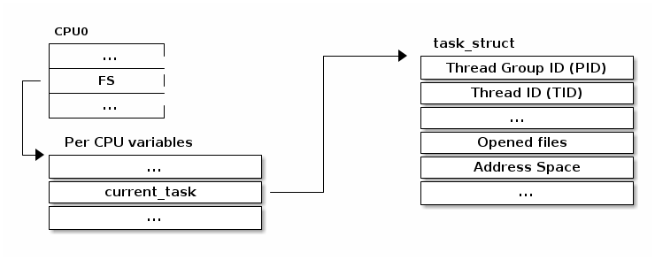
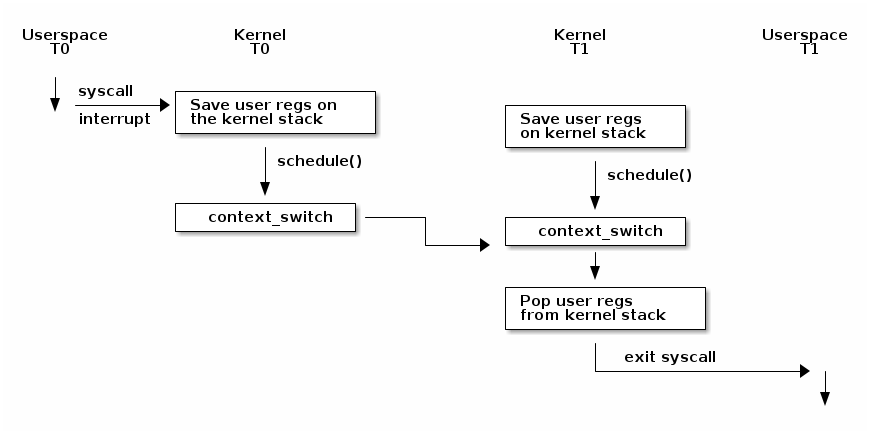

# 调试内核

## Kernel GDB scripts

* `CONFIG_GDB_SCRIPTS`可以通过构建python脚本来简化内核调试(添加新命令和函数)
* 当使用gdb vmlinux时，会自动加载构建根目录中的vmlinux-gdb.py文件
  * lx-symbols: 为vmlinux和模块重载符号
  * lx-dmesg: 显示内核 dmesg
  * lx-lsmod:显示加载的模块
  * lx-device-{bus|class|tree}: 显示设备总线、类和树
  * lx-ps: ps 类似查看任务
  * $lx_current() 包含当前task_struct
  * $lx_per_cpu(var, cpu) 返回一个单-cpu变量
  * apropos lx 显示所有可用的函数

# 进程和线程

进程是操作系统的抽象概念，用于组织多个资源：
* 地址空间
* 一个或多个线程
* 打开的文件
* 套接字（Socket）
* 信号量（semaphore）
* 共享内存区域
* 定时器
* 信号处理程序
* 许多其他资源和状态信息

所有这些信息都被组织在进程控制块（PCB）中。在 Linux 中，PCB 对应的结构体是`struct task_struct`。

## 进程资源查询

我们可以在 /proc/\<pid\> 目录中获取关于进程资源的摘要信息，其中 \<pid\> 是我们要查看的进程的进程 ID。

```
                +-------------------------------------------------------------------+
                | dr-x------    2 tavi tavi 0  2021 03 14 12:34 .                   |
                | dr-xr-xr-x    6 tavi tavi 0  2021 03 14 12:34 ..                  |
                | lrwx------    1 tavi tavi 64 2021 03 14 12:34 0 -> /dev/pts/4     |
           +--->| lrwx------    1 tavi tavi 64 2021 03 14 12:34 1 -> /dev/pts/4     |
           |    | lrwx------    1 tavi tavi 64 2021 03 14 12:34 2 -> /dev/pts/4     |
           |    | lr-x------    1 tavi tavi 64 2021 03 14 12:34 3 -> /proc/18312/fd |
           |    +-------------------------------------------------------------------+
           |                 +----------------------------------------------------------------+
           |                 | 08048000-0804c000 r-xp 00000000 08:02 16875609 /bin/cat        |
$ ls -1 /proc/self/          | 0804c000-0804d000 rw-p 00003000 08:02 16875609 /bin/cat        |
cmdline    |                 | 0804d000-0806e000 rw-p 0804d000 00:00 0 [heap]                 |
cwd        |                 | ...                                                            |
environ    |    +----------->| b7f46000-b7f49000 rw-p b7f46000 00:00 0                        |
exe        |    |            | b7f59000-b7f5b000 rw-p b7f59000 00:00 0                        |
fd --------+    |            | b7f5b000-b7f77000 r-xp 00000000 08:02 11601524 /lib/ld-2.7.so  |
fdinfo          |            | b7f77000-b7f79000 rw-p 0001b000 08:02 11601524 /lib/ld-2.7.so  |
maps -----------+            | bfa05000-bfa1a000 rw-p bffeb000 00:00 0 [stack]                |
mem                          | ffffe000-fffff000 r-xp 00000000 00:00 0 [vdso]                 |
root                         +----------------------------------------------------------------+
stat                 +----------------------------+
statm                |  Name: cat                 |
status ------+       |  State: R (running)        |
task         |       |  Tgid: 18205               |
wchan        +------>|  Pid: 18205                |
                     |  PPid: 18133               |
                     |  Uid: 1000 1000 1000 1000  |
                     |  Gid: 1000 1000 1000 1000  |
                     +----------------------------+
```

## 线程

线程是内核进程调度器调度的基本单位，决定了应用程序在 CPU 上的运行。其主要特点如下：  
- **独立堆栈**：每个线程都有自己的堆栈，与寄存器的值共同决定了线程的运行状态。  
- **共享资源**：线程在进程的上下文中运行，同一进程中的所有线程共享资源。  
- **调度单位**：内核调度的是线程，而非进程。用户级线程（如纤程或协程）在内核级别不可见。  

线程的典型实现通常将线程作为独立的数据结构，并链接到进程数据结构。然而，Linux 采用了不同的方式，其基本调度单位称为“任务”（task），对应结构体 `struct task_struct`。这个结构既可以表示线程，也可以表示进程。资源不直接嵌入到任务结构中，而是通过指针指向相关资源，从而实现灵活的资源管理。

## 克隆

Linux 使用 `clone()` 系统调用来创建线程或进程，允许调用者通过标志位灵活选择资源共享或隔离的方式。以下是常见的标志选项：  
- **CLONE_FILES**：与父进程共享文件描述符表。  
- **CLONE_VM**：与父进程共享地址空间。  
- **CLONE_FS**：与父进程共享文件系统信息（如根目录和当前目录）。  
- **CLONE_NEWNS**：创建独立的挂载命名空间。  
- **CLONE_NEWIPC**：创建独立的 IPC 命名空间（如 System V IPC 对象或 POSIX 消息队列）。  
- **CLONE_NEWNET**：创建独立的网络命名空间（如网络接口或路由表）。  

调用 `clone()` 时：  
- 使用标志 `CLONE_FILES | CLONE_VM | CLONE_FS` 会创建一个新的线程，与父进程共享大部分资源。  
- 不使用这些标志则会创建一个新的进程，资源相对独立。  

## 命名空间与容器

容器是一种轻量级的虚拟化技术，与传统虚拟化方式不同。传统虚拟化依赖虚拟机监视程序（hypervisor），为每个虚拟机提供独立的内核实例。而容器技术共享相同的内核实例，提供更高的性能和资源利用率。  
常见的容器技术包括：  
- **LXC**：支持运行轻量级的“虚拟机”。  
- **Docker**：专注于运行单个应用程序的容器。  

容器的实现依赖于内核特性，其中最关键的就是 **命名空间（namespace）**。命名空间允许对资源进行隔离，防止全局资源的互相干扰。例如，在没有容器的情况下，所有进程在 `/proc` 中可见并可被操作，而容器可以隔离这些进程，使得一个容器中的进程对其他容器不可见。  

命名空间的实现通过内核中的 `struct nsproxy` 结构完成，支持对以下资源类型进行分区：  
- IPC  
- 网络  
- cgroup  
- 挂载点  
- PID  
- 时间命名空间  

例如，网络接口的默认状态是在全局范围内共享。然而，通过创建一个新的网络命名空间（如 `struct net`），系统可以隔离接口列表，新创建的进程指向新命名空间，从而实现资源隔离。

## 访问当前进程

访问当前进程信息是内核中的高频操作，以下是一些常见的场景：  
- 打开文件时需要访问 `struct task_struct` 的 `file` 字段。  
- 映射新文件时需要访问 `mm` 字段。  
- 超过 90% 的系统调用涉及当前进程的结构体操作，因此需要快速的访问路径。  

Linux 提供了 **`current` 宏** 来高效访问当前进程的 `struct task_struct`。  
在多处理器系统中，**每个 CPU 都有一个独立的变量存储指向当前 `task_struct` 的指针**，确保了多核环境下的快速访问。



# 上下文切换



在发生上下文切换之前，我们必须进行内核转换，这可以通过系统调用或中断来实现。此时，用户空间的寄存器会保存在内核堆栈上。在某个时刻，可能会调用 schedule() 函数，该函数决定从线程 T0 切换到线程 T1（例如，因为当前线程正在阻塞等待 I/O 操作完成，或者因为它的时间片已经耗尽）。

此时，context_switch() 函数将执行特定于体系结构的操作，并在需要时切换地址空间：

```c
static __always_inline struct rq *
context_switch(struct rq *rq, struct task_struct *prev,
         struct task_struct *next, struct rq_flags *rf)
{
    prepare_task_switch(rq, prev, next);

    /*
     * paravirt 中，这与 switch_to 中的 exit 配对，
     * 将页表重载和后端切换合并为一个超级调用（hypercall）。
     */
    arch_start_context_switch(prev);

    /*
     * kernel -> kernel   lazy + transfer active
     *   user -> kernel   lazy + mmgrab() active
     *
     * kernel ->   user   switch + mmdrop() active
     *   user ->   user   switch
     */
    if (!next->mm) {                                // 到内核
        enter_lazy_tlb(prev->active_mm, next);

        next->active_mm = prev->active_mm;
        if (prev->mm)                           // 来自用户
            mmgrab(prev->active_mm);
        else
            prev->active_mm = NULL;
    } else {                                        // 到用户
        membarrier_switch_mm(rq, prev->active_mm, next->mm);
        /*
         * sys_membarrier() 在设置 rq->curr / membarrier_switch_mm() 和返回用户空间之间需要一个 smp_mb()。
         *
         * 下面通过 switch_mm() 或者在 'prev->active_mm == next->mm' 的情况下通过 finish_task_switch() 的 mmdrop() 来提供这个功能。
         */
        switch_mm_irqs_off(prev->active_mm, next->mm, next);

        if (!prev->mm) {                        // 来自内核
            /* 在 finish_task_switch() 中进行 mmdrop()。 */
            rq->prev_mm = prev->active_mm;
            prev->active_mm = NULL;
        }
    }

    rq->clock_update_flags &= ~(RQCF_ACT_SKIP|RQCF_REQ_SKIP);

    prepare_lock_switch(rq, next, rf);

    /* 在这里我们只切换寄存器状态和堆栈。 */
    switch_to(prev, next, prev);
    barrier();

    return finish_task_switch(prev);
  }
...
```

它将调用特定于架构的 switch_to 宏实现来切换寄存器状态和内核堆栈。请注意，寄存器被保存在堆栈上，并且堆栈指针被保存在任务结构体中：

```c
#define switch_to(prev, next, last)               \
do {                                              \
    ((last) = __switch_to_asm((prev), (next)));   \
} while (0)


/*
 * %eax: prev task
 * %edx: next task
 */
.pushsection .text, "ax"
SYM_CODE_START(__switch_to_asm)
    /*
     * 保存被调用者保存的寄存器
     * 其必须与 struct inactive_task_frame 中的顺序匹配
     */
    pushl   %ebp
    pushl   %ebx
    pushl   %edi
    pushl   %esi
    /*
     * 保存标志位以防止 AC 泄漏。如果 objtool 支持 32 位，则可以消除此项需求，以验证 STAC/CLAC 的正确性。
     */
    pushfl

    /* 切换堆栈 */
    movl    %esp, TASK_threadsp(%eax)
    movl    TASK_threadsp(%edx), %esp

  #ifdef CONFIG_STACKPROTECTOR
    movl    TASK_stack_canary(%edx), %ebx
    movl    %ebx, PER_CPU_VAR(stack_canary)+stack_canary_offset
  #endif

  #ifdef CONFIG_RETPOLINE
    /*
     * 当从较浅的调用堆栈切换到较深的堆栈时，RSB 可能会下溢或使用填充有用户空间地址的条目。
     * 在存在这些问题的 CPU 上，用捕获推测执行的条目覆盖 RSB，以防止攻击。
     */
    FILL_RETURN_BUFFER %ebx, RSB_CLEAR_LOOPS, X86_FEATURE_RSB_CTXSW
    #endif

    /* 恢复任务的标志位以恢复 AC 状态。 */
    popfl
    /* 恢复被调用者保存的寄存器 */
    popl    %esi
    popl    %edi
    popl    %ebx
    popl    %ebp

    jmp     __switch_to
  SYM_CODE_END(__switch_to_asm)
  .popsection
```


# 阻塞和唤醒

# 进程上下文