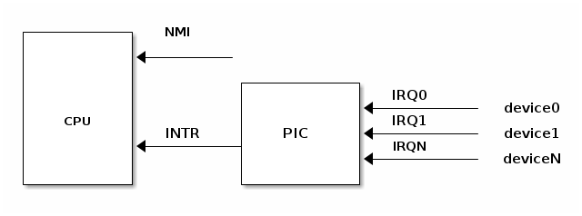

# 中断

中断是一种特殊事件，能够打断程序的正常执行流程，通常由硬件设备或CPU自身触发。当中断发生时，当前程序会暂停执行，转而运行中断处理程序，处理完毕后会恢复之前的执行流程。

根据来源，中断可以分为两类：
1. **同步中断**（异常）：由执行指令触发，例如除零错误、系统调用等。
2. **异步中断**（中断）：由外部事件触发，如硬件设备（例如网络卡）产生的中断。

根据是否能被禁用，中断还可以分为：
1. **可屏蔽中断**：可以被忽略或禁用，通常通过 INT 引脚发出信号。
2. **非可屏蔽中断**：无法被忽略或禁用，通常通过 NMI 引脚发出信号。

**大多数中断是可屏蔽中断**，它们允许临时禁用或推迟中断处理程序的执行。然而，某些重要的中断是非可屏蔽的，无法被禁用或推迟。

## 异常

异常有两种主要来源：

1. **处理器检测到的异常**：
   - **故障（Fault）**：指令执行前检测到的异常，通常可以修正。例如，页面故障（Page Fault）。故障会保存导致异常的指令地址（EIP），修复后程序可以重新执行该指令。
   - **陷阱（Trap）**：指令执行后报告的异常。EIP保存的是异常指令之后的指令地址。一个例子是调试陷阱，用于调试程序执行。
   - **中止（Abort）**：严重异常，通常无法修复，导致程序终止执行。

2. **程序编程**：
   - 由程序员明确触发的异常，例如通过 `int n` 指令产生的软件中断。

# 硬件

## 可编程中断控制器（PIC）

硬件设备通过中断请求（IRQ）引脚发出中断信号，连接到可编程中断控制器（PIC），而 PIC 则与 CPU 的 INTR 引脚连接。以下是中断请求和处理的流程：

1. **中断触发**：  设备在对应的 IRQ 引脚上触发中断信号。
2. **IRQ 转换**：  PIC 接收到中断请求后，将该 IRQ 转换为一个向量号，并将其写入 CPU 可读取的端口。
3. **中断信号发送**：  PIC 在 CPU 的 INTR 引脚上触发中断信号。
4. **等待确认**：  在触发下一个中断之前，PIC 必须等待 CPU 对当前中断的确认。
5. **CPU 确认**：  一旦 CPU 确认中断，开始处理中断。

## 嵌套中断与禁用 IRQ
- **嵌套中断**：  CPU 在确认当前中断后，无论前一个中断是否已处理完毕，中断控制器都能触发新的中断请求。操作系统的控制策略可能导致嵌套中断的发生。

- **禁用 IRQ**：  PIC 允许单独禁用某个 IRQ 线，从而确保中断处理程序按顺序执行，简化了设计。

这种中断控制机制使得硬件设备能够有效地与 CPU 交互，并确保中断的顺序处理与控制。

# 注释
> [1] 
>
> 